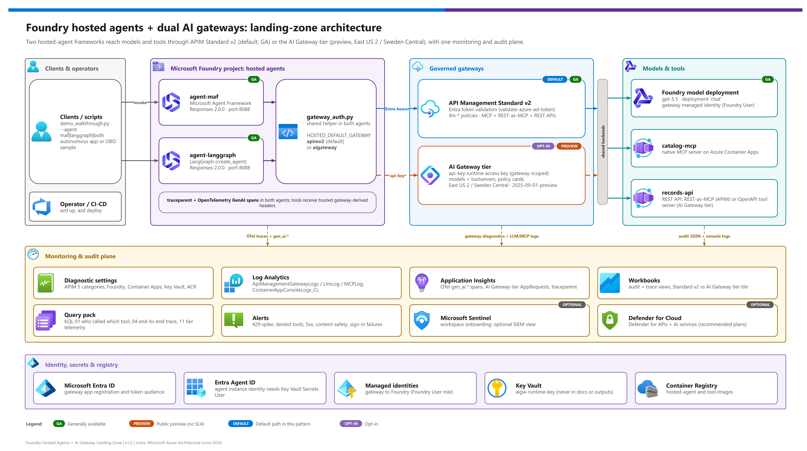
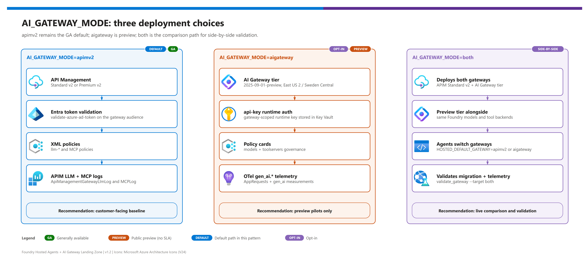
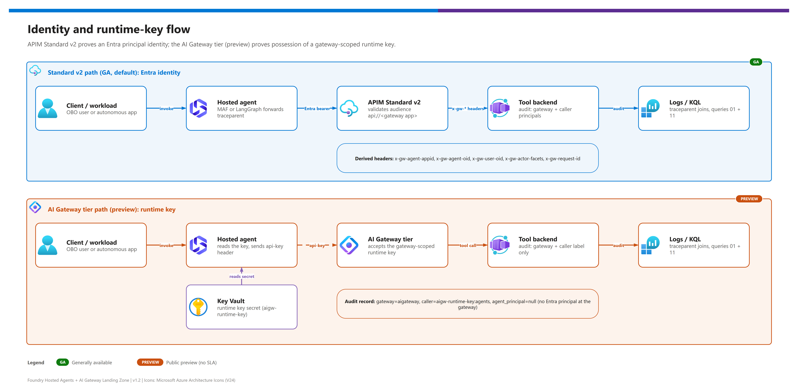

[README](../README.md) › [docs index](./00-reproduce-this-demo.md) › 01 Architecture

# 01 - Architecture

<p>
  
  
  
  
  
  
  
  
</p>

<p>
  
  
  
  
  
</p>

Architecture guide for platform engineers, solution architects, and developers who need to understand how two hosted-agent frameworks, two gateway families, tool backends, identity, and audit telemetry fit together. Read it before a customer workshop so you can answer "where does this call go, who authenticated it, and where is it logged?" for every hop.

## At a glance

| | Layer | In one sentence |
|---|---|---|
|  | **Agents** | Two hosted agents (Microsoft Agent Framework, LangGraph) on the official Foundry hosts, with the same gateway-auth and telemetry contract. |
|  | **Gateway (default)** | APIM Standard v2 validates Entra tokens, applies `llm-*` policies, allow-lists MCP tools, and logs to resource-specific tables. |
|  | **Gateway**  | AI Gateway tier fronts the same model and tools with a gateway-scoped `api-key`; its LLM and MCP telemetry lands in Application Insights `AppRequests`. |
|  | **Tools** | `catalog-mcp` (native MCP) and `records-api` (REST, exposed as MCP) on Container Apps, port 8080. |
|  | **Evidence** | Agent spans, gateway logs, backend `tool_audit` rows, and control-plane changes joined by `traceparent` / `x-gw-request-id`. |

> [!NOTE]
> Direct model calls from an agent to Foundry are **out of pattern**. Every model and tool call crosses a gateway - that is what makes the audit story possible.

## Reference architecture

[](./assets/foundry-hosted-agents-ai-gateway-landing-zone-architecture.png)

<sub>Editable source: [`assets/foundry-hosted-agents-ai-gateway-landing-zone-architecture.drawio`](./assets/foundry-hosted-agents-ai-gateway-landing-zone-architecture.drawio) - regenerate with `python scripts/export_diagrams.py docs/assets`.</sub>

## Gateway modes

[](./assets/gateway-modes.png)

<sub>Editable source: [`assets/gateway-modes.drawio`](./assets/gateway-modes.drawio) - regenerate with `python scripts/export_diagrams.py docs/assets`.</sub>

| | Mode | Status | What it means |
|---|---|---|---|
|  | **`apimv2`** |   | Only APIM v2 is deployed. Safe baseline for customer-facing demos. |
|  | **`aigateway`** |   | Only the AI Gateway tier is deployed. East US 2 / Sweden Central only. |
|  | **`both`** |  | Both deployed; `AGENT_DEFAULT_GATEWAY` (passed to the agents as `HOSTED_DEFAULT_GATEWAY`) picks which one the agents call. |

## Tier → component → role

| Tier | | Component | Mode / path | Role |
|---|---|---|---|---|
| Clients |  | **Demo walkthrough, OBO sample, validation scripts** | All | Invoke hosted agents and produce proof artifacts. |
| Hosted agents |  | **`agent-maf`** <br>  | `src/agents/maf`, protocol `responses` 2.0.0 | Microsoft Agent Framework implementation on `agent_framework_foundry_hosting.ResponsesHostServer`, using gateway-backed model and MCP clients. |
| Hosted agents |  | **`agent-langgraph`** <br>  | `src/agents/langgraph`, protocol `responses` 2.0.0 | LangGraph implementation on `langchain_azure_ai.agents.hosting.ResponsesHostServer`, using the same gateway contract. |
| Gateway |  | **APIM Standard v2** <br>   | `AI_GATEWAY_MODE=apimv2` or `both` | Default GA gateway path with XML policy, Entra validation, managed identity to model, MCP/REST governance, diagnostics. |
| Gateway |  | **AI Gateway tier** <br>  | `AI_GATEWAY_MODE=aigateway` or `both`, `AI_GATEWAY_TIER_LOCATION=eastus2\|swedencentral` | Preview dedicated AI gateway (`Microsoft.ApiManagement/service`, sku `AIGateway`) with model provider, model alias, MCP/OpenAPI tool servers, runtime keys, and telemetry in `AppRequests`. |
| Model |  | **Foundry model deployment** | APIM path `/llm/openai/v1`; AI Gateway path `/default/models/openai/v1` | Receives all model calls through a gateway; direct Foundry model calls are out of pattern. |
| Tools |  | **`catalog-mcp`, `records-api`** | APIM `/catalog-mcp/mcp`, `/records-mcp/mcp`; AI Gateway `/default/toolservers/<name>/mcp` | Domain-neutral native MCP and OpenAPI/REST-as-MCP tools. |
| Registry |  | **Container Registry** | All | Holds agent and tool images built remotely (`remoteBuild: true`). |
| Security |  | **Key Vault** | AI Gateway tier | Stores the `agents` runtime key as `AIGW_RUNTIME_KEY_SECRET_NAME`; each hosted agent's instance identity needs **Key Vault Secrets User** (granted by the `postdeploy` hook). |
| Identity |  | **Entra ID app registration** | APIM path | Gateway app (`api://<GATEWAY_APP_CLIENT_ID>`) whose audience APIM validates. |
| Identity |  | **Managed identities** | All | Gateway → Foundry model; agent instance identity → Key Vault secret read. |
| Monitoring |    | **App Insights, Log Analytics, workbook, KQL** | All | Correlates agent spans, gateway logs/telemetry, backend audit rows, and control-plane changes. |

## Request paths

Both paths start the same way: a client calls a hosted agent endpoint, and the agent (MAF or LangGraph) chooses a gateway from `HOSTED_DEFAULT_GATEWAY` (set from the azd env value `AGENT_DEFAULT_GATEWAY`).

### Path 1 - APIM Standard v2 (default) 

| Step | | What happens | Where it is recorded |
|---|---|---|---|
| **1** |  | Client calls the hosted agent (`POST /responses`; `/invocations` only when `HOSTED_PROTOCOL=invocations` locally). The agent starts a trace span. | Application Insights (agent span). |
| **2** |  | Agent acquires an Entra token and calls `<APIM_GATEWAY_URL>/<LLM_API_PATH>/openai/v1/responses`. | Entra sign-in logs (optional export). |
| **3** |  | APIM `validate-azure-ad-token` accepts the gateway-app audience and the Foundry/cognitiveservices audience used by hosted-agent identities, strips client `x-gw-*` headers, then sets them from the validated claims. | `ApiManagementGatewayLogs`. |
| **4** |  | `llm-token-limit` (per agent, `TOKEN_LIMIT_TPM_PER_AGENT`) and `llm-emit-token-metric` run; optional `llm-content-safety`. | `ApiManagementGatewayLlmLog`, token metrics. |
| **5** |  | APIM uses its managed identity to call the Foundry model backend. | Foundry `RequestResponse` / `Audit` logs. |
| **6** |  | Tool calls go to `MCP_CATALOG_URL` / `MCP_RECORDS_URL`; the MCP policy allow-lists tool names (403 otherwise) and rate-limits per agent. The backend writes a `tool_audit` record with principals from the `x-gw-*` headers. | `ApiManagementGatewayMCPLog`, backend `tool_audit`. |

### Path 2 - AI Gateway tier (preview) 

| Step | | What happens | Where it is recorded |
|---|---|---|---|
| **1** |  | Client calls the hosted agent; the agent starts a trace span. | Application Insights (agent span). |
| **2** |  | Agent reads the runtime key from Key Vault (`KEY_VAULT_URI` + `AIGW_RUNTIME_KEY_SECRET_NAME`) using its instance identity; with `AIGW_KEY_DELIVERY=env` it uses `AIGW_RUNTIME_KEY` instead. | Key Vault audit log. |
| **3** |  | Agent calls `<AIGW_GATEWAY_URL>/default/models/openai/v1/responses` with the `api-key` header; the gateway routes by the model alias, which must equal the request `model` (`chat`). | Application Insights `AppRequests` (`gen_ai.usage.*` in `Measurements`). |
| **4** |  | The model provider (kind Foundry, managed-identity auth; `modelName` equals the deployment name) calls the deployment. The gateway identity needs the **Foundry User** role. | Foundry logs. |
| **5** |  | Tool calls go to `AIGW_MCP_CATALOG_URL` (remote MCP tool server `catalog-mcp`) and `AIGW_MCP_RECORDS_URL` (OpenAPI-generated tool server `records`). Both fail closed. | `AppRequests` / `ApiManagementGatewayMCPLog` + backend `tool_audit`. |
| **6** |  | The tier writes request telemetry to Application Insights; query 11 compares `AppRequests` with the APIM path. | `infra/monitoring/queries/11-ai-gateway-tier-telemetry.kql`. |

### Request-path comparison

| Path | APIM Standard v2 default  | AI Gateway tier  |
|---|---|---|
| Model call | Agent gets Entra token for `api://<GATEWAY_APP_CLIENT_ID>`, calls `<APIM_GATEWAY_URL>/<LLM_API_PATH>/openai/v1/responses`, APIM validates token and uses managed identity to Foundry. | Agent reads runtime key from Key Vault and calls `<AIGW_GATEWAY_URL>/default/models/openai/v1/responses` with `api-key`; gateway routes by the model alias. |
| Catalog MCP | Agent calls `MCP_CATALOG_URL`; APIM validates token, strips/spreads `x-gw-*`, allow-lists tools, forwards to `catalog-mcp`. | Agent calls `AIGW_MCP_CATALOG_URL`; preview gateway validates runtime key and forwards configured backend credential/header. |
| Records MCP | Agent calls `MCP_RECORDS_URL`; APIM exposes REST API as MCP and logs `GatewayMCPLogs`. | Agent calls `AIGW_MCP_RECORDS_URL`; tool server generated from the OpenAPI document (which needs an absolute `servers[0].url`) emits telemetry to `AppRequests`. |
| Audit | Tool audit can include `agent_principal` / `human_principal` from Entra-derived headers. | Tool audit is honest about preview limitation: `gateway="aigateway"`, `caller="aigw-runtime-key:agents"`, `agent_principal=null` unless another app-level identity is supplied. |

> [!NOTE]
> MCP transport is Streamable HTTP on `/mcp`. The older `/sse` and `/messages` endpoints are deprecated. APIM MCP policies are inbound-only and never read `context.Response.Body`, so streaming responses are not buffered. Learn: [Expose REST API as MCP server](https://learn.microsoft.com/en-us/azure/api-management/export-rest-mcp-server), [Expose and govern an existing MCP server](https://learn.microsoft.com/en-us/azure/api-management/expose-existing-mcp-server).

## Trust boundaries

[](./assets/identity-token-flow.png)

| # | Boundary | | Control | What it proves | What it does **not** prove |
|---|---|---|---|---|
| **1** | Client → hosted agent |  | Foundry Agent Service authenticates callers with Microsoft Entra ID. | A caller was allowed to reach the agent. | Which tool the agent will pick. |
| **2** | Agent → gateway (`apimv2`) |  | Entra bearer token validated by APIM (`azp`/`appid`, `oid`, optional `sub`+`scp` for user context). | Which agent identity called, and for which user when an OBO token is supplied. | Anything about the content of the prompt. |
| **3** | Agent → gateway (`aigateway`) |  | `api-key` from Key Vault; gateway-scoped. | The caller holds a valid gateway key. | **Which** principal called - one key reaches every model and tool; no Entra validation at runtime. |
| **4** | Gateway → Foundry model |  | Managed identity with Foundry User role on the Foundry account. | Gateway is the only path to the model deployment. | Per-user authorization at the model. |
| **5** | Gateway → tool backend |  | APIM: sanitized `x-gw-*` headers; AI Gateway: configured backend auth (None / API key / OAuth2 / managed identity). | Tool name was on the allow-list; headers cannot be client-forged on `apimv2`. | Business-level authorization inside the backend. |
| **6** | Agent → Key Vault |  | The hosted agent's **instance identity** holds **Key Vault Secrets User** on the demo vault (granted by the `postdeploy` hook). | The runtime key is never baked into images; `AIGW_KEY_DELIVERY=env` is an explicit, demo-only opt-in. | Rotation policy - handle it operationally; a Key Vault network policy can still block agents running outside the VNet. |
| **7** | Backend → audit |  | `tool_audit` JSON line with `gateway`, `caller`, principals, `traceparent`. | Which gateway path served the call. | Cross-system join is DIY (see [known gaps](../README.md#known-gaps)). |

> [!IMPORTANT]
> **Live finding (2026-10-02):** the effective runtime identity of a hosted agent is its **instance identity principal** (`azd ai agent show <agent> --output json` → `instance_identity.principal_id`). It is distinct from the blueprint principal and from the Foundry project identity, is stable across agent versions, and exists only after the agent is deployed - so Bicep cannot grant it access. See [07 - Identity, authentication, and traceability](./07-identity-auth-traceability.md#the-runtime-principal-is-the-instance-identity).

> [!WARNING]
> On the AI Gateway tier, never describe `caller="aigw-runtime-key:agents"` as an agent identity. It names a **key**, not a principal. Use `apimv2` when per-principal attribution is the requirement.

## Data flow

| Data | Origin | Path | Stored where |
|---|---|---|---|
| Prompt / completion text | Client, model | Agent → gateway → model | Optional `ENABLE_LLM_MESSAGE_LOGGING` → `ApiManagementGatewayLlmLog` (APIM only); Foundry `RequestResponse` logs. |
| Token counts | Model response | Gateway policy / telemetry | `llm-emit-token-metric` (APIM); `Measurements["gen_ai.usage.input_tokens"/"output_tokens"]` on `AppRequests` (AI Gateway tier). |
| Tool arguments / results | Agent, backend | Agent → gateway → tool | `ApiManagementGatewayMCPLog` (both gateways); `AppRequests` (tier); backend `tool_audit`. |
| Runtime key | Gateway control plane | `listSecrets` → Key Vault → agent | Key Vault (or, demo-only, the azd env and agent config when `AIGW_KEY_DELIVERY=env`); never logged. |
| Trace context | Client / agent | `traceparent`, `x-gw-request-id` | Application Insights, gateway logs, `tool_audit`. |
| Seed data | `config/profiles/*.json`, `src/*/data/profiles/` | Copied into build contexts by `scripts/sync-agent-profiles.ps1` | Container images (generic sample data only). |

[](./assets/trace-correlation.png)

## Decisions with rationale

### Design decisions D1-D10

| ID | Decision | Rationale | Consequence |
|---|---|---|---|
| **D1** | Gateway modes `apimv2` , `aigateway` , `both` | Teams need a low-risk way to compare the preview tier against the default gateway. | APIM outputs stay primary; AI Gateway tier outputs are additional. |
| **D2** | Hosted-agent contract: port 8088, `GET /readiness`, `POST /responses` (served by the official host); azd extension `azure.ai.agents`, `host: azure.ai.agent`, `kind: hosted` | Matches the platform contract so the same image runs anywhere hosted agents run. | `agent-maf` and `agent-langgraph` share gateway/auth/telemetry behavior but use different official host packages. |
| **D3** | Optional second runtime: the same container on Container Apps (`DEPLOY_AGENT_ON_ACA`, default false) | Makes the "Foundry vs self-hosted runtime" comparison concrete: what you keep (contract, gateway, telemetry) vs what you lose (auto-provisioned agent identity, managed sessions, Toolbox). | Off by default. |
| **D4** | Tools: native MCP (`catalog-mcp`, "Expose and govern an existing MCP server") + REST exposed as MCP (`records-api`, "Expose REST API in API Management as an MCP server") | Shows both "bring your MCP server" and "wrap my REST API" governance paths. | Two tool servers, one allow-list. |
| **D5** | Identity: Entra validation on APIM; honest key-based identity on the tier | APIM can validate Entra tokens; AI Gateway tier runtime keys are not per-principal validation. | Docs and audit schema avoid overstating preview identity. |
| **D6** | Traceability: propagate `traceparent` and `x-gw-request-id` end to end | Needed to join agent, gateway, and backend evidence. | Cross-system correlation remains DIY. |
| **D7** | Monitoring plane: resource-specific tables, saved KQL, workbook, alerts | GA operational surface, mature policy, resource-specific diagnostics. | Customer-facing demos start on `apimv2`. |
| **D8** | Landing-zone network: public endpoints with Entra auth by default; `NETWORK_ISOLATION=true` adds VNet `10.40.0.0/16`, delegated subnets, 8 private endpoints and 9 private DNS zones (what-if validated, not live-deployed) | Keeps the first build fast; private is an explicit add-on. | Private build adds time (see [00](./00-reproduce-this-demo.md#time-budget)). |
| **D9** | Guardrails: `llm-content-safety` (`ENABLE_CONTENT_SAFETY`), `llm-token-limit` per agent identity, MCP tool allow-list, `rate-limit-by-key` on MCP | Controls belong at the choke point, not in each agent. | Same guardrail for both frameworks. |
| **D10** | Known gaps listed openly | A demo that hides gaps loses credibility. | See [README known gaps](../README.md#known-gaps). |

### Change decisions C1-C10 (v1.1, updated for v1.2)

| ID | Change | Why |
|---|---|---|
| **C1** | `AI_GATEWAY_MODE=both`  | Side-by-side comparison with a single deploy. |
| **C2** | Tier location guard (`eastus2` or `swedencentral`) | Preview only exists in those regions; fail fast in `preprovision`. |
| **C3** | Tier module on `Microsoft.ApiManagement/service@2025-09-01-preview` with sku `AIGateway` (needs the `AIGatewayPreview` feature registered) | Workspace `default`, model provider, model alias, tool servers, `apiKeys/agents`. |
| **C4** | Two agents on the official hosts + shared `gateway_auth.py` | Framework swapability must be real, not prose. |
| **C5** | `azure.yaml` services `agent-maf`, `agent-langgraph`, `catalog-mcp`, `records-api` | One `azd deploy` surface. |
| **C6** | New variables and outputs | Every knob documented in [12](./12-configuration-reference.md). |
| **C7** | Audit honesty | `gateway`, `caller`, `agent_principal` reflect what each gateway can really prove. |
| **C8** | Query 11 + workbook tile | Compare tier `AppRequests` telemetry with APIM telemetry. |
| **C9** | Scripts and tests for `--target`, `--gateway`, `--query 11` | Regressions are caught offline. |
| **C10** | Live test | Static verification is not enough for a preview tier; the 2026-10-02 run passed both gateways - see [04](./04-testing.md#live-validation-2026-10-02). |

The runtime key lives in Key Vault (`KEY_VAULT_URI` + `AIGW_RUNTIME_KEY_SECRET_NAME`) because it is a gateway-scoped secret in preview; agents read it at runtime and never output the value. If a Key Vault network policy blocks the agent, the options are isolation mode (proper) or `AIGW_KEY_DELIVERY=env` (demo-only) - see [05](./05-troubleshooting.md#hosted-agent-gets-forbiddenbyconnection-from-key-vault).

## Adapting this pattern to another domain

Retargeting remains configuration-only: change `DOMAIN_PROFILE`, profile JSON, seed data, and the `workload` block in `demo-ids.local.json`. Do not rename gateway routes, audit fields, or hosted-agent protocol surfaces for a new domain.

| Step | | Action |
|---|---|---|
| **1** |  | Copy `config/profiles/manufacturing-field-ops.json` to a new profile (for example `it-service-desk` is already shipped as a second example). |
| **2** |  | Add `items.json` and `records.json` seed data under `src/catalog-mcp/data/profiles/<profile>/` and `src/records-api/data/profiles/<profile>/`. |
| **3** |  | `azd env set DOMAIN_PROFILE <profile>`; run `scripts/sync-agent-profiles.ps1`. |
| **4** |  | `azd deploy` the agents and tool services; run the walkthrough. |

<details>
<summary><b>Profile JSON shape (abridged)</b></summary>

```json
{
  "profileName": "manufacturing-field-ops",
  "displayName": "Manufacturing Field Operations",
  "agent": {
    "name": "FieldOpsGatewayAgent",
    "description": "Assists operators with parts availability and work-order coordination through governed tools.",
    "instructions": "Use governed catalog and records tools ... Do not invent inventory, work orders, people, or customer-specific facts."
  },
  "labels": { "item": "part", "items": "parts", "record": "work order", "records": "work orders" },
  "catalogTools": { "list_items": "...", "search_items": "...", "get_item": "...", "check_availability": "...", "check_availability_batch": "..." },
  "recordsTools": { "list_records": "...", "get_record": "...", "create_record": "...", "update_record": "..." },
  "seedData": { "items": "src/catalog-mcp/data/profiles/<profile>/items.json", "records": "src/records-api/data/profiles/<profile>/records.json" },
  "walkthrough": [ { "step": "S1", "segment": "Hosted agents", "prompt": "...", "expectedTool": null, "assertion": "..." } ]
}
```

Tool **names** stay `list_items`, `search_items`, ... for every domain - the gateway allow-list and audit schema depend on them. Only the descriptions, labels, and data change.

</details>

## References

> [!NOTE]
> The AI Gateway tier is a public preview; re-check these pages before a customer session because resource shapes can change.

- AI Gateway tier overview: <https://learn.microsoft.com/en-us/azure/api-management/ai-gateway-overview>
- AI Gateway models and tools: <https://learn.microsoft.com/en-us/azure/api-management/ai-gateway-manage-models-tools>
- Microsoft Agent Framework hosted agents: <https://learn.microsoft.com/en-us/azure/foundry/how-to/develop/framework-hosted-agents?pivots=programming-language-python>
- LangGraph hosted agents: <https://learn.microsoft.com/en-us/azure/foundry/how-to/develop/langchain-hosted-agents>
- Hosted agents concept: <https://learn.microsoft.com/en-us/azure/foundry/agents/concepts/hosted-agents>

Next: [02 - Prerequisites](./02-prerequisites.md) →

---

*Last updated: 2026-10-02*
