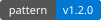
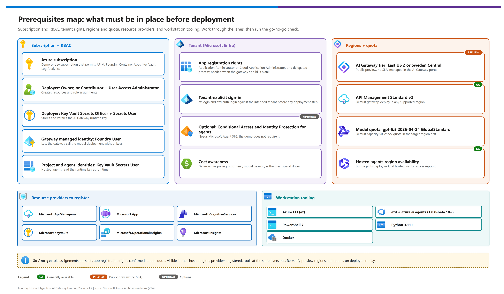
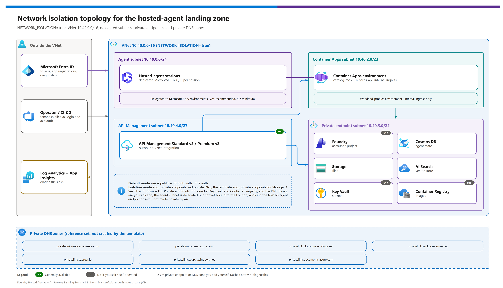

[README](../README.md) › [docs index](./00-reproduce-this-demo.md) › 02 Prerequisites

# 02 - Prerequisites

<p>
  
  
  
  
  
  
</p>

<p>
  
  
  
  
</p>

Prerequisite gate for operators preparing a subscription, tenant, region, and workstation for the v1.2 dual-gateway / dual-agent-framework demo. Work top to bottom; the **pre-flight checklist at the end** is the go/no-go.

## At a glance

| | Gate | Why it matters |
|---|---|---|
|  | **Subscription + RBAC** | Role assignments (managed identities, Key Vault, Foundry) need Owner or User Access Administrator. |
|  | **Entra app rights** | The hook creates a gateway app registration when `GATEWAY_APP_CLIENT_ID` is blank. |
|  | **Preview feature registration**  | The `AIGatewayPreview` feature must be registered, and the AI Gateway tier only exists in East US 2 / Sweden Central during preview. |
|  | **Model quota** | `gpt-5.5` `2026-04-24` GlobalStandard capacity must exist in your region. |
|  | **Tooling** | `az`, `azd` + `azure.ai.agents` extension (`>=1.0.0-beta.18`), PowerShell 7, Python 3.11+. |

> [!IMPORTANT]
> Everything dated **2026-10-02** below (regions, models, quotas, previews) is a snapshot. Re-verify at deploy time with the CLI snippets provided.

[](./assets/prerequisites-map.png)

<sub>Editable source: [`assets/prerequisites-map.drawio`](./assets/prerequisites-map.drawio) - regenerate with `python scripts/export_diagrams.py docs/assets`.</sub>

## Subscription, preview feature registration, and licensing

| | Requirement | Minimum | Notes |
|---|---|---|---|
|  | **Azure subscription** | One demo/dev subscription | Must permit APIM, Foundry, Container Apps, Key Vault, Log Analytics, and role assignments. |
|  | **Subscription RBAC** | Owner, or Contributor + User Access Administrator | Needed for managed identities and Key Vault/Foundry role assignments. |
|  | **Entra app registration** | Application Administrator, Cloud Application Administrator, or delegated process | Needed for APIM gateway app when `GATEWAY_APP_CLIENT_ID` is blank. |
|  | **AI Gateway tier preview** <br>  | `AIGatewayPreview` feature registered; East US 2 or Sweden Central | Public preview, no SLA, pricing TBA, and managed in `ai.gateway.azure.com`. Without the feature the deployment fails (see below). |
|  | **Foundry hosted agents** <br>  | Region/model availability and `azure.ai.agents` azd extension | Both `agent-maf` and `agent-langgraph` deploy with `host: azure.ai.agent`, `kind: hosted`. Sub-features (optimizer, long-running execution, A2A v0.3, routines) are preview. |
|  | **Agent 365 / Conditional Access for agents** | Base Agent ID requires no special license. Conditional Access and Identity Protection on agents need Microsoft Agent 365 (via Microsoft 365 E7, or the Agent 365 add-on plus Entra ID P1 or Microsoft 365 E3). | Do not require a higher Entra tier than current Learn guidance states. This demo does **not** need these features to run. |

### Register the AI Gateway preview feature

> [!WARNING]
> **The AI Gateway tier will not deploy until your subscription has the `AIGatewayPreview` feature registered.** The tier is `Microsoft.ApiManagement/service@2025-09-01-preview` with sku `AIGateway`; without the feature registration (or in an unsupported region) ARM rejects it. The old `Microsoft.ApiManagement/aigateways` type and `2026-05-01-preview` API version never worked in live testing (`InvalidResourceType` / `NoAvailableScaleGroups`) and are not used. Registration is per subscription and can take several minutes.

```powershell
az feature register --namespace Microsoft.ApiManagement --name AIGatewayPreview --subscription <SUBSCRIPTION_ID>
# repeat until the state is "Registered"
az feature show --namespace Microsoft.ApiManagement --name AIGatewayPreview --subscription <SUBSCRIPTION_ID> --query properties.state -o tsv
# propagate the registration to the resource provider
az provider register --namespace Microsoft.ApiManagement --subscription <SUBSCRIPTION_ID>
```

Skip this step only when you deploy with `AI_GATEWAY_MODE=apimv2`.

> [!NOTE]
> The demo itself does not depend on Entra ID P2 or any Agent 365 license. Licensing only matters if you add Conditional Access or Identity Protection for agent identities on top.

## RBAC and identities

| | Principal | Role | Scope | Why |
|---|---|---|---|---|
|  | **Deploying user / pipeline** | Owner, or Contributor + User Access Administrator | Subscription (or demo resource group) | Creates resources and role assignments. |
|  | **Deploying user / pipeline** | Key Vault Secrets Officer + Key Vault Secrets User | Demo Key Vault | `postprovision` stores and verifies the AI Gateway runtime key. |
|  | **Deploying user** | Application Administrator or Cloud Application Administrator | Tenant | Creates the gateway Entra app `gw-<env>` when `GATEWAY_APP_CLIENT_ID` is blank. |
|  | **Gateway system-assigned managed identity** | **Foundry User** (`53ca6127-db72-4b80-b1b0-d745d6d5456d`) | Foundry account | Gateway calls the model deployment without keys. |
|  | **Hosted-agent instance identity** (one per agent) | **Key Vault Secrets User** (`4633458b-17de-408a-b874-0445c86b69e6`) | Demo Key Vault | Hosted agents read the AI Gateway runtime key. The identity exists only after `azd deploy`, so the `postdeploy` hook grants the role; this is the identity the agent actually runs as (see [07](./07-identity-auth-traceability.md#the-runtime-principal-is-the-instance-identity)). |
|  | **Foundry project managed identity** | Not used for Key Vault reads | - | Distinct from the instance identity; granting it Key Vault access does not help the running agent. |

Role definitions: [Azure built-in roles](https://learn.microsoft.com/en-us/azure/role-based-access-control/built-in-roles).

## Resource providers

| | Provider | Needed for |
|---|---|---|
|  | `Microsoft.ApiManagement` | APIM v2 and the AI Gateway tier (`service` with sku `AIGateway`; needs the `AIGatewayPreview` feature). |
|  | `Microsoft.App` | Container Apps for `catalog-mcp` and `records-api`. |
|  | `Microsoft.CognitiveServices` | Foundry account, project, model deployment. |
|  | `Microsoft.ContainerRegistry` | Agent and tool images. |
|  | `Microsoft.KeyVault` | Runtime key storage. |
|  | `Microsoft.OperationalInsights`, `Microsoft.Insights` | Log Analytics, Application Insights, workbooks, alerts. |
|  | `Microsoft.Network` | Only when `NETWORK_ISOLATION=true`. |

```powershell
foreach ($ns in 'Microsoft.ApiManagement','Microsoft.App','Microsoft.CognitiveServices','Microsoft.ContainerRegistry','Microsoft.KeyVault','Microsoft.OperationalInsights','Microsoft.Insights','Microsoft.ManagedIdentity') {
  az provider register --namespace $ns --subscription <SUBSCRIPTION_ID>
}
az provider show --namespace Microsoft.ApiManagement --subscription <SUBSCRIPTION_ID> --query registrationState -o tsv
```

## Workstation tooling and packages

| | Tool / package | Verify | Purpose |
|---|---|---|---|
|  | **Azure CLI** | `az version` | Auth, provider registration, manual checks. |
|  | **Azure Developer CLI** | `azd version` | `azd up`, services, hooks, and outputs. |
|  | **azd extension `azure.ai.agents`** | `azd extension list` | Deploys `agent-maf` and `agent-langgraph`; v1.2 requires `>=1.0.0-beta.18`. |
|  | **PowerShell 7** | `pwsh -Version` | Hooks and profile sync script. |
|  | **Python 3.11+** | `python --version` | Tests and validation scripts. |
|  | **Docker / remote build support** | `docker version` when local builds are used | Hosted-agent and tool images (`remoteBuild: true` avoids local Docker). |
|  | **draw.io Desktop / `DRAWIO_EXE`** | `python scripts/export_diagrams.py docs/assets --check` | Regenerates and verifies PNG diagrams. |
|  | **MAF packages** | `agent-framework-core`, `agent-framework-openai`, `agent-framework-foundry-hosting` (install with `--pre`) | Microsoft Agent Framework hosted agent on the official `ResponsesHostServer`. |
|  | **LangGraph packages** | `langchain-azure-ai[hosting]`, `langchain`, `langchain-openai`, `langchain-mcp-adapters` (install with `--pre`) | LangGraph hosted agent on the official `ResponsesHostServer`. |

Install the azd extension if missing:

```powershell
azd extension install azure.ai.agents
```

## Region tiering and availability

Published snapshot date: **2026-10-02**. Verify at deployment time.

[](./assets/network-topology.png)

| | Surface | Region requirement | Recommendation |
|---|---|---|---|
|  | **Primary deployment `AZURE_LOCATION`** | Must support Foundry model, hosted agents, APIM v2, Container Apps, Key Vault, Log Analytics. | `eastus2` is the safest default for this demo. |
|  | **AI Gateway tier `AI_GATEWAY_TIER_LOCATION`**  | **Only `eastus2` or `swedencentral` during public preview.** | Use `eastus2` unless data residency requires Sweden Central. |
|  | **APIM Standard v2 / Premium v2** | Verify SKU in target region. | Standard v2 default; Premium v2 for stricter enterprise networking. |
|  | **Model deployment** | Verify `MODEL_NAME`, `MODEL_VERSION`, `MODEL_SKU`, and quota. | Keep `gpt-5.5` `2026-04-24` unless explicitly changed. |

### AI Gateway tier region matrix

| Region | AI Gateway tier | Hosted agents | Notes |
|---|---|---|---|
| **East US 2** (`eastus2`) |  ✅ | ✅ | Recommended default; 2,000 concurrent hosted-agent sessions per region. |
| **Sweden Central** (`swedencentral`) | ✅ | ✅ | Use for EU data-residency conversations; 2,000 concurrent sessions per region. |
| Any other region | ❌ (preview) | ✅ in 31 regions - see list below | `preprovision` rejects other `AI_GATEWAY_TIER_LOCATION` values. |

Legend: ✅ available · ❌ not available · ⚠️ verify.

### Hosted-agent regions

Hosted agents are available in 31 regions as of the Learn snapshot on 2026-10-02; the list is growing. Learn: [Hosted agents concept](https://learn.microsoft.com/en-us/azure/foundry/agents/concepts/hosted-agents).

<details>
<summary><b>All 31 hosted-agent regions (2026-10-02)</b></summary>

Australia East · Brazil South · Canada Central · Canada East · Central US · East US · East US 2 · France Central · Germany West Central · Italy North · Japan East · Japan West · Korea Central · North Central US · Norway East · Poland Central · South Africa North · South Central US · South India · Southeast Asia · Spain Central · Sweden Central · Switzerland North · Switzerland West · UAE North · UK South · UK West · West Central US · West Europe · West US · West US 3

</details>

### Preview caveats for AI Gateway tier

| | Caveat | Operational implication |
|---|---|---|
|  | **Public preview; no SLA**  | Use for pilots and validation with rollback to APIM v2. |
|  | **Pricing TBA** | Do not use it for final cost commitments without current pricing. |
|  | **Management API `2025-09-01-preview`** | Expect API/property churn; validate automation after every update. |
|  | **Runtime access key in `api-key` header** | Store the key in Key Vault; do not treat it as principal identity. If a Key Vault network policy blocks the agent, see [05](./05-troubleshooting.md#hosted-agent-gets-forbiddenbyconnection-from-key-vault). |
|  | **Gateway-scoped keys** | One key reaches all models and tools in the gateway during preview; create separate keys per app/environment where possible. |

> [!WARNING]
> Preview networking (inbound Private Link, outbound VNet integration) for the AI Gateway tier is itself in preview, and the tier private endpoint plus outbound integration are not verified end to end. Do not assume private-only AI Gateway tier traffic in a customer commitment.

## Model availability matrix (dated 2026-10-02)

 Snapshot from Microsoft Learn research on **2026-10-02**. Capacity differs per subscription and region - always run the verify snippets below before `azd up`.

| Model | Version | SKU | Status in this demo | Retirement | Verdict |
|---|---|---|---|---|---|
| `gpt-5.5` | `2026-04-24` | GlobalStandard | **Default** (`MODEL_NAME`, `MODEL_VERSION`) | 2027-10-26 | ✅ Use |
| `gpt-5.6-sol` / `-luna` / `-terra` | per Learn | GlobalStandard | Alternative;  2026-07-09 | 2028-01-11 | ✅ Optional - change all model vars together |
| `gpt-4o`, `gpt-4.1` | - | - | Avoid - deprecated | 2026-10-14 → 2027-04-14 | ❌ Do not use |
| `gpt-5.1`, `gpt-5.2` | - | - | Avoid - shorter runway | 2027-05-15 / 2027-06-08 | ⚠️ Avoid for new builds |

<details>
<summary><b>Verify model availability and quota (CLI)</b></summary>

```powershell
# Confirm the intended context first - never rely on ambient state
az account show --query "{tenant:tenantId, subscription:id}" -o table

# Is the model/version offered in the region?
az cognitiveservices model list --location eastus2 --subscription <SUBSCRIPTION_ID> `
  --query "[?model.name=='gpt-5.5'].{name:model.name, version:model.version, skus:model.skus[].name}" -o table

# How much GlobalStandard quota is left?
az cognitiveservices usage list --location eastus2 --subscription <SUBSCRIPTION_ID> -o table
```

If `gpt-5.5` is missing or quota is zero, pick another region/model and update `MODEL_NAME`, `MODEL_VERSION`, `MODEL_SKU`, and `MODEL_CAPACITY` together. Learn: [Model retirement schedule](https://learn.microsoft.com/en-us/azure/foundry/openai/concepts/model-retirement-schedule).

</details>

## Quotas and limits

| | Limit | Value | Source / note |
|---|---|---|---|
|  | **Model capacity** | `MODEL_CAPACITY=50` (GlobalStandard capacity units) | Raise or lower to fit your quota. |
|  | **Per-agent token limit** | `TOKEN_LIMIT_TPM_PER_AGENT=20000` | `llm-token-limit` on APIM. |
|  | **AI Gateway request limit** | `AIGW_REQUEST_LIMIT_RPM=120` | Request-rate card on the AI Gateway tier. |
|  | **Hosted-agent idle timeout** | 2-60 minutes (default 15) | Sessions are deleted after 30 days of inactivity. |
|  | **Tools per agent** | 128 | Hosted-agent limit. |
|  | **Concurrent sessions per region** | 2,000 in East US 2, Sweden Central, Canada Central, Japan East, North Central US, South Africa North, Southeast Asia; 1,000 elsewhere | Check Learn for the current list. |
|  | **Sandbox size** | 0.5 vCPU / 1 GiB (demo default), 1 / 2, 2 / 4 | Set in `azure.yaml`. |
|  | **Agent subnet (private build)** | `/24` recommended, `/27` hard minimum, delegated to `Microsoft.App/environments` | Demo uses `10.40.0.0/24`. |
|  | **Private ACR** | Foundry projects created after 2026-06-25 | Older projects need a publicly reachable registry. |

## Naming

| | Resource | Pattern (`<env>` = azd environment name, `<sfx>` = 8-char hash) |
|---|---|---|
|  | **azd environment name** | Lowercase alphanumeric + hyphen, starts alphanumeric, no trailing hyphen, **≤ 20 characters** (enforced by `preprovision`). |
|  | Foundry account / project | `fdry-<env>-<sfx>` / `proj-<env>` |
|  | APIM / AI Gateway tier | `apim-<env>-<sfx>` / `aigw-<env>-<sfx>` |
|  | Container Apps environment | `cae-<env>-<sfx>` |
|  | Key Vault (≤ 24 chars) | `kv-<env>-<sfx>` |
|  | Log Analytics / App Insights | `law-<env>-<sfx>` / `appi-<env>-<sfx>` |

## Cost table (estimate - verify with the Azure Pricing Calculator)

> [!CAUTION]
> These are **relative cost bands, not quotes**. AI Gateway tier pricing is not yet announced. Use the [Azure Pricing Calculator](https://azure.microsoft.com/pricing/calculator/) and the Foundry [pricing page](https://azure.microsoft.com/pricing/details/foundry-agent-service/) before committing a number to a customer.

| | Component | Cost driver | Relative band (estimate) |
|---|---|---|---|
|  | **APIM Standard v2** | Fixed per-unit hourly + request volume | 🟧 Highest fixed cost - delete when idle. |
|  | **AI Gateway tier**  | **Pricing TBA** | ⏳ Unknown. |
|  | **Foundry model (`gpt-5.5`)** | Tokens in/out | Usage-based; capped by `TOKEN_LIMIT_TPM_PER_AGENT`. |
|  | **Hosted-agent runtime** | CPU + memory consumed during **active** sessions | Low for a demo; oversizing multiplies by concurrency. |
|  | **Container Apps (tools)** | vCPU-seconds, memory | Low. |
|  | **Log Analytics / App Insights** | GB ingested × `LOG_RETENTION_DAYS` (90) | Low-medium; `ENABLE_LLM_MESSAGE_LOGGING` increases volume. |
|   | **ACR, Key Vault** | Tier / operations | Negligible. |
|   | **Private networking (optional)** | Private endpoints, DNS zones | Adds hourly cost per endpoint. |
|  | **Sentinel (optional)** | GB ingested | Off by default (`ENABLE_SENTINEL=false`). |

## Pre-flight checklist

> [!TIP]
> Run this last, right before `azd up`. Every box should be ticked.

- [ ] Tenant and subscription IDs are known.
- [ ] `az login --tenant <TENANT_ID>` and `azd auth login --tenant-id <TENANT_ID>` completed; `az account show` matches.
- [ ] `AI_GATEWAY_TIER_LOCATION` is `eastus2` or `swedencentral` when the preview tier is enabled.
- [ ] `az feature show --namespace Microsoft.ApiManagement --name AIGatewayPreview` reports `Registered` (tier modes only).
- [ ] `azure.ai.agents` extension is installed (`>=1.0.0-beta.18`).
- [ ] MAF and LangGraph package requirements are understood for local/offline validation.
- [ ] Model/version quota and retirement posture are checked (see the dated matrix).
- [ ] APIM v2 SKU availability checked.
- [ ] Resource providers registered.
- [ ] azd environment name is ≤ 20 characters.
- [ ] Runtime key handling is approved: Key Vault only (or the demo-only `AIGW_KEY_DELIVERY=env` opt-in), never docs/output/logs.
- [ ] Optional diagnostics exports have the required tenant permissions.

Next: [03 - Deployment](./03-deployment.md) →

---

*Last updated: 2026-10-02*
