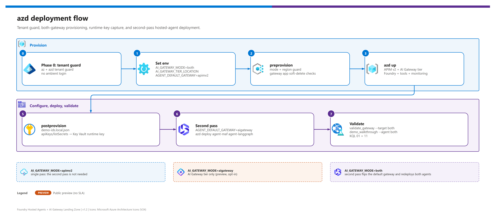

[README](../README.md) › [docs index](./00-reproduce-this-demo.md) › 03 Deployment

# 03 - Deployment

<p>
  
  
  
  
  
  
</p>

<p>
  
  
  
  
  
</p>

Deployment runbook for the primary infrastructure-as-code path. v1.2 deploys **both** APIM Standard v2 and the AI Gateway tier preview side by side for comparison - both were live-validated on 2026-10-02 - while keeping APIM v2 as the safe runtime baseline. For a no-IaC build, see [03b - Manual deployment](./03b-manual-deployment.md).

## At a glance

| | | |
|---|---|---|
|  | **Tool** | `azd up` with `preprovision` / `postprovision` hooks, plus a per-agent `postdeploy` hook |
|  | **Pass 1** | Agents point at APIM v2 (`AGENT_DEFAULT_GATEWAY=apimv2`, delivered to the agents as `HOSTED_DEFAULT_GATEWAY`) |
|  | **Pass 2** | Flip to `aigateway`, then `azd deploy agent-maf agent-langgraph` |
|  | **Agents** | `agent-maf` and `agent-langgraph` on the official hosts, `host: azure.ai.agent`, `remoteBuild: true` |
|  | **Cleanup** | `azd down --purge --force` (took about 36 minutes in the live run) |

> [!WARNING]
> **Register the `AIGatewayPreview` feature first** when you use `aigateway` or `both`: `az feature register --namespace Microsoft.ApiManagement --name AIGatewayPreview`, wait for `Registered`, then `az provider register --namespace Microsoft.ApiManagement`. Details in [02 - Prerequisites](./02-prerequisites.md#register-the-ai-gateway-preview-feature).

> [!WARNING]
> **Phase 0 is not optional.** This workstation can hold several Azure tenants and subscriptions, and `az` and `azd` keep **separate** logins. Always run `az login --tenant` **and** `azd auth login --tenant-id`, then confirm with `az account show` before any provisioning. A bare `azd up` can target the wrong tenant or subscription.

## Fast path - `azd up` with both gateways

[](./assets/azd-deployment-flow.png)

<sub>Editable source: [`assets/azd-deployment-flow.drawio`](./assets/azd-deployment-flow.drawio) - regenerate with `python scripts/export_diagrams.py docs/assets`.</sub>

| Step | | Action | Gate |
|---|---|---|---|
| **0** |  | Authenticate to the right tenant (az **and** azd) | - [ ] `az account show` matches the target |
| **1** |  | Configure deployment knobs with `azd env set` | - [ ] `azd env get-values` reviewed |
| **2** |  | `azd provision --preview`, then `azd up` | - [ ] Hooks pass (including each agent's `postdeploy`), resources created |
| **3** |  | Validate both gateway routes | - [ ] `validate_gateway.py` reports no failed checks |
| **4** |  | Switch hosted agents to the AI Gateway tier  | - [ ] Agents redeployed with `aigateway` |

### Phase 0 - Authenticate to the right tenant

 Resolve the intended tenant and subscription first (ask if unknown - never guess), then:

```powershell
$tenant = "<TENANT_ID>"
$subscription = "<SUBSCRIPTION_ID>"
$envName = "<ENV_NAME>"   # lowercase, <= 20 characters

azd auth login --tenant-id $tenant
az login --tenant $tenant
az account set --subscription $subscription
az account show --query "{tenant:tenantId, subscription:id, subName:name, user:user.name}" -o table

azd env new $envName
azd env set AZURE_TENANT_ID $tenant
azd env set AZURE_SUBSCRIPTION_ID $subscription
azd env set AZURE_LOCATION eastus2
```

> [!NOTE]
> `preprovision` re-checks that `az account show` matches the azd environment's tenant and subscription and stops if it does not.

### Phase 1 - Configure deployment knobs

 Defaults live in `infra/azd.parameters.json`; this block sets the comparison (`both`) configuration.

```powershell
azd env set AI_GATEWAY_MODE both
azd env set AI_GATEWAY_TIER_LOCATION eastus2
azd env set AIGW_REQUEST_LIMIT_RPM 120
azd env set AIGW_RUNTIME_KEY_SECRET_NAME aigw-runtime-key
azd env set AGENT_DEFAULT_GATEWAY apimv2
azd env set APIM_SKU StandardV2
azd env set APIM_PUBLISHER_EMAIL <you@example.com>
azd env set APIM_PUBLISHER_NAME "Demo Publisher"
azd env set MODEL_NAME gpt-5.5
azd env set MODEL_VERSION 2026-04-24
azd env set MODEL_DEPLOYMENT_NAME chat
azd env set MODEL_SKU GlobalStandard
azd env set MODEL_CAPACITY 50
azd env set DOMAIN_PROFILE manufacturing-field-ops
```

| Knob | Values | Effect |
|---|---|---|
| `AI_GATEWAY_MODE` | `apimv2` (default) · `aigateway` · `both` | Which gateway resources are deployed. |
| `AI_GATEWAY_TIER_LOCATION` | `eastus2` · `swedencentral` | AI Gateway tier region (see [02](./02-prerequisites.md#ai-gateway-tier-region-matrix)). |
| `AGENT_DEFAULT_GATEWAY` | `apimv2` · `aigateway` | Which gateway the hosted agents call (azd value; the agents see it as `HOSTED_DEFAULT_GATEWAY`). |
| `AIGW_KEY_DELIVERY` | `keyvault` (default) · `env` | How the agents get the AI Gateway runtime key; `env` is a demo-only opt-in (see [below](#key-delivery-and-the-postdeploy-hook)). Set with `azd env set` only; it is not an infra parameter. |
| `APIM_SKU` | `StandardV2` (default) · `PremiumV2` | APIM v2 tier. |
| `NETWORK_ISOLATION` | `false` (default) · `true` | Adds VNet `10.40.0.0/16`, delegated subnets, 8 private endpoints and 9 private DNS zones.  |
| `DEPLOY_AGENT_ON_ACA` | `false` (default) | Optional second runtime on Container Apps. |

Full reference: [12 - Configuration reference](./12-configuration-reference.md).

### Phase 2 - Preview and deploy

 Preview first, then deploy:

```powershell
azd provision --preview
azd up
```

#### What each hook does

| | Hook | v1.2 responsibilities |
|---|---|---|
|  | `preprovision` | Validates the environment name (≤ 20 chars), tenant/subscription context, `AI_GATEWAY_MODE=apimv2\|aigateway\|both`, AI Gateway tier region (`eastus2\|swedencentral`), APIM SKU, and the network toggle. Ensures the gateway Entra app `gw-<env>` exists when `GATEWAY_APP_CLIENT_ID` is blank. Runs the soft-delete prompts for previously deleted Key Vault / Foundry / APIM names. |
|  | `postprovision` | Writes `demo-ids.local.json`. When `ENABLE_ENTRA_DIAGNOSTICS=true`, runs `scripts/Enable-EntraDiagnostics.ps1`. If the AI Gateway tier is deployed, reads the `agents` runtime key with `listSecrets` and stores it in Key Vault as `AIGW_RUNTIME_KEY_SECRET_NAME`; with `AIGW_KEY_DELIVERY=env` it also writes the key to the azd env value `AIGW_RUNTIME_KEY` (and clears it in `keyvault` mode). Reminds you to register the APIM v2 gateway in the Foundry portal (**Manage > AI Gateway > Register existing API Management gateway**). |

> [!NOTE]
> The hooks do **not** seed sample data. The tool services ship their own demo data, so no seeding step is needed.

|  | `postdeploy` (per agent service) | Grants the deployed agent's **instance identity** the **Key Vault Secrets User** role on the demo vault. See below. |

> [!TIP]
> The agent services receive their environment through `azure.yaml` with the `HOSTED_` prefix (for example `HOSTED_DEFAULT_GATEWAY` is projected from the azd value `AGENT_DEFAULT_GATEWAY`). Change the azd value, then redeploy the agents.

#### Key delivery and the postdeploy hook

The hosted agent's effective identity is its **instance identity principal**, which only exists after the agent is deployed, so Bicep cannot grant it Key Vault access. Each agent service (`agent-maf`, `agent-langgraph`) therefore runs `infra/hooks/postdeploy-agents.ps1 -AgentName <service>` after `azd deploy`.

| Step | | What the hook does |
|---|---|---|
| **1** |  | Checks the az tenant/subscription context against the azd environment. |
| **2** |  | Resolves the instance identity principal (3 tries, 10 s apart): `azd ai agent show <agent> --output json` first, then the azd env value `AGENT_<NAME>_INSTANCE_IDENTITY_PRINCIPAL_ID`, then a best-effort data-plane lookup. |
| **3** |  | Runs an idempotent `az role assignment create` for **Key Vault Secrets User** at the vault scope (retrying `PrincipalNotFound`). |
| **4** |  | Prints a summary table: `granted`, `exists`, `NOT FOUND` or `FAILED`. A missing principal or failed grant only warns and exits 0. |

The hook skips itself when `AIGW_KEY_DELIVERY=env`, when `AI_GATEWAY_MODE=apimv2` (APIM v2 needs no Key Vault access for agents), or when `AZURE_RESOURCE_GROUP` / `KEY_VAULT_NAME` is missing. azd sets `AZD_SERVICE_NAME` for service hooks, so each run handles only the agent being deployed.

> [!NOTE]
> The `postdeploy` hook is covered by offline tests but was **not** exercised live - the live run granted the role by hand. If the summary shows `NOT FOUND` or `FAILED`, run the manual equivalent:
> ```powershell
> $principal = (azd ai agent show <agent-name> --output json | ConvertFrom-Json).instance_identity.principal_id
> az role assignment create --assignee-object-id $principal --assignee-principal-type ServicePrincipal `
>   --role "Key Vault Secrets User" --scope <KEY_VAULT_RESOURCE_ID>
> ```

> [!WARNING]
> **Key Vault network policy.** Under a policy that forces Key Vault public access off (for example, an organization policy that sets Key Vault `publicNetworkAccess` to `Disabled`), hosted agents - which run outside your VNet - get `ForbiddenByConnection` even with the role granted. The proper fix is `NETWORK_ISOLATION=true` (Key Vault private endpoint plus agent subnet injection; not yet live-validated). The demo-only compromise is:
> ```powershell
> azd env set AIGW_KEY_DELIVERY env
> azd provision   # postprovision writes the key into the azd env
> azd deploy agent-maf agent-langgraph
> ```
> That stores the runtime key in **plaintext** in `.azure/<env>/.env` and in the hosted-agent configuration. Never use it outside a disposable demo, and see [05](./05-troubleshooting.md#hosted-agent-gets-forbiddenbyconnection-from-key-vault). In `keyvault` mode the agent also falls back to a non-empty `AIGW_RUNTIME_KEY` when the Key Vault read fails, logging the WARNING `aigw_runtime_key_source`.

### Phase 3 - Validate both gateway routes

 

```powershell
python scripts/validate_gateway.py --ids demo-ids.local.json --target apimv2
python scripts/validate_gateway.py --ids demo-ids.local.json --target aigateway
```

- [ ] `apimv2` target reports no failed checks.
- [ ] `aigateway` target reports no failed checks (the model alias in the request must equal the alias name, `chat`).

> [!NOTE]
> APIM accepts two Entra audiences: the gateway app audience and `https://cognitiveservices.azure.com`, which is the audience used by hosted-agent identities.

### Phase 4 - Switch hosted agents to the AI Gateway tier

 The first `azd up` deploys agents with `AGENT_DEFAULT_GATEWAY=apimv2`. After the AI Gateway tier is validated, run a second pass for the hosted agents only:

```powershell
azd env set AGENT_DEFAULT_GATEWAY aigateway
azd deploy agent-maf agent-langgraph
```

To return to the default path:

```powershell
azd env set AGENT_DEFAULT_GATEWAY apimv2
azd deploy agent-maf agent-langgraph
```

| Pass | `AGENT_DEFAULT_GATEWAY` | Command | Agent auth to gateway |
|---|---|---|---|
|  **1** | `apimv2` | `azd up` | Entra bearer token (validated by APIM) |
|  **2** | `aigateway` | `azd deploy agent-maf agent-langgraph` | `api-key` runtime key read from Key Vault |

- [ ] Both agents redeployed with the new value.
- [ ] `scripts/demo_walkthrough.py --gateway aigateway --dry-run` completes (see Final validation).

## Gateway phase details

| | Mode | Resources / routes | Validation |
|---|---|---|---|
|  | `apimv2` | APIM v2, `/llm/openai/v1`, `/catalog-mcp/mcp`, `/records-mcp/mcp`, `/records`, XML policies, diagnostics. | Entra bearer token auth, APIM LLM/MCP logs, tool audit with principal headers. |
|  | `aigateway`  | `Microsoft.ApiManagement/service@2025-09-01-preview` (sku `AIGateway`, SystemAssigned identity, about 3 minutes to provision), workspace `default`, model provider + model alias, model endpoint `/default/models/openai/v1`, tool servers, runtime key. | `api-key` auth (401 without a key), Key Vault secret exists, query 11 has `AppRequests` rows after traffic. |
|   | `both` | Both sets. | Validate both with `scripts/validate_gateway.py`; choose the active agent path with `AGENT_DEFAULT_GATEWAY`. |

## Final validation

 

```powershell
python scripts/demo_walkthrough.py --ids demo-ids.local.json --agent both --gateway apimv2 --dry-run
python scripts/demo_walkthrough.py --ids demo-ids.local.json --agent both --gateway aigateway --dry-run
python scripts/run_audit_queries.py --ids demo-ids.local.json --query 01
python scripts/run_audit_queries.py --ids demo-ids.local.json --query 11
pytest
```

- [ ] Walkthrough dry runs complete for both gateways.
- [ ] Audit query `01` (APIM) returns rows after traffic.
- [ ] Audit query `11` (AI Gateway tier telemetry in `AppRequests`) returns rows after traffic.
- [ ] `pytest` has no failures.

> [!IMPORTANT]
> Logs and telemetry can lag several minutes behind traffic. Wait and re-run before concluding a query is empty. See [04 - Testing](./04-testing.md) and [05 - Troubleshooting](./05-troubleshooting.md).

## Cleanup

 Tear down everything the environment created. `--purge` also purges soft-deleted Key Vault, Foundry, and APIM names so the same names can be reused.

```powershell
azd down --purge --force
```

> [!NOTE]
> In the live run, teardown took 36 min 33 s. The Cognitive Services account was left soft-deleted and had to be purged manually (`az cognitiveservices account purge`), and the gateway Entra app `gw-<env>` was deleted by hand.

- [ ] Resource group removed.
- [ ] Soft-deleted resources purged (or the soft-delete prompts will appear on the next `azd up`).

---

Next: [03b - Manual deployment](./03b-manual-deployment.md) or [04 - Testing](./04-testing.md) →

*Last updated: 2026-10-02*
