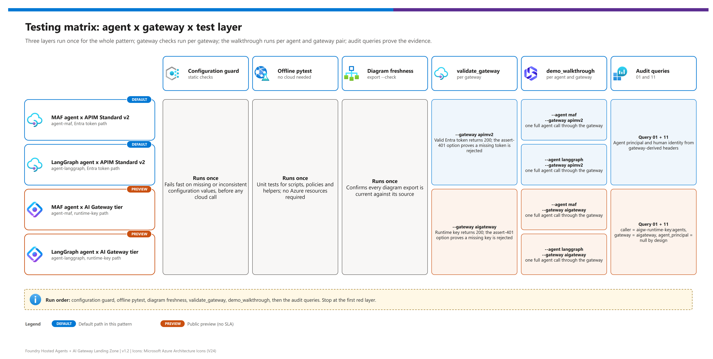
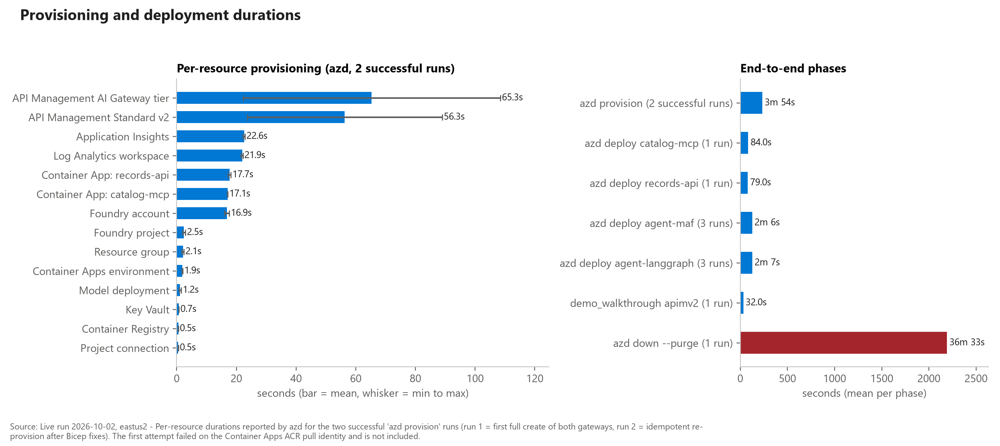

[README](../README.md) › [docs index](./00-reproduce-this-demo.md) › 04 Testing

# 04 - Testing and Validation

<p>
&nbsp;
&nbsp;
&nbsp;
&nbsp;

</p>

    

This page is for the engineer who has just deployed (or is about to deploy) the landing zone and needs to answer one question: **"is it actually working, and for which agent and gateway combination?"** It lays out the layers of verification from offline unit tests to live gateway probes, evaluations and red teaming, and shows what each layer proves and what it cannot.

## At a glance

| | Layer | Needs Azure? | Typical runtime | Proves |
|---|---|---|---|---|
|  | Unit / offline tests (`pytest`) | No | seconds | Agent contract, audit schema, policy XML, KQL files, config docs coverage |
|  | Static IaC and policy checks | No | seconds | Bicep parameter plumbing, quoted azd parameters, policy controls present |
|  | Gateway validation script | Yes | under a minute | 401 on missing or wrong credentials, 200 with the right one, optional 429 probe |
|  | Demo walkthrough | Yes (or `--dry-run`) | minutes | End-to-end agent, gateway, tool and audit story (S1 to S5) |
|  | Audit queries | Yes | seconds per query | Identity and trace correlation actually landed in logs |
|  | Evaluations | Yes | minutes | Agent quality (task adherence, tool use) |
|  | AI Red Teaming Agent | Yes | minutes to hours | Attack Success Rate against the agent target |

> [!NOTE]
> Everything that does not need Azure runs in CI-friendly time. Layers that need Azure are **opt-in** and clearly separated so a laptop with no subscription can still run the full offline suite.

## Test pyramid and coverage

```text
        /\          Red teaming + evaluations   (Azure, minutes to hours)
       /--\         Audit queries                (Azure, seconds)
      /----\        Walkthrough S1..S5           (Azure or --dry-run)
     /------\       Gateway validation           (Azure, under a minute)
    /--------\      Static IaC + policy checks   (offline, seconds)
   /----------\     Unit / contract tests        (offline, seconds)
```

| | Layer | Command or artifact | Offline | Validation status |
|---|---|---|---|---|
|  **Unit / offline** | Audit record, MCP handshake, records API CRUD, hosted-agent contract (`/readiness`, `/responses`; `/invocations` for the local-only protocol), trace propagation, retarget-domain guard | `pytest` | Yes |  |
|  **Static IaC** | Policy XML well-formed and contains `validate-azure-ad-token`, `llm-token-limit`, `llm-emit-token-metric`; MCP policy is inbound-only; azd parameters quoted; `main.bicep` params all passed by `azd.bicep`; KQL files reference known tables | `pytest tests/test_policies.py tests/test_infra_static.py tests/test_kql_queries.py tests/test_configuration.py` | Yes |  |
|  **Gateway validation** | 401 without a credential, success with one, per-gateway tool names, concurrent 429 probe | `python scripts/validate_gateway.py ...` | No |  both gateways, see [Live validation](#live-validation-2026-10-02) |
|  **Walkthrough** | S1 hosted agents, S2 identity, S3 tools/MCP, S4 scale/posture, S5 observability | `python scripts/demo_walkthrough.py ...` | `--dry-run` only |  for live mode |
|  **Audit queries** | KQL 01 (who called which tool), 04 (end-to-end trace), 11 (AI Gateway tier telemetry in `AppRequests`) | `python scripts/run_audit_queries.py ...` | No |  all 11 saved queries ran; see [doc 09](./09-monitoring-and-audit.md#live-evidence) |
|  **Evaluations** | Agent evaluators over a dataset | Foundry portal or SDK | No |  not run by this repo |
|  **Red teaming** | AI Red Teaming Agent scan | Foundry portal or SDK | No |  not run by this repo |

> [!IMPORTANT]
> "Static only" means the check inspects files, not deployed resources. A green offline suite proves the repo is internally consistent; it does not prove a deployment is healthy. Use the gateway validation, walkthrough and audit queries for that.

## Agent × gateway test matrix

Both agents (Microsoft Agent Framework and LangGraph, each on its official host) were exercised against both gateway lanes in the live run of 2026-10-02. ✅ = passed live; offline contract tests and `--dry-run` cover the same cells without Azure.

[](./assets/testing-matrix.png)

<sub>Editable source: [`assets/testing-matrix.drawio`](./assets/testing-matrix.drawio) - regenerate with `python scripts/export_diagrams.py docs/assets`.</sub>

| Agent (host) | Gateway | Readiness / contract (offline) | Walkthrough `--dry-run` | Gateway 401 assertion | Live S1-S5 |
|---|---|:-:|:-:|:-:|:-:|
|  Agent Framework (`maf`, `ResponsesHostServer`) | APIM v2 (`apimv2`) | ✅ | ✅ | ✅ | ✅ |
|  Agent Framework (`maf`, `ResponsesHostServer`) | AI Gateway tier (`aigateway`) | ✅ | ✅ | ✅ | ✅ |
|  LangGraph (`langgraph`, `ResponsesHostServer`) | APIM v2 (`apimv2`) | ✅ | ✅ | ✅ | ✅ |
|  LangGraph (`langgraph`, `ResponsesHostServer`) | AI Gateway tier (`aigateway`) | ✅ | ✅ | ✅ | ✅ |

The AI Gateway tier is  , so the `aigateway` rows only apply when `AI_GATEWAY_MODE` is `aigateway` or `both` (see [doc 03](./03-deployment.md)). Network isolation (`NETWORK_ISOLATION=true`) is **not** in this matrix: it is  (what-if validated only).

## Run the checks (step cards)

Run the offline steps first. Do not skip ahead to the gateway steps if an earlier gate is red.

| Step | | Action | Validation |
|---|---|---|---|
| 1 |  | `pytest` from the repository root, using the same virtual environment as the scripts. | - [ ] All tests pass or skip with a stated reason. Docs-coverage tests read [12 - Configuration reference](./12-configuration-reference.md). |
| 2 |  | `pytest tests/test_configuration.py` after any change to env vars, outputs or `demo-ids` keys. | - [ ] Every new variable is documented in doc 12. |
| 3 |  | `python scripts/export_diagrams.py docs/assets --check` | - [ ] Exit 0: every `.drawio` has a PNG at least as new as the source. |
| 4 |  | `python scripts/validate_gateway.py --ids demo-ids.local.json --target apimv2 --assert-401` | - [ ] Missing or wrong bearer returns 401. - [ ] Valid bearer for `api://<GATEWAY_APP_CLIENT_ID>` reaches the model and both MCP servers. |
| 5 |  | `python scripts/validate_gateway.py --ids demo-ids.local.json --target aigateway --assert-401` | - [ ] Missing or wrong `api-key` returns 401. - [ ] Runtime key from Key Vault (or `AIGW_RUNTIME_KEY` locally) succeeds. - [ ] The request `model` equals the model alias name (`chat`). |
| 6 |  | `python scripts/demo_walkthrough.py --ids demo-ids.local.json --agent both --gateway apimv2 --dry-run`, then repeat with `--gateway aigateway`. | - [ ] Steps S1 to S5 all print PASS for both agents. |
| 7 |  | `python scripts/run_audit_queries.py --ids demo-ids.local.json --query 01`, then `--query 11` (add `--trace-id <id>` with `--query 04`). | - [ ] Query 01 returns tool calls with principals. - [ ] Query 11 returns `AppRequests` rows for the AI Gateway lane (may be empty until telemetry lands). |

> [!TIP]
> To prove the throttling story (S4) add `--probe-429` to `validate_gateway.py`. It fires concurrent requests (default up to 25 attempts, `--max-429-attempts`) until the gateway returns 429, then confirms the audit trail still carries the trace id. On the AI Gateway tier, 183 of 240 probe requests were throttled in the live run.

### Gateway validation matrix

| Target | Credential sent | Source of credential | Expected on missing or wrong credential |
|---|---|---|---|
| `apimv2` | Entra bearer token for `api://<GATEWAY_APP_CLIENT_ID>` | `DefaultAzureCredential` / `az` (`--scope` overrides) | 401 |
| `aigateway` | `api-key` header (gateway-scoped runtime key) | Key Vault via `keyVaultUri` and `AIGW_RUNTIME_KEY_SECRET_NAME`; `--aigw-key` or `AIGW_RUNTIME_KEY` for local fallback (or `AIGW_KEY_DELIVERY=env`) | 401 |

Both lanes return 401 for a bad credential, but for different reasons: APIM v2 validates an Entra token (see [doc 07](./07-identity-auth-traceability.md)); the AI Gateway tier only checks possession of a runtime key.

## Regression checklist

> [!TIP]
> Run this before you tag a change or demo a build. Every item maps to a row in the matrix above.

- [ ] `pytest` is green (offline suite).
- [ ] `python scripts/export_diagrams.py docs/assets --check` exits 0.
- [ ] `validate_gateway.py --target apimv2 --assert-401` passes (when APIM lane deployed).
- [ ] `validate_gateway.py --target aigateway --assert-401` passes (when AI Gateway tier lane deployed).
- [ ] Walkthrough `--dry-run` passes for `maf` and `langgraph` on every deployed lane.
- [ ] Audit query 01 shows `human_principal` and `agent_principal` for APIM v2 calls, and `caller = aigw-runtime-key:agents` with `agent_principal` null for AI Gateway tier calls.
- [ ] Both agents' `postdeploy` summaries show the instance identity `granted` or `exists` (when `AIGW_KEY_DELIVERY=keyvault` and the tier is deployed).
- [ ] No secret, key or token appears in any log line (the audit test enforces redaction of `authorization`, `api-key` and subscription keys).
- [ ] Docs updated for any new env var, output or `demo-ids` key.

## Evaluations and AI Red Teaming Agent

<p>
&nbsp;
&nbsp;

</p>

Functional tests tell you the plumbing works. They do not tell you whether the agent gives good answers or resists abuse. Foundry provides two complementary capabilities for that.

| Capability | What it measures | Status | Learn |
|---|---|---|---|
| Foundry evaluations platform | Runs evaluators over datasets or live traffic |  | [Evaluation concepts](https://learn.microsoft.com/en-us/azure/foundry/concepts/evaluation-evaluators/agent-evaluators) |
| Agent evaluators (Task Completion, Task Adherence, Intent Resolution, Tool Use Quality and similar) | Whether the agent selected and used the right tools and finished the task |  most evaluators | [Agent evaluators](https://learn.microsoft.com/en-us/azure/foundry/concepts/evaluation-evaluators/agent-evaluators) |
| AI Red Teaming Agent (PyRIT-based, reports Attack Success Rate) | How often adversarial prompts succeed against a model or agent target |  | [AI Red Teaming Agent](https://learn.microsoft.com/en-us/azure/foundry/concepts/ai-red-teaming-agent) |
| Guardrails and controls (Azure AI Content Safety engine) | Blocks or annotates harmful content at the model or agent boundary | see [doc 10](./10-enterprise-posture-and-scale.md) | [Foundry guardrails](https://learn.microsoft.com/en-us/azure/foundry/) |

> [!CAUTION]
> Agent evaluators are mostly **preview**: names, scores and supported inputs can change. Treat scores as trend signals, not release gates, until the evaluators you rely on reach GA.

This repository does **not** ship an evaluation dataset or a red-team run; it makes the agent evaluable by emitting OpenTelemetry GenAI spans (`invoke_agent`, `execute_tool`, `chat`) and traceable audit records. Suggested loop:

1. Point an evaluation at the deployed hosted-agent endpoint using a small domain dataset derived from the profile's `walkthrough` prompts.
2. Run the AI Red Teaming Agent against the same target and record Attack Success Rate per risk category.
3. Keep results outside the repository (they contain model outputs) and note the evaluator names and versions you used.

## Live validation (2026-10-02)

   

A disposable deployment of v1.2.0 (environment `fhagl1002`) was provisioned and exercised in `eastus2` on 2026-10-02, then torn down. Both gateway paths and both agents were tested end to end. This section records what that run proved, what it did not, and what had to be fixed to get there. The earlier v1.1 run (2026-10-01, APIM v2 only; the AI Gateway tier could not be created) is kept in [`live-run-2026-10-01.json`](./assets/evidence/live-run-2026-10-01.json) for history.

| Path | Status | Evidence |
|---|---|---|
| APIM Standard v2 (`apimv2`) |  | `validate_gateway.py --assert-401`, 429 probe, `demo_walkthrough.py` S1-S5 for both agents, saved audit queries |
| AI Gateway tier (`aigateway`) |   | `Microsoft.ApiManagement/service@2025-09-01-preview` (sku `AIGateway`) deployed; 401 without a key; S1-S5 for both agents; 429 probe (183 of 240 throttled); telemetry in `AppRequests` |
| Hosted-agent hosts |  | Official `ResponsesHostServer` for Agent Framework and LangGraph (no fallback), platform-injected telemetry and identity variables |
| Network isolation (`NETWORK_ISOLATION=true`) |  | `az deployment sub what-if`: 127 resources, no errors. **Not deployed live.** |
| `postdeploy` Key Vault role hook |  | Offline tests only; the live run granted the role manually |

### Pass/fail matrix


*Source: live run 2026-10-02, eastus2. Regenerate with `python scripts/render_evidence.py` after editing [`live-run-2026-10-02.json`](./assets/evidence/live-run-2026-10-02.json).*

| Check | Result |
|---|---|
| `validate_gateway.py --target apimv2 --assert-401` | ✅ 401 without a credential; LLM, catalog and records MCP calls all succeed |
| `validate_gateway.py --target aigateway --assert-401` | ✅ 401 without an `api-key`; `/default/models/openai/v1/{chat/completions,responses}` and both tool servers (`catalog_list_items`, `records_list_records`) succeed |
| 429 probe (AI Gateway tier) | ✅ 183 of 240 concurrent requests throttled |
| `demo_walkthrough.py` (both agents x both gateways) | ✅ S1-S5 PASS in all four combinations |
| Saved audit queries 01-11 | ✅ All ran; row counts and the empty ones are explained in [09 - Live evidence](./09-monitoring-and-audit.md#live-evidence) |
| Network isolation | ⚠️ what-if only |

### Provisioning durations



| Step | Duration |
|---|---|
| `azd provision` #1 | Failed: Container Apps could not pull from ACR (defect 1) |
| `azd provision` #2 | 4 min 45 s |
| `azd provision` #3 | 3 min 04 s |
| Deploy `catalog-mcp` / `records-api` | 1 min 24 s / 1 min 19 s |
| Deploy `agent-maf` (v1, v2, v3) | 2 min 48 s / 1 min 43 s / 1 min 48 s |
| Deploy `agent-langgraph` (v1, v2, v3) | 2 min 16 s / 2 min 07 s / 1 min 59 s |
| AI Gateway tier provisioning | about 3 min |
| Walkthrough (`apimv2`) | 32 s |
| `azd down --purge --force` | 36 min 33 s |

> [!NOTE]
> The provisioning figures are from a run with a fix loop, so treat them as relative cost, not a published SLA.

### Defects found and fixed during the v1.2 live run

<details>
<summary>11 defects found live, with the file or area changed for each</summary>

| # | Symptom | Fix (file or area) |
|---|---|---|
| 1 | Container Apps could not pull images: the user-assigned identity had no `AcrPull` | Role assignment added in `infra/modules/container-apps.bicep` |
| 2 | `azd deploy` for the agents lacked project values | New outputs `AZURE_AI_PROJECT_ID`, `AZURE_AI_PROJECT_ENDPOINT`, `AIGW_RUNTIME_KEY_SECRET_NAME` |
| 3 | AI Gateway tier model calls failed: provider `modelName` did not match the Foundry deployment | `modelName` must equal the deployment **name** (`chat`) |
| 4 | `validate_gateway.py` used one tool name for both gateways and a serial 429 probe | Per-gateway tool names and a concurrent 429 probe |
| 5 | `postprovision` failed in strict mode and mis-parsed `listSecrets` | Hook fixed |
| 6 | Hosted agents could not read the runtime key from Key Vault (`ForbiddenByConnection` under policy) | `AIGW_KEY_DELIVERY=env` fallback added (demo-only), later formalised with a `postdeploy` role hook |
| 7 | Audit query 02 returned wrong or no rows | `02-*.kql` rewritten |
| 8 | Audit query 11 assumed a table the tier does not write | `11-*.kql` rewritten for `AppRequests` |
| 9 | Audit query 04 ignored `--trace-id` | Parameter substitution fixed in `run_audit_queries.py` |
| 10 | Audit query 09 referenced `ErrorMessage` | Uses `LastErrorMessage` and `LastErrorReason` |
| 11 | Evidence chart captions did not name the host | Renderer captions fixed |

</details>

> [!IMPORTANT]
> **Hosted-agent identity finding.** The effective runtime identity of a hosted agent is its **instance identity principal** (from `azd ai agent show <agent> --output json`, `instance_identity.principal_id`). It is distinct from the blueprint principal and the Foundry project identity, is stable across agent versions, and exists only after the agent is deployed - so Bicep cannot grant it access. It needs **Key Vault Secrets User** to read the AI Gateway runtime key. APIM v2 needs no role for the agent. See [07 - the runtime principal](./07-identity-auth-traceability.md#the-runtime-principal-is-the-instance-identity).

> [!WARNING]
> **Key Vault `ForbiddenByConnection`.** Under a policy that forces Key Vault public access off (the MCAPS `KeyVault_PublicNetwork_Modify` policy in the test subscription), hosted agents - which run outside the VNet - could not read the secret even with the role. The proper fix is network isolation mode (not live-validated); `AIGW_KEY_DELIVERY=env` is a demo-only compromise. See [05](./05-troubleshooting.md#hosted-agent-gets-forbiddenbyconnection-from-key-vault).

**Teardown.** `azd down --purge --force` took 36 min 33 s. The Cognitive Services account stayed soft-deleted and was purged manually, and the gateway Entra app was deleted by hand. Verify with `az group exists --name <rg>` rather than trusting `azd down` alone.

**Not proven.** Only the 429 policy was exercised on the AI Gateway tier (token-limit, content-safety and IP-filter policies were not triggered). Entra sign-in diagnostics were off, so audit query 07 returned no rows, and `AzureActivity` was not connected (query 08). Network isolation was not deployed.

---

Next: [05 - Troubleshooting](./05-troubleshooting.md) →

*Last updated: 2026-10-02*
