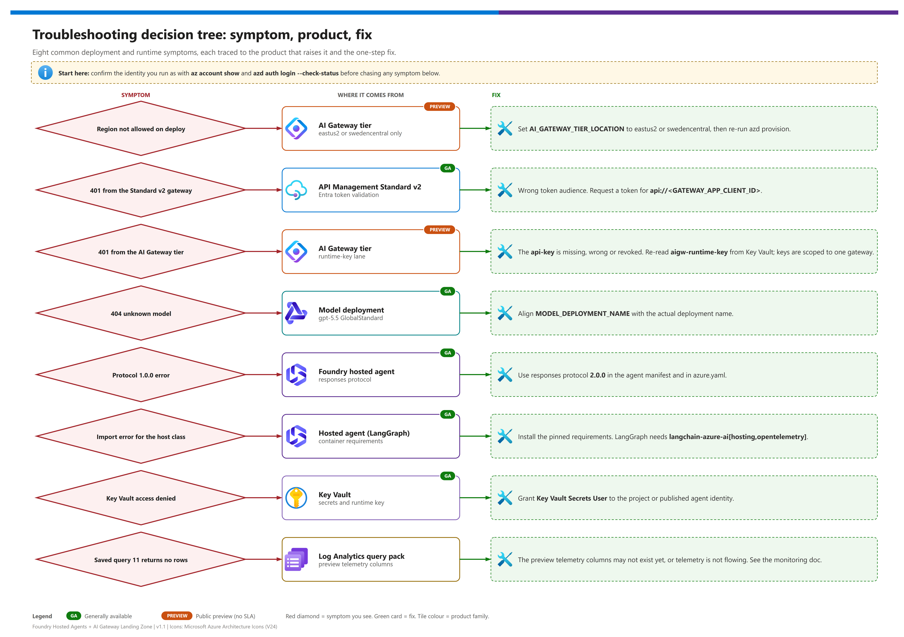

[README](../README.md) › [docs index](./00-reproduce-this-demo.md) › 05 Troubleshooting

# 05 - Troubleshooting

&nbsp;
&nbsp;
&nbsp;
&nbsp;
&nbsp;
&nbsp;

   

A symptom-first guide for the failures you are most likely to hit while deploying and running the landing zone. Start with the quick-triage table, jump to the product section for detail, and use the escalation package at the bottom if you still need help.

## Decision tree

Editable source: [`assets/troubleshooting-decision-tree.drawio`](./assets/troubleshooting-decision-tree.drawio) - regenerate with `python scripts/export_diagrams.py docs/assets`.

## Quick triage

| Where | Symptom | Likely cause | Fix |
|---|---|---|---|
|  **AI Gateway tier**  | Provisioning fails with `NoAvailableScaleGroups`, `InvalidResourceType` or a missing sku | The subscription is not registered for the `AIGatewayPreview` feature, or the region is wrong | Run the [feature registration](./02-prerequisites.md#register-the-ai-gateway-preview-feature) and re-register the provider; use `eastus2` or `swedencentral` |
|  **AI Gateway tier** | Provisioning fails with "region not allowed" | The AI Gateway tier is public preview in **East US 2 and Sweden Central only** | Set `AI_GATEWAY_TIER_LOCATION` to `eastus2` or `swedencentral`; keep the rest of the landing zone wherever you like |
|  **APIM v2** | 401 from the gateway | Token audience is wrong, or the token is missing | Request a token for `api://<GATEWAY_APP_CLIENT_ID>` (or `https://cognitiveservices.azure.com`, both are accepted) |
|  **AI Gateway tier** | 401 from the gateway | `api-key` missing, wrong, or revoked | Re-read the runtime key from Key Vault; check `keyVaultUri` and `AIGW_RUNTIME_KEY_SECRET_NAME` |
|  **Foundry Models** | 404 "unknown model" / deployment not found | `MODEL_DEPLOYMENT_NAME` does not match the deployed model name | Align the variable with the deployment name (the demo targets `gpt-5.5` GlobalStandard) |
|  **Hosted agents** | Error mentioning protocol `1.0.0` | Agent declared the old protocol | Use `responses` protocol version `2.0.0` in the agent manifest and `azure.yaml` |
|  **Hosted agents** | Import error for a host class at startup | Unpinned or missing packages; missing `hosting` extra; requirements installed without `--pre` | Install the pinned `requirements.txt` with `--pre`; LangGraph needs `langchain-azure-ai[hosting,opentelemetry]` |
|  **Key Vault** | `ForbiddenByConnection` or access denied reading the runtime key | Identity lacks **Key Vault Secrets User** (grant it to the hosted agent's **instance identity**), or a policy forces Key Vault public access off | See [the Key Vault entry](#hosted-agent-gets-forbiddenbyconnection-from-key-vault) |
|  **Log Analytics** | Query 11 returns no rows | Telemetry not yet flowing; the tier writes `AppRequests`, not `ApiManagementGatewayLlmLog` | See the Log Analytics section below and [doc 09](./09-monitoring-and-audit.md) |

> [!TIP]
> Most "it worked yesterday" reports are an expired `az` or `azd` login, a rotated runtime key, or a changed tenant. Check the identity you are running as before debugging anything else: `az account show` and `azd auth login --check-status`.

##  API Management (v2 lane)

| Symptom | Cause | Fix |
|---|---|---|
| 401 on `/llm/openai/v1/...` | `validate-azure-ad-token` rejected the token (audience, issuer, expired) | Decode the token (`aud`, `iss`, `exp`) and compare with the policy's accepted audiences; both `{{gateway-audience}}` and `https://cognitiveservices.azure.com` are accepted |
| 403 JSON-RPC `-32601` from an MCP path | Tool name not in the MCP policy allow-list | Add the tool to the allow-list in `infra/policies/mcp-api-policy.xml` (see [doc 08](./08-tools-apim-mcp-topology.md)) |
| 429 with `Retry-After` | `llm-token-limit` (`TOKEN_LIMIT_TPM_PER_AGENT`, default 20000) or MCP rate limit (120 calls per 60 s per validated `azp`) | Expected under load; raise the named value or reduce concurrency |
| 413 on MCP call | Payload guard in the hardened MCP policy | Send a smaller request body |
| Tool response missing or truncated | A policy touched `context.Response.Body` | Remove it. MCP policies must be **inbound-only**; reading the response body breaks streaming. See [Microsoft Learn: MCP server overview](https://learn.microsoft.com/en-us/azure/api-management/mcp-server-overview) |
| Tool backend sees no human identity | Caller used `client_credentials` (no `scp`), so `x-gw-user-oid` is intentionally empty | Expected for autonomous agents; see [doc 07](./07-identity-auth-traceability.md) |

> [!WARNING]
> Client-supplied `x-gw-*` headers are deleted by the identity-headers fragment before gateway-derived values are set. If you see forged identity in audit logs, the fragment is not included on that API.

##  AI Gateway tier 

The tier is preview with no SLA, restricted to East US 2 and Sweden Central. It is an `Microsoft.ApiManagement/service` resource with sku `AIGateway` at API version `2025-09-01-preview`, and it requires the `AIGatewayPreview` feature registration. The resource shapes in this repo were validated live on 2026-10-02, but they can still change. `Microsoft.ApiManagement/aigateways` and `2026-05-01-preview` do not work. Source: [AI Gateway overview](https://learn.microsoft.com/en-us/azure/api-management/ai-gateway-overview).

| Symptom | Cause | Fix |
|---|---|---|
| `NoAvailableScaleGroups` / `InvalidResourceType` | Feature not registered, or the wrong resource type or API version was used | Register `AIGatewayPreview`, re-register `Microsoft.ApiManagement`, and deploy `service` with sku `AIGateway` at `2025-09-01-preview` |
| Region not allowed  | Wrong location | `AI_GATEWAY_TIER_LOCATION` = `eastus2` or `swedencentral` |
| Model call fails with a deployment-not-found error | Provider `modelName` does not equal the Foundry deployment **name**, or the request `model` does not equal the model alias name | Use `chat` for all three |
| Tool server returns a URL error | The OpenAPI tool server has no absolute `servers[0].url` | Bicep injects it; keep the OpenAPI document's server URL absolute |
| 401 with a runtime key | Key copied from another gateway, or regenerated | The key is **gateway-scoped**. Re-create it and store it in the Key Vault secret `aigw-runtime-key` |
| Runtime key not in Key Vault | `postprovision` could not read the key (strict mode or `listSecrets` parse, fixed in v1.2) | Re-run `azd provision`, or create a key named `agents` in the portal at `https://ai.gateway.azure.com` and store it in Key Vault |
| Query 11 or the portal shows no LLM log rows | The tier does not write `ApiManagementGatewayLlmLog` | Query `AppRequests` (`AppRoleName` `aigw-<name> East US 2`; tokens in `Measurements`); MCP calls are also in `ApiManagementGatewayMCPLog` |
| Model call returns backend auth error | Backend auth (None / API key / OAuth2 / Managed identity) misconfigured, or the managed identity lacks the Foundry User role | Fix the backend credential; grant the gateway's managed identity the Foundry User role on the Foundry resource |
| Tool backend audit shows `agent_principal: null` | By design: the tier authenticates a runtime key, not an Entra principal | Read `caller` (`aigw-runtime-key:agents`) and `gateway` (`aigateway`) instead |

##  Foundry hosted agents

Hosted agents run the official hosts (no fallback server). Hosted agents are GA; several sub-features (long-running execution, A2A, routines, durable state) are preview. Container contract and limits: [doc 06](./06-hosted-agents-explained.md).

| Symptom | Cause | Fix |
|---|---|---|
| Container starts but never becomes ready | `GET /readiness` does not return 200, or the app is not listening on port **8088** | Bind `0.0.0.0:8088` over plain HTTP; the platform terminates TLS |
| Protocol 1.0.0 error | Old protocol selected | `responses` 2.0.0 |
| Host class import error | Packages not pinned, or the hosting extra missing | Use the pinned requirements; see the package check below |
| Cold start after idle | Sessions scale to zero after the idle timeout (2 to 60 minutes, default 15) | Expected; first call after idle is slower |
| `azd` deploy of the agent fails | Old `azure.ai.agents` extension | Upgrade to `>=1.0.0-beta.18` (see [azd triage](#azd-triage)) |
| Private registry pull fails | Projects created after 2026-06-25 require a private Azure Container Registry | Use ACR with the project identity granted pull access |
| Host crashes with `PermissionError: /app/.agentserver` | The container runs as `app` but `/app` is owned by root | The Dockerfile must run `chown app:app /app` (already present in v1.2) |
| Hosted call returns HTTP 200 with `status: "failed"` and `error.code: "server_error"` (Agent Framework) | The agent could not reach its model, gateway or tools; the host reports failures inside the response body | Check the agent log stream; the usual causes are the Key Vault entry below and an alias mismatch |
| LangGraph answers without using tools | The MCP server was unreachable; the agent logs `mcp_tools_unavailable` and continues without tools | Fix gateway reachability or credentials; this is by design, not a crash |
| Preview warnings at startup  | The official hosts are pre-release | Informational; ignore |

### Hosted-agent package check

| Framework | Must be installed | Host class | Notes |
|---|---|---|---|
| Microsoft Agent Framework | `agent-framework-core`, `agent-framework-openai`, `agent-framework-foundry-hosting` (pre-release), `mcp` | `ResponsesHostServer` from `agent_framework_foundry_hosting` | Docker build uses `pip --pre` |
| LangGraph | `langchain-azure-ai[hosting,opentelemetry]`, `langchain`, `langchain-openai`, `langchain-mcp-adapters` | `ResponsesHostServer` from `langchain_azure_ai.agents.hosting` | The `hosting` extra provides the host class |

##  Container Apps (tool backends)

| Symptom | Cause | Fix |
|---|---|---|
| `catalog-mcp` or `records-api` unhealthy | Wrong target port | They listen on **8080**; check ingress target port |
| MCP call returns 502 through the gateway | Backend revision not ready or scaled to zero with cold start | Check the revision in the Container Apps environment; retry |
| Empty audit lines | Console log table has no data yet | Allow a few minutes for ingestion; confirm `ContainerAppConsoleLogs_CL` has rows |
| Image pull failure | Registry identity lacks pull rights | Grant the app's managed identity `AcrPull` on the registry |

##  Key Vault

| Symptom | Cause | Fix |
|---|---|---|
| `Forbidden` reading `aigw-runtime-key` | Missing RBAC | Assign **Key Vault Secrets User** to the hosted agent's **instance identity** (not the project identity) |
| Unsure which identity reads the secret | The runtime principal is the agent's instance identity, which exists only after `azd deploy` | `azd ai agent show <agent> --output json`, read `instance_identity.principal_id`; the `postdeploy` hook grants the role ([03](./03-deployment.md#key-delivery-and-the-postdeploy-hook)) |
| Secret not found | Wrong secret name | Align `AIGW_RUNTIME_KEY_SECRET_NAME` with the secret created by `postprovision` |
| `ForbiddenByConnection` | See the next section | See the next section |

### Hosted agent gets ForbiddenByConnection from Key Vault

 The agent log shows a Key Vault 403 with `ForbiddenByConnection`, even though the role assignment exists. Hosted agents run **outside your VNet**, and when an organization policy disables Key Vault public network access, the vault firewall rejects them. This happened in the live run.

| Order | Fix | Notes |
|---|---|---|
| **1** | Confirm the role: `az role assignment list --scope <KEY_VAULT_ID> --assignee <instance principal id>` | Rules out a plain RBAC gap. The `postdeploy` hook is not live-verified, so grant manually if it shows `NOT FOUND` or `FAILED`. |
| **2** | **Proper fix:** `azd env set NETWORK_ISOLATION true`, then `azd provision` and `azd deploy` | Adds a Key Vault private endpoint and agent subnet injection.  what-if validated only; you also need in-VNet access for `azd deploy` and the Key Vault data plane. |
| **3** | **Demo-only compromise:** `azd env set AIGW_KEY_DELIVERY env`, then `azd provision` and `azd deploy agent-maf agent-langgraph` | The runtime key is stored in **plaintext** in `.azure/<env>/.env` and the agent configuration. The agent logs the WARNING `aigw_runtime_key_source source=env`. |

> [!WARNING]
> Option 3 trades security for convenience. Use it only in a disposable demo environment and rotate the AI Gateway runtime key afterwards. In `keyvault` mode the agent also falls back to a non-empty `AIGW_RUNTIME_KEY` when the Key Vault read fails, so a stale value in the environment can mask this problem.

##  Microsoft Entra ID

| Symptom | Cause | Fix |
|---|---|---|
| `AADSTS` audience error | Requested scope does not match the gateway app | Use `api://<GATEWAY_APP_CLIENT_ID>/.default` |
| No human identity on tool calls | Autonomous (client_credentials) flow | Use OBO via `samples/obo-client/invoke_as_user.py --agent maf\|langgraph` for user-attributed calls |
| Cannot find agent sign-ins | They are an `agentSignIn` attribute on existing sign-in logs, not a new table | See [Agent sign-in and audit logs](https://learn.microsoft.com/en-us/entra/agent-id/sign-in-audit-logs-agents) |
| Agent identity limit worry | The 250-identities limit applies to non-Microsoft platforms using app-only client credentials; Foundry is exempt | See [Agent ID FAQ](https://learn.microsoft.com/en-us/entra/agent-id/faq) |

##  Log Analytics

| Symptom | Cause | Fix |
|---|---|---|
| Query 11 empty | No traffic yet, or telemetry lag | Query 11 reads `AppRequests` (tier) and `AppDependencies` (content safety); send traffic and wait a few minutes |
| Query 04 shows no gateway rows for a trace id | Gateway log rows carry no trace id | Expected; join on time and caller, or use the `AppRequests` rows |
| Query 09 error `ErrorMessage` not found | `ApiManagementGatewayLogs` has no `ErrorMessage` column | Use `LastErrorMessage` and `LastErrorReason` (fixed in v1.2) |
| No `ApiManagementGatewayMCPLog` rows | Diagnostic category `GatewayMCPLogs` not enabled | Enable categories `GatewayLogs`, `GatewayLlmLogs`, `GatewayMCPLogs` ([monitor MCP servers](https://learn.microsoft.com/en-us/azure/api-management/monitor-mcp-servers)) |
| Trace id missing in tool audit | Caller did not send `traceparent` | The agents generate one if absent; confirm the gateway preserved it (`exists-action="skip"`) |
| `run_audit_queries.py` auth error | CLI credential for the wrong tenant | `az login --tenant <TENANT_ID>` and retry |

## azd triage

| Step | | Action | Validation |
|---|---|---|---|
| 1 |  | `azd env get-values` and confirm location, subscription and `AI_GATEWAY_MODE` | - [ ] Values are what you intended |
| 2 |  | `azd extension list` and confirm `azure.ai.agents` is `>=1.0.0-beta.18`  | - [ ] Extension current |
| 3 |  | `azd provision --preview` then `azd provision` | - [ ] Fails with a specific resource error, not auth |
| 4 |  | `azd deploy agent-maf` (or `agent-langgraph`) | - [ ] Agent version reaches the ready state |

## Escalation package

If you need help, collect these (never include secrets):

- [ ] `azd env get-values` output with secret-like values redacted.
- [ ] Your ids file (`demo-ids.local.json`) **without** keys or tokens.
- [ ] The exact error text and HTTP status.
- [ ] The APIM request id or `x-gw-request-id` from the failing call.
- [ ] The `traceparent` header used for the request.
- [ ] Whether `AI_GATEWAY_MODE`, `AGENT_DEFAULT_GATEWAY` and `AI_GATEWAY_TIER_LOCATION` were set intentionally.

> [!NOTE]
> For the AI Gateway tier (preview, no SLA) also record the management API version (`2025-09-01-preview`), the region, and whether the `AIGatewayPreview` feature shows `Registered`.

---

Next: [06 - Hosted agents explained](./06-hosted-agents-explained.md) →

*Last updated: 2026-10-02*
