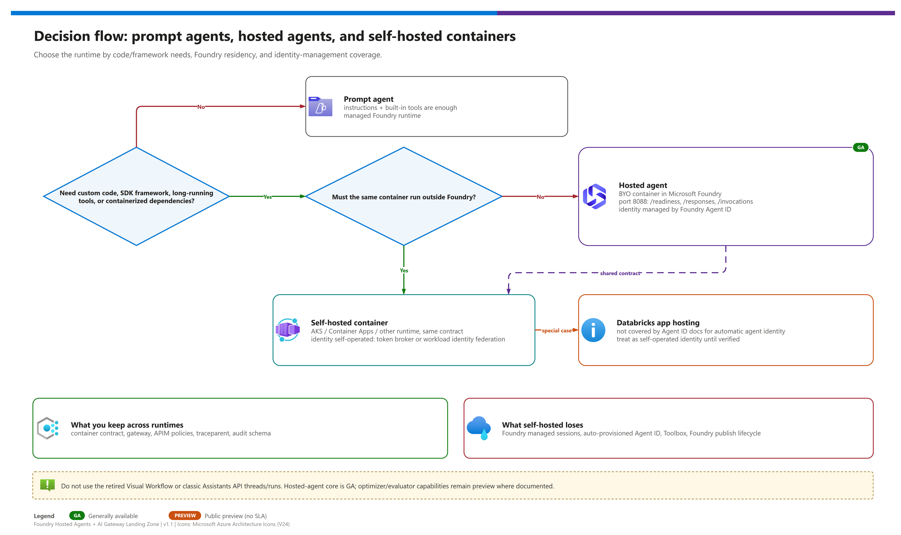
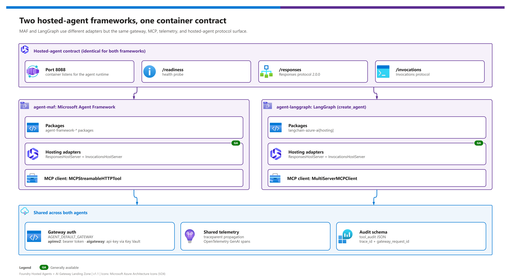

[README](../README.md) › [docs index](./00-reproduce-this-demo.md) › 06 Hosted agents explained

# 06 - Foundry Hosted Agents Explained

<p>
&nbsp;
&nbsp;
&nbsp;
&nbsp;

</p>

   

This page explains what a **Foundry hosted agent** is, what contract your container must meet, how the two reference agents in this repository (Microsoft Agent Framework and LangGraph) differ, and when to choose hosted over a self-managed runtime. Read it before [07 - Identity](./07-identity-auth-traceability.md) and [08 - Tools](./08-tools-apim-mcp-topology.md): both assume you know where the agent runs.

## At a glance

| | Item | Summary |
|---|---|---|
|  | **Foundry Agent Service** | Runs your container as a managed, per-session sandbox. Core hosted agents are ; long-running execution, A2A, routines and durable state are . |
|  | **Foundry project** | The scope for the agent, its connections, identity and model deployments. One project per environment tier is the practical pattern. |
|  | **Foundry Models** | The model the agent calls, here `gpt-5.5` (GlobalStandard), reached **through the gateway** rather than directly. |
|  | **Azure Container Registry** | Holds the agent image. Projects created after 2026-06-25 require a **private** registry. |
|  | **Azure Container Apps** | Hosts the tool backends (`catalog-mcp`, `records-api`) and, optionally, a self-hosted comparison copy of the agent. |

Source: [Hosted agents concepts](https://learn.microsoft.com/en-us/azure/foundry/agents/concepts/hosted-agents).

## Which kind of agent, and where does it run?

[](./assets/agent-type-decision.png)

Two independent axes decide the shape of a deployment. Do not conflate them.

| Axis | Choices | What this demo does |
|---|---|---|
| **1. Who runs the code?** | Prompt agent (no code, platform runs it) · **Hosted agent** (your container, platform hosts it) · Self-hosted (you run the container on your compute) | Hosted agents, plus an optional Container Apps copy (`DEPLOY_AGENT_ON_ACA`, default `false`) for comparison |
| **2. Where does egress go?** | **Public** · **BYO VNet** · **Managed VNet** (plus "Standard setup with private networking") | Public by default; private options in [doc 10](./10-enterprise-posture-and-scale.md) |

> [!NOTE]
> Egress is described by those named options only. Avoid shorthand like "Basic/Standard tiers": it does not match the product's terminology.

## The container contract

Foundry does not care which framework you use as long as the container behaves like this. Source: [Hosted agent contract](https://learn.microsoft.com/en-us/azure/foundry/agents/concepts/hosted-agent-contract).

| | Requirement | Detail |
|---|---|---|
|  **Port** | Listen on **8088** | Plain HTTP inside the sandbox; the platform terminates TLS |
|  **Readiness** | `GET /readiness` returns 200 | Used by the platform to know the container can take traffic |
|  **Responses API** | `POST /responses` | Conversation-oriented; protocol `responses` version **2.0.0**  |
|  **Invocations API** | `POST /invocations` | Simple request/response alternative. Implement at least one of `/responses` or `/invocations` |
|  **Lifecycle** | Handle SIGTERM gracefully | The platform stops idle sessions |
|  **Telemetry** | Emit OpenTelemetry | Export to Application Insights via `APPLICATIONINSIGHTS_CONNECTION_STRING`; spans `invoke_agent`, `execute_tool`, `chat`. Export is GA for hosted and prompt agents |

The repository enforces this contract offline: `tests/test_hosted_agent_contract.py` starts each agent with `FHAGL_USE_FASTAPI_FALLBACK=1` (a small FastAPI app that serves `/readiness`, `/responses` and `/invocations`) and asserts the responses.

## Agent Framework vs LangGraph

[](./assets/agent-frameworks.png)

Both agents implement the same behaviour (same profile, same tools, same gateway selection, byte-identical `gateway_auth.py` and `telemetry.py`). They differ only in framework plumbing.

| | Dimension | Microsoft Agent Framework (`maf`) | LangGraph (`langgraph`) |
|---|---|---|---|
|  | **Packages** | `agent-framework-core==1.20.0`, `agent-framework-openai==1.15.0`, `agent-framework-foundry-hosting==1.0.0b261002` (, `--pre`), `mcp==1.30.0` | `langchain-azure-ai[hosting,opentelemetry]==1.2.10`, `langchain==1.4.3`, `langchain-openai==1.6.7`, `langchain-mcp-adapters==0.3.2` |
|  | **Host classes** | `ResponsesHostServer(agent=..., history_source="agent_server")`, `InvocationsHostServer(agent=...)` from `agent_framework_foundry_hosting` | `ResponsesHostServer(graph)`, `InvocationsHostServer(graph)` from `langchain_azure_ai.agents.hosting` |
|  | **Chat client** | `OpenAIChatClient` | `ChatOpenAI(use_responses_api=True, output_version="responses/v1")` |
|  | **MCP client** | `MCPStreamableHTTPTool` per server (`catalog`, `records`) | `MultiServerMCPClient` with `streamable_http` transport |
|  | **Checkpointer / human-in-the-loop** | Conversation history held by the Agent Service (`history_source="agent_server"`); `store=False` on the model | Graph checkpointers available; this demo does not enable one |
|  | **Injected env vars** | `DD_`-prefixed values from `azure.yaml` (for example `DD_AGENT_DEFAULT_GATEWAY`, `DD_AGENT_PROTOCOL`, `DD_AGENT_RUNTIME`); the code reads the `DD_` name first, then the plain name | Same |
|  | **Gateway selection** | `AGENT_DEFAULT_GATEWAY` = `apimv2` or `aigateway`; model base URL `${APIM_GATEWAY_URL}/${LLM_API_PATH}/openai/v1` or `${AIGW_GATEWAY_URL}/default/models/openai/v1` | Same |
|  | **Protocol** |  |  |

> [!TIP]
> **Recommendation:** start with Microsoft Agent Framework if your team is new to both: it has the shortest path to a hosted agent and the Agent Service stores conversation history for you. Choose LangGraph if you already have LangChain assets or need explicit graph control flow and checkpointers. Because the tools sit behind the gateway, switching framework does not change identity, audit or policy.

### Code excerpts

<details><summary><b>Show: Agent Framework agent (<code>src/agents/maf/agent.py</code>)</b></summary>

```python
from agent_framework import Agent, MCPStreamableHTTPTool
from agent_framework.openai import OpenAIChatClient

profile = load_profile()
selection = resolve_gateway()
client = OpenAIChatClient(
    model=selection.model_deployment,
    base_url=selection.model_base_url_with_slash,
    api_key=selection.api_key,
    default_headers=selection.default_headers,
)
tools = [
    MCPStreamableHTTPTool(name="catalog", url=selection.catalog_mcp_url,
                          headers=gateway_headers(selection),
                          description="Catalog MCP tools", load_prompts=False),
    MCPStreamableHTTPTool(name="records", url=selection.records_mcp_url,
                          headers=gateway_headers(selection),
                          description="Records MCP tools", load_prompts=False),
]
agent = Agent(
    client=client,
    instructions=profile["agent"]["instructions"],
    name=profile["agent"]["name"],
    description=profile["agent"]["description"],
    tools=tools,
    default_options={"store": False},
)
```

Hosting (`src/agents/maf/main.py`): `ResponsesHostServer(agent=agent, history_source="agent_server").run(port=port)` or `InvocationsHostServer(agent=agent).run(port=port)`.

</details>

<details><summary><b>Show: LangGraph agent (<code>src/agents/langgraph/agent.py</code>)</b></summary>

```python
from langchain.agents import create_agent
from langchain_mcp_adapters.client import MultiServerMCPClient
from langchain_openai import ChatOpenAI

profile = load_profile()
selection = resolve_gateway()
model = ChatOpenAI(
    model=selection.model_deployment,
    base_url=selection.model_base_url_with_slash,
    api_key=selection.api_key,
    default_headers=selection.default_headers,
    use_responses_api=True,
    output_version="responses/v1",
)
client = MultiServerMCPClient({
    "catalog": {"transport": "streamable_http", "url": selection.catalog_mcp_url,
                "headers": gateway_headers(selection)},
    "records": {"transport": "streamable_http", "url": selection.records_mcp_url,
                "headers": gateway_headers(selection)},
})
tools = await client.get_tools()
graph = create_agent(model=model, tools=tools,
                     system_prompt=profile["agent"]["instructions"])
```

Hosting (`src/agents/langgraph/main.py`): `ResponsesHostServer(graph).run(port)` or `InvocationsHostServer(graph).run(port)` from `langchain_azure_ai.agents.hosting`.

</details>

Learn: [Microsoft Agent Framework hosted agents](https://learn.microsoft.com/en-us/azure/foundry/how-to/develop/framework-hosted-agents?pivots=programming-language-python) and [LangChain / LangGraph hosted agents](https://learn.microsoft.com/en-us/azure/foundry/how-to/develop/langchain-hosted-agents).

### Image and deployment definition

| | Item | Value |
|---|---|---|
|  | Base image | `python:3.12-slim`, non-root user `app`, port 8088, profiles copied to `config/profiles`, `pip --pre` for the pre-release hosting package |
|  | `azure.yaml` | Services `agent-maf` and `agent-langgraph` use `host: azure.ai.agent`, `kind: hosted`, protocol `responses` 2.0.0, CPU 0.5, memory 1Gi, remote build |
|  | Tooling | azd extension `azure.ai.agents` (`>=1.0.0-beta.18`); there is no `az` CLI group for hosted agents, and the data-plane REST API uses `api-version=v1` |

> [!WARNING]
> The shipping `azure.yaml` sets `FHAGL_USE_FASTAPI_FALLBACK: "1"`, which makes the container serve the small offline FastAPI app instead of the real framework host server. Keep that in mind when you interpret a live "hosted" run, and review it before you claim framework behaviour.

## Session model

Hosted agents are **session-based**: every session gets its own sandbox (a micro VM with its own network interface and IP), 1:1.

| Property | Value |
|---|---|
| Idle timeout | 2 to 60 minutes (default 15) |
| Inactivity retention | Sessions are deleted after 30 days of inactivity |
| Scale | Scale to zero; first call after idle pays a cold start |
| Per-agent tool limit | 128 tools per agent |
| Concurrent sessions per region | 2,000 in seven named regions, 1,000 elsewhere (31 regions in total) |
| State | Conversation history via the Agent Service; durable state is  |

Do not keep business state in the container's memory: a new session may land in a fresh sandbox. Keep durable data in the tool backends. Source: [Hosted agents concepts](https://learn.microsoft.com/en-us/azure/foundry/agents/concepts/hosted-agents).

## Hosted vs self-hosted

| | Dimension | Foundry hosted agent | Self-hosted (Container Apps, `DEPLOY_AGENT_ON_ACA=true`) |
|---|---|---|---|
|  | Operations | Platform manages scale, sessions, sandboxing | You manage ingress, scaling, revisions |
|  | Identity | Entra Agent ID blueprint and identity (shared per project until publish, then dedicated) | Container Apps managed identity you assign |
|  | Governance | Visible in the Foundry control plane; agent lifecycle managed | Outside the agent lifecycle unless you register it |
|  | Networking | Public, BYO VNet or Managed VNet options | Your Container Apps environment and VNet |
|  | Cost model | Billed by the platform; scales to zero between sessions (check current Foundry pricing) | Container Apps pricing for the plan you pick |
|  | Flexibility | Must meet the container contract | Any runtime shape |

> [!TIP]
> **Recommendation:** use hosted agents as the default: the contract is small, scale-to-zero is automatic, and identity and governance integrate with Foundry. Use self-hosting only when you need a runtime that cannot meet the contract. The optional Container Apps copy here exists to show the identity and audit differences, not as the primary path.

## Appendix: swapping the framework

The contract is framework-agnostic, so any framework that can serve the contract can replace the reference agents. The gateway, tools and audit trail stay unchanged.

| Framework | Status in this repo | What to change |
|---|---|---|
| Microsoft Agent Framework | Shipped (`src/agents/maf`) | Nothing |
| LangGraph | Shipped (`src/agents/langgraph`) | Nothing |
| OpenAI Agents SDK | Not shipped | Point the SDK's OpenAI client at the gateway base URL with the same default headers; add MCP via the SDK's streamable HTTP tool; serve `/readiness` and `/responses` on 8088 |
| Anthropic / Claude Agent SDK | Not shipped | Same idea: route model and MCP calls through the gateway; ensure the model deployment exposed by the gateway is compatible with the SDK's expected API |
| GitHub Copilot SDK | Not shipped | Listed by the platform as a supported framework; apply the same contract |

Whatever you choose, reuse `gateway_auth.py` (gateway selection, token or runtime key, `traceparent` creation, `x-gw-*` stripping) and `telemetry.py` so the audit properties in [doc 07](./07-identity-auth-traceability.md) keep holding.

---

Next: [07 - Identity, auth and traceability](./07-identity-auth-traceability.md) →

*Last updated: 2026-10-02*
