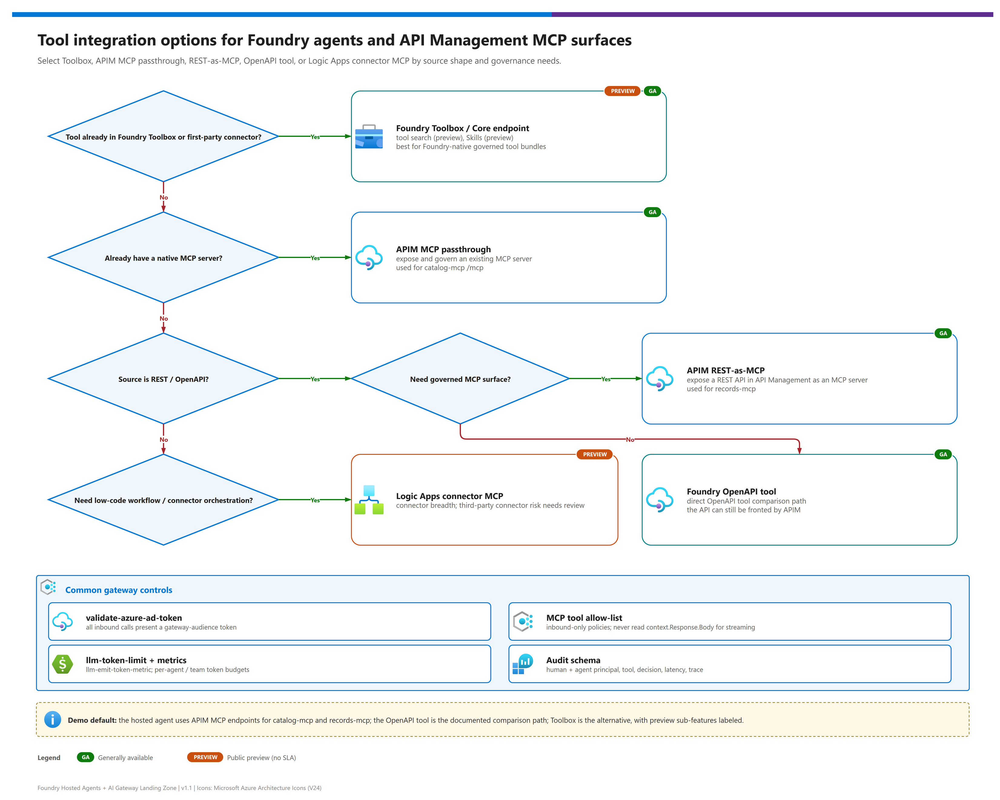

[README](../README.md) › [docs index](./00-reproduce-this-demo.md) › 08 Tools, APIM and MCP topology

# 08 - Tools, APIM and MCP Topology

<p>
&nbsp;
&nbsp;
&nbsp;
&nbsp;

</p>

   

An agent is only as useful, and only as safe, as the tools it can reach. This page shows how tools are exposed to the hosted agents through the gateway: the integration options Foundry offers, how this demo publishes two Model Context Protocol (MCP) servers and one REST API, how the two gateway lanes differ, and the policy rules that keep tool traffic governed.

## At a glance

| | Item | Summary |
|---|---|---|
|  | **APIM v2 lane** |  MCP servers and REST API published behind APIM policies: Entra validation, allow-list, rate limit |
|  | **AI Gateway tier lane** |  Tool servers registered in the gateway under `/default/toolservers/<name>/mcp`, runtime-key access |
|  | **Tool backends** | `catalog-mcp` (MCP) and `records-api` (REST) run on Azure Container Apps, port 8080 |
|  | **Foundry Toolbox** | Core is ; tool search and Skills are . Not required by this demo |
|  | **Logic Apps connector MCP** | , third-party risk caveat; out of scope |

## How should an agent get its tools?

[](./assets/tool-integration-decision.png)

| | Option | Best when | Status | Governance |
|---|---|---|---|---|
|  **Foundry MCP tool (project connection)** | You want the Agent Service to call an MCP server using a project connection (`project_connection_id`) |  base tool | Connection-level auth; gateway optional |
|  **MCP server behind APIM (this demo, v2 lane)** | You need identity validation, allow-lists and per-agent limits on tool calls |  (APIM v2 tiers) | Full policy pipeline |
|  **Tool server in the AI Gateway tier (this demo, tier lane)** | You want managed registration and policy cards, and accept runtime-key access |  | Gateway-level cards only |
|  **Foundry Toolbox** | You want a curated, shared bundle of tools across agents | Core ; search and Skills  | Toolbox-level |
|  **OpenAPI tool** | You have a REST API with a spec | ; anonymous, API key or managed identity auth | Per-tool auth |
|  **Logic Apps connector MCP** | You need a prebuilt SaaS connector |  | Review third-party data handling first |

> [!TIP]
> **Recommendation:** for enterprise tools that touch business data, put an MCP server (or REST API turned into one) **behind the gateway** so every call is validated, allow-listed, rate-limited and audited. Use the Foundry MCP tool or Toolbox for lightweight, low-risk or shared tools. Learn: [Foundry MCP tool](https://learn.microsoft.com/en-us/azure/foundry/agents/how-to/tools/model-context-protocol), [Toolbox overview](https://learn.microsoft.com/en-us/azure/foundry/agents/concepts/toolbox-overview), [OpenAPI tool](https://learn.microsoft.com/en-us/azure/foundry/agents/how-to/tools/openapi).

> [!NOTE]
> **MCP tool vs Foundry MCP Server.** The Foundry **MCP tool** is what an *agent* uses at runtime to call an MCP server. The **Foundry MCP Server** is a separate  feature that exposes Foundry capabilities to *IDE and developer tooling*. They are different things: do not use one name for the other.

## Topology: where each path goes

| | Lane | Tool | Gateway path | Credential |
|---|---|---|---|---|
|  | APIM v2 | Catalog MCP | `/catalog-mcp/mcp` | Entra bearer (validated) |
|  | APIM v2 | Records MCP | `/records-mcp/mcp` | Entra bearer (validated) |
|  | APIM v2 | Records REST | `/records` | Entra bearer (validated) |
|  | AI Gateway tier | Catalog MCP | `/default/toolservers/catalog-mcp/mcp` | `api-key` runtime key |
|  | AI Gateway tier | Records MCP | `/default/toolservers/records/mcp` | `api-key` runtime key |

Both lanes end at the same Container Apps backends, so tool behaviour is identical; only the front door and the identity guarantees change ([doc 07](./07-identity-auth-traceability.md)).

## APIM v2 MCP vs AI Gateway tier tool servers

MCP support in API Management is available on tiers other than Consumption. Two documented ways to publish tools: [expose a REST API as an MCP server](https://learn.microsoft.com/en-us/azure/api-management/export-rest-mcp-server) and [expose and govern an existing MCP server](https://learn.microsoft.com/en-us/azure/api-management/expose-existing-mcp-server). The demo uses the existing-server pattern for `catalog-mcp` and `records`.

| | Dimension | APIM v2 MCP | AI Gateway tier tool servers |
|---|---|---|---|
| | Status |  |   |
| | Authentication to the gateway | Entra token, validated per request | Gateway-scoped `api-key` |
| | Authorization of tools | Policy allow-list (JSON-RPC 403 `-32601`) | Gateway policy cards |
| | Rate limiting | `rate-limit-by-key` per validated agent app (120 calls per 60 s) | Request rate limit card |
| | Identity to the backend | `x-gw-*` headers derived from the token | `x-gw-caller: aigw-runtime-key:agents` only |
| | Backend auth | Policy-defined | None / API key / OAuth2 / Managed identity |
| | Logs | `ApiManagementGatewayMCPLog` (category `GatewayMCPLogs`) | OTel GenAI telemetry to Application Insights or OTLP |
| | Private networking | Per APIM networking options | Preview |

Learn: [Manage models and tools](https://learn.microsoft.com/en-us/azure/api-management/ai-gateway-manage-models-tools) and [Govern and secure AI assets](https://learn.microsoft.com/en-us/azure/api-management/ai-gateway-govern-secure-assets).

## Inbound-only policy rule

> [!WARNING]
> **MCP policies must be inbound-only.** Never read or modify `context.Response.Body` in an MCP API policy: it forces buffering and breaks Streamable HTTP responses. Put every control (validation, allow-list, rate limit, headers) in `<inbound>`. The demo's `tests/test_policies.py` fails if `context.Response.Body` appears in the MCP policy. Source: [MCP server overview](https://learn.microsoft.com/en-us/azure/api-management/mcp-server-overview).

The hardened MCP policy does, in order:

1. Validate the Entra token (`validate-azure-ad-token`, two accepted audiences).
2. Include the `identity-headers` fragment (delete forged `x-gw-*`, set trusted ones).
3. Preserve `traceparent` (`exists-action="skip"`).
4. Read the **request** body to find the JSON-RPC method and tool name (`preserveContent: true`).
5. For `tools/call`, return **403 JSON-RPC `-32601`** unless the tool is on the allow-list.
6. `rate-limit-by-key`: 120 calls per 60 s per validated `azp`.
7. Emit a trace entry (method, tool, agent app id).

<details><summary><b>Show: <code>infra/policies/mcp-api-policy.xml</code> (abridged)</b></summary>

```xml
<inbound>
    <base />
    <validate-azure-ad-token tenant-id="common" output-token-variable-name="validatedToken"
                             failed-validation-httpcode="401"
                             failed-validation-error-message="Missing or invalid gateway token.">
        <audiences>
            <audience>{{gateway-audience}}</audience>
            <audience>https://cognitiveservices.azure.com</audience>
        </audiences>
    </validate-azure-ad-token>
    <include-fragment fragment-id="identity-headers" />
    <set-header name="traceparent" exists-action="skip">
        <value>@(context.Request.Headers.GetValueOrDefault("traceparent", string.Empty))</value>
    </set-header>
    <!-- set-variable mcpMethod / mcpToolName: parse the request body (preserveContent: true) -->
    <choose>
        <when condition="mcpMethod == tools/call">
            <choose>
                <when condition="tool is empty or not in the allow-list">
                    <return-response>
                        <set-status code="403" reason="Forbidden" />
                        <set-body>{"jsonrpc":"2.0","error":{"code":-32601,
                                   "message":"Tool is not permitted by the gateway allow-list."},"id":null}</set-body>
                    </return-response>
                </when>
            </choose>
        </when>
    </choose>
    <rate-limit-by-key calls="120" renewal-period="60" counter-key="validatedAzp" />
</inbound>
<backend><base /></backend>
<outbound><base /></outbound>   <!-- intentionally empty: never touch context.Response.Body -->
```

Conditions are paraphrased for readability; the real file uses C# policy expressions.

</details>

## Tool catalog

Tool names and descriptions come from the active domain profile (`config/profiles/manufacturing-field-ops.json`); the allow-list above contains all nine. Swap the profile and the descriptions change without code changes.

| | Server | Tool | What it does (from the profile) | Writes? |
|---|---|---|---|---|
|  | `catalog-mcp` | `list_items` | Browse the parts catalog, optionally filtered by category | No |
|  | `catalog-mcp` | `search_items` | Search parts by name, category, SKU, supplier or description | No |
|  | `catalog-mcp` | `get_item` | Full catalog record for a known part id | No |
|  | `catalog-mcp` | `check_availability` | Availability for one known part id | No |
|  | `catalog-mcp` | `check_availability_batch` | Availability for multiple part ids in one request | No |
|  | `records` | `list_records` | List work orders with optional status, priority, assignee or location filters | No |
|  | `records` | `get_record` | Retrieve one work order by id | No |
|  | `records` | `create_record` | Create a work order with title, description, priority, location and parts required | **Yes** |
|  | `records` | `update_record` | Patch mutable fields on an existing work order | **Yes** |

> [!NOTE]
> Rate limits differ by surface: MCP paths allow 120 calls per 60 s per validated agent app; the REST records API allows 240 per 60 s; model calls are limited by `llm-token-limit` (`TOKEN_LIMIT_TPM_PER_AGENT`, default 20000 tokens per minute, with prompt-token estimation).

## Streamable HTTP vs SSE

| | Transport | Endpoint | Status |
|---|---|---|---|
| | **Streamable HTTP** | `/mcp` | Default and recommended; used by both agents (`MCPStreamableHTTPTool`, `streamable_http`) |
| | Server-Sent Events | `/sse` + `/messages` | Deprecated; do not build new integrations on it |

Both frameworks in this repo use Streamable HTTP, which is also what the gateway paths above expose. Because streaming responses pass through APIM, the inbound-only rule above is not a style preference: response-body policies break it.

## Observability for tools

| What | Where | Learn |
|---|---|---|
| Per-call gateway logs for MCP | `ApiManagementGatewayMCPLog` (enable `GatewayMCPLogs`) | [Monitor MCP servers](https://learn.microsoft.com/en-us/azure/api-management/monitor-mcp-servers) |
| Backend tool audit (identity, decision, latency) | Container Apps console logs and Application Insights | [doc 07](./07-identity-auth-traceability.md#audit-record-schema) |
| Joined view | Audit queries 01, 04, 05 | [doc 09](./09-monitoring-and-audit.md) |

---

Next: [09 - Monitoring and audit](./09-monitoring-and-audit.md) →

*Last updated: 2026-10-02*
