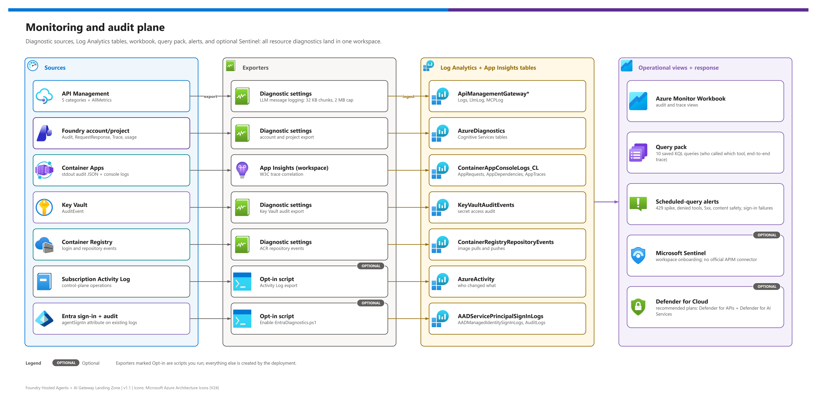
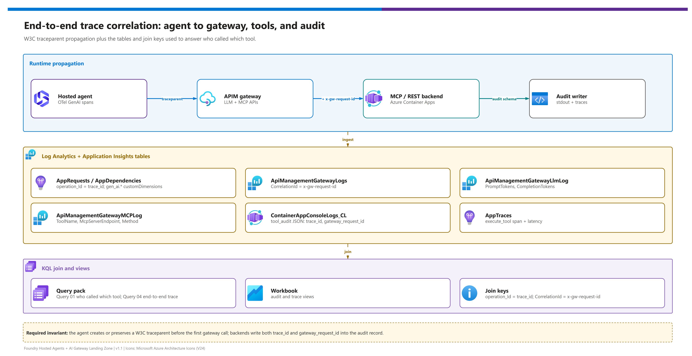

[README](../README.md) › [docs index](./00-reproduce-this-demo.md) › 09 Monitoring and audit

# 09 - Monitoring and audit

<p>
  &nbsp;
  &nbsp;
  &nbsp;
  &nbsp;
  &nbsp;
  &nbsp;
  &nbsp;
  &nbsp;
  &nbsp;
  &nbsp;
  
</p>

   

This is the **audit plane** of the landing zone: how a security, compliance or platform team proves *which human, through which agent, called which tool or model, at what time, with how many tokens, and whether the gateway allowed it*. It is written for platform engineers who operate the demo and for auditors or security architects who need to see the evidence trail before they approve a hosted-agent workload.

> [!IMPORTANT]
> **The auditor's question.** *"Last Tuesday a work order was created by an agent. Which person asked for it, which agent identity acted, which gateway and tool carried the call, what did the model cost in tokens, and was any control triggered?"*
> Every section below exists to answer that one question with a join across a handful of Log Analytics tables - without logging secrets or full tool payloads.

## At a glance

| | Item | What it gives you |
|---|---|---|
|  | **One workspace** | Gateway, container, Foundry, Key Vault, registry and (opt-in) Activity Log and Entra data land in a single Log Analytics workspace (`PerGB2018`, `LOG_RETENTION_DAYS`, default 90). |
|  | **Workspace-based Application Insights** | Agent and tool OpenTelemetry spans, plus the structured `tool_audit` record, share the same workspace. |
|  | **11 saved queries** | A query pack named `NN-slug` that answers the audit, usage, denial, trace, identity, control-plane, content-safety and Foundry questions. |
|  | **1 workbook, 7 tiles** | Token usage, gateway comparison, tool calls, denials, latency, LLM sample and end-to-end trace lookup. |
|  | **Up to 5 alerts** | Scheduled-query rules (severity 2) for throttling spikes, denied tools, 5xx, content-safety blocks and agent sign-in failures. |
|  | **Opt-in SIEM / CSPM path** | Microsoft Sentinel onboarding, Activity Log export and Entra diagnostics are single `azd env set` switches. |

## The audit plane

The picture below shows where each signal is produced and where it is stored. The two lanes - **gateway logs** (what the platform saw) and **application telemetry** (what the agent and tools said about themselves) - are joined on trace and correlation identifiers.

[](./assets/monitoring-audit-plane.png)

<sub>Editable source: [`assets/monitoring-audit-plane.drawio`](./assets/monitoring-audit-plane.drawio) - regenerate with `python scripts/export_diagrams.py docs/assets`.</sub>

[](./assets/trace-correlation.png)

<sub>Editable source: [`assets/trace-correlation.drawio`](./assets/trace-correlation.drawio) - regenerate with `python scripts/export_diagrams.py docs/assets`.</sub>

> [!NOTE]
> Both pictures describe the Standard v2 path end to end. The preview AI Gateway tier emits OpenTelemetry `gen_ai.*` data to Application Insights instead of APIM resource logs, so the same question is answered with query 11 plus the tool audit record (see [AI Gateway tier telemetry](#ai-gateway-tier-telemetry-preview)).

## Sources, categories and tables

Each Azure resource sends a defined set of log categories to the workspace through a diagnostic setting. Categories are the *switch*, tables are what you query. Resource-specific tables are used where the service supports them (`logAnalyticsDestinationType: Dedicated` on API Management).

| Source | Diagnostic setting / path | Categories enabled | Tables you query | Status |
|---|---|---|---|---|
|  **API Management (Standard v2)** | `apim-resource-logs` ([monitor reference](https://learn.microsoft.com/en-us/azure/api-management/monitor-api-management-reference)) | `GatewayLogs`, `GatewayLlmLogs`, `GatewayMCPLogs`, `WebSocketConnectionLogs`, `DeveloperPortalAuditLogs` + `AllMetrics` | `ApiManagementGatewayLogs`, `ApiManagementGatewayLlmLog`, `ApiManagementGatewayMCPLog` |  |
|  **Foundry account** | `foundry-account-logs` | `Audit`, `RequestResponse`, `Trace`, `AzureOpenAIRequestUsage`, `ManagedNetworkEvent` + `AllMetrics` | `AzureDiagnostics` (or resource-specific tables, depending on the account's destination type) |  |
|  **Foundry project** | `foundry-project-logs` | `Audit`, `Trace` | `AzureDiagnostics` |  |
|  **Container Apps environment** | `appLogsConfiguration` (workspace shared key) | Console and system logs for catalog MCP, records API and the optional agent-on-ACA | `ContainerAppConsoleLogs_CL` (contains the `tool_audit` JSON lines) |  |
|  **Key Vault** | `keyvault-audit` | `AuditEvent` | `AzureDiagnostics` |  |
|  **Container Registry** | `acr-logs` | `ContainerRegistryLoginEvents`, `ContainerRegistryRepositoryEvents` | `ContainerRegistryLoginEvents`, `ContainerRegistryRepositoryEvents` |  |
|  **Subscription Activity Log** | `modules/activity-log.bicep` ([activity log](https://learn.microsoft.com/en-us/azure/azure-monitor/essentials/activity-log)) | `Administrative`, `Security`, `Policy`, `ResourceHealth`, `Recommendation` | `AzureActivity` |  `ENABLE_ACTIVITY_LOG_EXPORT` |
|  **Microsoft Entra ID** | `scripts/Enable-EntraDiagnostics.ps1` (tenant level; needs a Security Administrator) | Service principal, managed identity and audit logs; agent sign-ins appear as an `agentSignIn` attribute ([Learn](https://learn.microsoft.com/en-us/entra/agent-id/sign-in-audit-logs-agents)) | `AADServicePrincipalSignInLogs`, `AADManagedIdentitySignInLogs`, `AuditLogs` |  `ENABLE_ENTRA_DIAGNOSTICS` |
|  **AI Gateway tier** | OpenTelemetry `gen_ai.*` to Application Insights ([Learn](https://learn.microsoft.com/en-us/azure/api-management/genai-gateway-capabilities)) | n/a - telemetry, not a diagnostic category | `AppDependencies`, `AppTraces`, `AppRequests` |   |
|  **Hosted agents and tools** | Application Insights exporter (`APPLICATIONINSIGHTS_CONNECTION_STRING`) | OTel spans `invoke_agent`, `chat`, `execute_tool`; `tool_audit` log lines | `AppTraces`, `AppDependencies`, `AppRequests` |  prompt and hosted agents ([Learn](https://learn.microsoft.com/en-us/azure/foundry/observability/concepts/trace-agent-concept)) |

> [!NOTE]
> There is **no Foundry Agent Service-specific diagnostic category**. Agent-level observability comes from OpenTelemetry traces exported to Application Insights; Foundry export is GA for prompt and hosted agents and Preview for workflow and external agents. The OpenTelemetry GenAI semantic conventions (`chat {model}`, `create_agent`, `invoke_agent {agent}`, `execute_tool {tool}`) are still marked *Development* upstream, so treat attribute names as subject to change ([OpenTelemetry GenAI](https://opentelemetry.io/docs/specs/semconv/gen-ai/)).

APIM's built-in analytics also gains a *Language models* view for token and model usage. It is useful for a quick look, but classic APIM analytics retires in March 2027, so the saved queries and workbook here deliberately rely on Log Analytics instead ([APIM monitoring](https://learn.microsoft.com/en-us/azure/api-management/monitor-api-management)).

## LLM message logging and privacy

 API Management can log the full prompt and completion text of every model call into `ApiManagementGatewayLlmLog` ([LLM logging](https://learn.microsoft.com/en-us/azure/api-management/api-management-howto-llm-logs)). The demo turns it on by default so query 06 has something to show.

| Setting | Value in this demo | Notes |
|---|---|---|
| Switch | `ENABLE_LLM_MESSAGE_LOGGING` (default `true`) | Sets APIM `largeLanguageModel` logging to `logs: enabled` and `messages: all`; `false` sets `disabled` / `none`. |
| Chunking | 32 KB (32,768-byte) chunks with sequence numbers | Large messages are split across rows and re-assembled by `CorrelationId`. |
| Platform cap | 2 MB per message (hard limit) | Separate from generic request/response body logging, which is limited to 8,192 bytes. |
| Demo cap | `maxSizeInBytes: 262144` (256 KB) for requests and responses | Set in `gateway-apimv2.bicep`; lower it further for shared environments. |
| Generic body logging | Disabled (`bytes: 0`) | Tool and REST payloads are not logged by the gateway. |

> [!WARNING]
> **Prompts and completions are customer data.** They can contain personal data, business secrets or confidential identifiers. Enable `ENABLE_LLM_MESSAGE_LOGGING` only in demo or approved audit scopes, restrict workspace access with Azure RBAC (the workspace is configured for resource-permission access), set `LOG_RETENTION_DAYS` deliberately, and set `ENABLE_LLM_MESSAGE_LOGGING=false` for any environment that carries real data. The `tool_audit` record never contains tokens or full payloads by design.

## Token metrics and dimensions

Token accounting has two layers: the **log** (`ApiManagementGatewayLlmLog`, per request) and the **metric** emitted by the gateway policy. The Standard v2 gateway uses the `llm-*` policy family ([llm-emit-token-metric](https://learn.microsoft.com/en-us/azure/api-management/llm-emit-token-metric-policy), [llm-token-limit](https://learn.microsoft.com/en-us/azure/api-management/llm-token-limit-policy)).

| Signal |  Where it is set | Dimensions / key | Used for |
|---|---|---|---|
| `llm-emit-token-metric` | Model API policy | Agent `appid`, user `oid`, API, subscription | Per-agent and per-user consumption in Azure Monitor metrics and workbook tile `token-usage`. |
| `llm-token-limit` | Model API policy | Counter key = validated `azp` claim; `TOKEN_LIMIT_TPM_PER_AGENT` (default 20,000 tokens per minute) | Per-agent throttling; a breach returns HTTP 429 and feeds the `token-limit-throttling-spike` alert. |
| `llm-content-safety` | Model API policy, gated by `ENABLE_CONTENT_SAFETY` | Content-safety backend | Blocks harmful prompts; surfaces in query 09 and the `content-safety-blocks` alert. |
| `ApiManagementGatewayLlmLog` | Diagnostic category `GatewayLlmLogs` | `CorrelationId`, `ModelName`, `PromptTokens`, `CompletionTokens`, `TotalTokens` | Per-request token audit; joined to the tool audit by `gateway_request_id`. |

> [!TIP]
> To attribute tokens to a person, join `ApiManagementGatewayLlmLog.CorrelationId` to the audit record's `gateway_request_id` (query 02 and query 01 do this for you). The `x-gw-user-oid` and `x-gw-agent-appid` headers added by APIM are the source of the dimensions.

## The audit record

Every tool backend (catalog MCP server and records API) writes **one JSON line** per call with `event: "tool_audit"`. It goes to `ContainerAppConsoleLogs_CL` and, where the agent exports telemetry, to `AppTraces`.

| Field |  Meaning |
|---|---|
| `timestamp`, `service`, `tool`, `operation` | When, which backend, which tool, which operation. |
| `trace_id`, `span_id`, `traceparent` | W3C trace context forwarded unchanged by the gateway. |
| `decision`, `reason` | `allowed` or `denied`, plus the policy reason. |
| `human_principal` | `{ oid }` of the delegated user, or `null` for autonomous calls. |
| `agent_principal` | `{ appid, oid, actor_facets }` of the calling agent identity. |
| `gateway_request_id` | APIM `context.RequestId` - the join key to the gateway tables. |
| `gateway` | `apimv2` when any `x-gw-*` identity header is present, `aigateway` when `x-gw-caller` is present, `null` when called directly. |
| `caller` | `aigw-runtime-key:agents` on the AI Gateway tier path; `null` otherwise. |
| `domain_profile`, `latency_ms`, `status_code` | Workload profile and result. |

Identity travels in the headers `x-gw-agent-appid`, `x-gw-agent-oid`, `x-gw-user-oid`, `x-gw-actor-facets` and `x-gw-request-id`; `traceparent` is forwarded unchanged.

> [!NOTE]
> On the AI Gateway tier the runtime key proves *possession* of a gateway-scoped key, not a principal. Expect `gateway = "aigateway"`, `caller = "aigw-runtime-key:agents"` and `agent_principal = null` - an honest limitation, not a defect. See [doc 11](./11-demo-walkthrough.md) for how to present it.

## Correlation join keys

| Key | Left side | Right side | Why it matters |
|---|---|---|---|
| `traceparent` / `trace_id` | Agent spans and `tool_audit` lines | `AppRequests.OperationId`, `AppDependencies.OperationId` | Connects the agent turn to the backend span. |
| `gateway_request_id` | `tool_audit.gateway_request_id` | `CorrelationId` on `ApiManagementGatewayLogs`, `ApiManagementGatewayLlmLog`, `ApiManagementGatewayMCPLog` | Connects the tool decision to the gateway row and the token spend. |
| `SessionId` | `ApiManagementGatewayMCPLog.SessionId` | MCP client session | Groups the calls of one MCP session. |
| Agent `appid` / user `oid` | Audit record and metric dimensions | `AADServicePrincipalSignInLogs.AppId`, `AuditLogs` | Ties a call to an Entra sign-in event when Entra export is enabled. |

## The saved queries

Eleven queries are deployed to a Log Analytics **query pack** by `modules/querypack.bicep` (names `NN-slug`, loaded with `loadTextContent` from `infra/monitoring/queries/`). Open the workspace in the portal, choose *Queries*, and filter by the pack ([query packs](https://learn.microsoft.com/en-us/azure/azure-monitor/logs/query-packs)). From a terminal, run any query with `python scripts/run_audit_queries.py --query 01` and `--trace-id <id>` for query 04.

The KQL blocks below are quoted verbatim from the files in `infra/monitoring/queries/`.

###  01 - Who called which tool

| | |
|---|---|
| **Saved query** | `01-who-called-which-tool` |
| **Purpose** | The headline audit question: human, agent, tool, decision, tokens and time in one row. |
| **Tables** | `ContainerAppConsoleLogs_CL`, `AppTraces`, `ApiManagementGatewayMCPLog`, `ApiManagementGatewayLlmLog` |

<details><summary><b>Show KQL</b></summary>

```kusto
// Question: who (human + agent) called which tool/backend, with tokens, when, and was it allowed? Tables: ContainerAppConsoleLogs_CL, AppTraces, ApiManagementGatewayMCPLog, ApiManagementGatewayLlmLog.
let ToolAudit =
    union isfuzzy=true
        (ContainerAppConsoleLogs_CL | project TimeGenerated, RawLog=tostring(Log_s)),
        (AppTraces | project TimeGenerated, RawLog=tostring(Message))
    | where RawLog has '"event":"tool_audit"'
    | extend audit = parse_json(RawLog)
    | project
        TimeGenerated,
        trace_id = tostring(audit.trace_id),
        service = tostring(audit.service),
        tool = tostring(audit.tool),
        operation = tostring(audit.operation),
        decision = tostring(audit.decision),
        reason = tostring(audit.reason),
        human_oid = tostring(audit.human_principal.oid),
        agent_appid = tostring(audit.agent_principal.appid),
        agent_oid = tostring(audit.agent_principal.oid),
        gateway_request_id = tostring(audit.gateway_request_id),
        status_code = toint(audit.status_code);
let GatewayTools =
    ApiManagementGatewayMCPLog
    | project McpTime=TimeGenerated, CorrelationId, ServerName, ToolName, Method, TransportType, Error;
let Tokens =
    ApiManagementGatewayLlmLog
    | summarize PromptTokens=sum(PromptTokens), CompletionTokens=sum(CompletionTokens), TotalTokens=sum(TotalTokens) by CorrelationId;
ToolAudit
| join kind=leftouter GatewayTools on $left.gateway_request_id == $right.CorrelationId
| join kind=leftouter Tokens on CorrelationId
| project TimeGenerated, trace_id, human_oid, agent_appid, agent_oid, service, tool=coalesce(tool, ToolName), operation=coalesce(operation, Method), decision, reason, status_code, PromptTokens, CompletionTokens, TotalTokens, ServerName, TransportType
| order by TimeGenerated desc
```

</details>

###  02 - Token usage by agent and user

| | |
|---|---|
| **Saved query** | `02-token-usage-by-agent-and-user` |
| **Purpose** | Token consumption per agent identity and delegated user, per model. |
| **Tables** | `ApiManagementGatewayLlmLog`, `AppTraces` |

<details><summary><b>Show KQL</b></summary>

```kusto
// Question: how many LLM tokens were consumed by agent and delegated user? Tables: ApiManagementGatewayLlmLog, AppTraces.
let AgentContext =
    AppTraces
    | where Message has "agent_appid" or tostring(Properties.agent_appid) != ""
    | project CorrelationId=tostring(Properties.gateway_request_id), agent_appid=tostring(Properties.agent_appid), user_oid=tostring(Properties.user_oid);
ApiManagementGatewayLlmLog
| summarize PromptTokens=sum(PromptTokens), CompletionTokens=sum(CompletionTokens), TotalTokens=sum(TotalTokens), Requests=count() by CorrelationId, ModelName
| join kind=leftouter AgentContext on CorrelationId
| summarize Requests=sum(Requests), PromptTokens=sum(PromptTokens), CompletionTokens=sum(CompletionTokens), TotalTokens=sum(TotalTokens) by agent_appid, user_oid, ModelName
| order by TotalTokens desc
```

</details>

###  03 - Denied and throttled requests

| | |
|---|---|
| **Saved query** | `03-denied-and-throttled-requests` |
| **Purpose** | Every 401/403/429 at the gateway, every MCP denial and every `denied` audit decision in one list. |
| **Tables** | `ApiManagementGatewayLogs`, `ApiManagementGatewayMCPLog`, `ContainerAppConsoleLogs_CL`, `AppTraces` |

<details><summary><b>Show KQL</b></summary>

```kusto
// Question: which gateway requests were denied or throttled? Tables: ApiManagementGatewayLogs, ApiManagementGatewayMCPLog, ContainerAppConsoleLogs_CL, AppTraces.
let AuditDenied =
    union isfuzzy=true
        (ContainerAppConsoleLogs_CL | project TimeGenerated, RawLog=tostring(Log_s)),
        (AppTraces | project TimeGenerated, RawLog=tostring(Message))
    | where RawLog has '"event":"tool_audit"'
    | extend audit=parse_json(RawLog)
    | where tostring(audit.decision) == "denied"
    | project TimeGenerated, Source="tool_audit", CorrelationId=tostring(audit.gateway_request_id), Status=toint(audit.status_code), Reason=tostring(audit.reason), Tool=tostring(audit.tool);
let GatewayDenied =
    ApiManagementGatewayLogs
    | extend ErrorText=tostring(column_ifexists("ErrorMessage", "")), BackendMessage=tostring(column_ifexists("BackendResponseMessage", ""))
    | where ResponseCode in (401, 403, 429) or BackendResponseCode in (401, 403, 429)
    | project TimeGenerated, Source="apim", CorrelationId, Status=coalesce(ResponseCode, BackendResponseCode), Reason=coalesce(ErrorText, BackendMessage), Tool="";
let McpDenied =
    ApiManagementGatewayMCPLog
    | where Error has_any ("Forbidden", "throttl", "Unauthorized") or ErrorType has_any ("Forbidden", "Throttled", "Unauthorized")
    | project TimeGenerated, Source="mcp", CorrelationId, Status=int(null), Reason=Error, Tool=ToolName;
union AuditDenied, GatewayDenied, McpDenied
| order by TimeGenerated desc
```

</details>

###  04 - End-to-end trace

| | |
|---|---|
| **Saved query** | `04-end-to-end-trace` (parameter `traceId`) |
| **Purpose** | Every known hop for a W3C trace id or an APIM correlation id, ordered by time. Powers the workbook trace lookup. |
| **Tables** | `AppRequests`, `AppDependencies`, `AppTraces`, `ApiManagementGatewayLogs`, `ApiManagementGatewayMCPLog`, `ApiManagementGatewayLlmLog` |

<details><summary><b>Show KQL</b></summary>

```kusto
// Question: show every known hop for a trace or APIM correlation id. Tables: AppRequests, AppDependencies, AppTraces, ApiManagementGatewayLogs, ApiManagementGatewayMCPLog, ApiManagementGatewayLlmLog.
declare query_parameters(traceId:string = "");
union isfuzzy=true
    (AppRequests | project TimeGenerated, Source="AppRequests", Name, OperationId, ParentId, CorrelationId="", Message=tostring(Success), DurationMs=DurationMs, Properties),
    (AppDependencies | project TimeGenerated, Source="AppDependencies", Name, OperationId, ParentId, CorrelationId="", Message=tostring(Success), DurationMs=DurationMs, Properties),
    (AppTraces | project TimeGenerated, Source="AppTraces", Name=tostring(Properties["span.name"]), OperationId, ParentId, CorrelationId=tostring(Properties.gateway_request_id), Message, DurationMs=real(null), Properties),
    (ApiManagementGatewayLogs | project TimeGenerated, Source="ApiManagementGatewayLogs", Name=ApiId, OperationId="", ParentId="", CorrelationId, Message=strcat(ResponseCode, " ", ErrorMessage), DurationMs, Properties=pack_all()),
    (ApiManagementGatewayMCPLog | project TimeGenerated, Source="ApiManagementGatewayMCPLog", Name=ToolName, OperationId="", ParentId="", CorrelationId, Message=Error, DurationMs=real(null), Properties=pack_all()),
    (ApiManagementGatewayLlmLog | project TimeGenerated, Source="ApiManagementGatewayLlmLog", Name=ModelName, OperationId="", ParentId="", CorrelationId, Message=strcat("tokens=", TotalTokens), DurationMs=real(null), Properties=pack_all())
| where isempty(traceId) or OperationId == traceId or ParentId == traceId or CorrelationId == traceId or tostring(Properties.trace_id) == traceId
| order by TimeGenerated asc
```

</details>

###  05 - MCP tool calls

| | |
|---|---|
| **Saved query** | `05-mcp-tool-calls` |
| **Purpose** | Which MCP servers and tools were invoked through APIM, over which transport, by which client, with which error. |
| **Tables** | `ApiManagementGatewayMCPLog` |

<details><summary><b>Show KQL</b></summary>

```kusto
// Question: what MCP tools were called through APIM? Tables: ApiManagementGatewayMCPLog.
ApiManagementGatewayMCPLog
| project TimeGenerated, CorrelationId, ServerName, McpServerEndpoint, ToolName, Method, TransportType, SessionId, ClientName, ClientVersion, Error, ErrorType
| order by TimeGenerated desc
```

</details>

###  06 - LLM prompts and completions

| | |
|---|---|
| **Saved query** | `06-llm-prompts-and-completions` |
| **Purpose** | The 100 most recent LLM message logs with token accounting. Sensitive - see the [privacy warning](#llm-message-logging-and-privacy). |
| **Tables** | `ApiManagementGatewayLlmLog` |

<details><summary><b>Show KQL</b></summary>

```kusto
// Question: sample LLM message logs and token accounting. Tables: ApiManagementGatewayLlmLog.
ApiManagementGatewayLlmLog
| extend
    ModelName = tostring(column_ifexists("ModelName", column_ifexists("Model", ""))),
    PromptTokens = toint(column_ifexists("PromptTokens", int(null))),
    CompletionTokens = toint(column_ifexists("CompletionTokens", int(null))),
    TotalTokens = toint(column_ifexists("TotalTokens", int(null))),
    PromptMessages = tostring(column_ifexists("PromptMessages", column_ifexists("RequestMessages", ""))),
    CompletionMessages = tostring(column_ifexists("CompletionMessages", column_ifexists("ResponseMessages", "")))
| project TimeGenerated, CorrelationId, ModelName, PromptTokens, CompletionTokens, TotalTokens, PromptMessages, CompletionMessages
| order by TimeGenerated desc
| take 100
```

</details>

###  07 - Agent identity sign-ins

| | |
|---|---|
| **Saved query** | `07-agent-identity-sign-ins` |
| **Purpose** | Service principal and managed identity sign-ins, plus audit events that mention an agent. Returns rows only after Entra export is enabled (`ENABLE_ENTRA_DIAGNOSTICS`). |
| **Tables** | `AADServicePrincipalSignInLogs`, `AADManagedIdentitySignInLogs`, `AuditLogs` |

<details><summary><b>Show KQL</b></summary>

```kusto
// Question: which agent-related service principal or managed identity sign-ins succeeded/failed? Tables: AADServicePrincipalSignInLogs, AADManagedIdentitySignInLogs, AuditLogs.
union isfuzzy=true
    (AADServicePrincipalSignInLogs | project TimeGenerated, Source="ServicePrincipal", ServicePrincipalId, ServicePrincipalName, AppId, ResourceDisplayName, ResultType, ResultDescription, IPAddress, ConditionalAccessStatus),
    (AADManagedIdentitySignInLogs | project TimeGenerated, Source="ManagedIdentity", ServicePrincipalId, ServicePrincipalName, AppId, ResourceDisplayName, ResultType, ResultDescription, IPAddress, ConditionalAccessStatus),
    (AuditLogs | where tostring(TargetResources) has "agent" or OperationName has "agent" | project TimeGenerated, Source="Audit", ServicePrincipalId="", ServicePrincipalName=OperationName, AppId="", ResourceDisplayName=tostring(TargetResources), ResultType=tostring(Result), ResultDescription=tostring(ResultReason), IPAddress="", ConditionalAccessStatus="")
| order by TimeGenerated desc
```

</details>

###  08 - Control-plane changes

| | |
|---|---|
| **Saved query** | `08-control-plane-changes` |
| **Purpose** | Who changed the gateway, Foundry, Key Vault, Container Apps or monitoring resources. Requires `ENABLE_ACTIVITY_LOG_EXPORT`. |
| **Tables** | `AzureActivity` |

<details><summary><b>Show KQL</b></summary>

```kusto
// Question: who changed gateway, Foundry, Key Vault, Container Apps, or monitoring resources? Tables: AzureActivity.
AzureActivity
| where ResourceProviderValue in~ ("MICROSOFT.APIMANAGEMENT", "MICROSOFT.COGNITIVESERVICES", "MICROSOFT.APP", "MICROSOFT.KEYVAULT", "MICROSOFT.INSIGHTS", "MICROSOFT.OPERATIONALINSIGHTS")
| project TimeGenerated, Caller, OperationNameValue, ActivityStatusValue, ResourceGroup, ResourceProviderValue, ResourceId, CorrelationId, Properties
| order by TimeGenerated desc
```

</details>

###  09 - Content-safety blocks

| | |
|---|---|
| **Saved query** | `09-content-safety-blocks` |
| **Purpose** | Requests blocked by gateway or model content-safety controls. |
| **Tables** | `ApiManagementGatewayLogs`, `ApiManagementGatewayLlmLog`, `AppTraces` |

<details><summary><b>Show KQL</b></summary>

```kusto
// Question: which requests were blocked by gateway or model content-safety controls? Tables: ApiManagementGatewayLogs, ApiManagementGatewayLlmLog, AppTraces.
union isfuzzy=true
    (ApiManagementGatewayLogs | where ErrorMessage has_any ("content safety", "content_filter", "jailbreak", "blocked") | project TimeGenerated, Source="APIM", CorrelationId, Detail=ErrorMessage, ApiId, ResponseCode),
    (ApiManagementGatewayLlmLog | where tostring(PromptMessages) has_any ("content_filter", "blocked") or tostring(CompletionMessages) has_any ("content_filter", "blocked") | project TimeGenerated, Source="LLM", CorrelationId, Detail=strcat("tokens=", TotalTokens), ApiId="", ResponseCode=int(null)),
    (AppTraces | where Message has_any ("content safety", "content_filter", "blocked") | project TimeGenerated, Source="AppTraces", CorrelationId=tostring(Properties.gateway_request_id), Detail=Message, ApiId="", ResponseCode=int(null))
| order by TimeGenerated desc
```

</details>

###  10 - Foundry audit

| | |
|---|---|
| **Saved query** | `10-foundry-audit` |
| **Purpose** | Foundry account and project audit and trace events, plus agent spans in Application Insights. |
| **Tables** | `AzureDiagnostics`, `AppTraces` |

<details><summary><b>Show KQL</b></summary>

```kusto
// Question: what Foundry account/project audit and trace events occurred? Tables: AzureDiagnostics, AppTraces.
union isfuzzy=true
    (AzureDiagnostics | where ResourceProvider == "MICROSOFT.COGNITIVESERVICES" | project TimeGenerated, Source="AzureDiagnostics", Category, OperationName, ResultType, CorrelationId, ResourceId, Detail=properties_s),
    (AppTraces | where tostring(Properties["service.name"]) has_any ("foundry", "agent") or Message has_any ("invoke_agent", "execute_tool", "chat") | project TimeGenerated, Source="AppTraces", Category=tostring(Properties.Category), OperationName=tostring(Properties["span.name"]), ResultType=tostring(Properties.Success), CorrelationId=tostring(Properties.gateway_request_id), ResourceId=tostring(Properties.ResourceId), Detail=Message)
| order by TimeGenerated desc
```

</details>

###  11 - AI Gateway tier telemetry

| | |
|---|---|
| **Saved query** | `11-ai-gateway-tier-telemetry` |
| **Purpose** | Compares preview AI Gateway tier OpenTelemetry GenAI telemetry with Standard v2 LLM logs, per hour, model and operation. |
| **Tables** | `AppDependencies`, `AppTraces`, `AppRequests`, `ApiManagementGatewayLlmLog` |
| **Status** |  Columns marked `verify_after_live_deploy` need validation against live tier telemetry. |

<details><summary><b>Show KQL</b></summary>

```kusto
// Question: how does preview AI Gateway tier OpenTelemetry GenAI telemetry compare with Standard v2 APIM LLM logs? Tables: AppDependencies, AppTraces, AppRequests, ApiManagementGatewayLlmLog. Columns marked verify_after_live_deploy require live AI Gateway tier telemetry validation.
let TierGenAi =
    union isfuzzy=true AppDependencies, AppTraces, AppRequests
    | extend props = todynamic(Properties)
    | where bag_keys(props) has_any ("gen_ai.request.model", "gen_ai.response.model", "gen_ai.operation.name", "gen_ai.token.type")
        or tostring(Name) has "gen_ai"
        or tostring(Message) has "gen_ai"
    | extend Gateway = "aigateway-tier",
             Model = coalesce(tostring(props["gen_ai.request.model"]), tostring(props["gen_ai.response.model"]), tostring(props["gen_ai.model"]), "verify_after_live_deploy"),
             Operation = coalesce(tostring(props["gen_ai.operation.name"]), tostring(props["gen_ai.operation"]), "verify_after_live_deploy"),
             TokenType = coalesce(tostring(props["gen_ai.token.type"]), tostring(props["gen_ai.usage.token_type"]), "verify_after_live_deploy"),
             TokenCount = todouble(coalesce(props["gen_ai.usage.input_tokens"], props["gen_ai.usage.output_tokens"], props["gen_ai.usage.total_tokens"], props["token_count"], 0)),
             CorrelationId = coalesce(tostring(OperationId), tostring(props["trace_id"]), tostring(props["correlation_id"]));
let StandardV2 =
    ApiManagementGatewayLlmLog
    | extend Gateway = "apim-standard-v2",
             Model = tostring(ModelName),
             Operation = "chat-or-responses",
             TokenType = "total",
             TokenCount = todouble(TotalTokens),
             CorrelationId = tostring(CorrelationId);
union isfuzzy=true TierGenAi, StandardV2
| summarize Requests=count(), Tokens=sum(TokenCount) by Gateway, Model, Operation, TokenType, bin(TimeGenerated, 1h)
| order by TimeGenerated desc, Gateway asc
```

</details>

## AI Gateway tier telemetry (preview)

   The AI Gateway tier is observed through OpenTelemetry `gen_ai.*` attributes sent to the connected Application Insights resource, not through APIM diagnostic categories.

> [!CAUTION]
> No diagnostic setting is deployed for the tier because the resource-log categories were **not verified**. Query 11 is therefore defensive (`isfuzzy=true`, `verify_after_live_deploy` placeholders). Do not present its column names as final until the live report confirms them, and do not claim the tier provides Entra-validated caller identity: it authenticates with a gateway-scoped runtime `api-key`.

MCP calls recorded in Application Insights carry `api.type == "Mcp"`, `gen_ai.operation.name`, `gen_ai.tool.name` and `gen_ai.conversation.id`; payload logging is off by default. Never read `context.Response.Body` in an MCP policy - it buffers the response and breaks streaming ([MCP in API Management](https://learn.microsoft.com/en-us/azure/api-management/mcp-server-overview)).

## Workbook

 The workbook (`infra/monitoring/workbook.json`, *Notebook/1.0*, deployed by `modules/workbook.bicep`) has a title tile and seven query tiles. Open it from the `WORKBOOK_ID` output ([workbooks](https://learn.microsoft.com/en-us/azure/azure-monitor/visualize/workbooks-overview)).

| Tile | Title | Answers | Backed by |
|---|---|---|---|
| `token-usage` | Token usage by model / agent dimension | Who is spending tokens on which model? | `ApiManagementGatewayLlmLog` |
| `standard-v2-vs-aigw-tier` | Standard v2 vs AI Gateway tier token usage | Do both gateway lanes meter similarly? | Query 11 |
| `tool-calls` | Tool calls by server and tool | Which tools are hot? | `ApiManagementGatewayMCPLog` |
| `denied-throttled` | Denied and throttled | Where are controls firing? | Query 03 |
| `latency-5xx` | Gateway latency and 5xx (P95 + failures) | Is the gateway healthy? | `ApiManagementGatewayLogs` |
| `llm-sample` | LLM log sample | What do prompts and completions look like? | Query 06 |
| `trace-lookup` | End-to-end trace lookup (`{traceId}` parameter) | What happened to one request? | Query 04 |

## Alerts

 `modules/alerts.bicep` creates scheduled-query rules ([log search alerts](https://learn.microsoft.com/en-us/azure/azure-monitor/alerts/alerts-types#log-alerts)) when `ENABLE_ALERTS=true`. All rules use **severity 2**, evaluate every 5 minutes (`PT5M`) over a 15-minute window (`PT15M`). An action group `ag-hosted-agent-gateway` is created only when `ALERT_EMAIL` is set; without it the rules still fire and are visible in the portal.

| Alert | Icon | Condition | Threshold | Severity |
|---|---|---|---|---|
| `token-limit-throttling-spike` |  | HTTP 429 on an API whose id contains `llm` | 5 or more | 2 |
| `denied-tool-calls` |  | MCP error `Forbidden`, or HTTP 401/403 | 1 or more | 2 |
| `gateway-5xx-rate` |  | HTTP 5xx at the gateway | 3 or more | 2 |
| `content-safety-blocks` |  | Error message mentions `content`, or backend 403 | 1 or more | 2 |
| `agent-sign-in-failures` |  | `ResultType != 0` on service principal or managed identity sign-ins. Created only when `ENABLE_ENTRA_DIAGNOSTICS=true` | 1 or more | 2 |

## Optional: Microsoft Sentinel and Defender for Cloud

 The demo prepares the workspace for a SIEM and recommends - but does not deploy - Defender plans.

| Product | What it adds | Status | In this demo |
|---|---|---|---|
|  **Microsoft Sentinel** ([overview](https://learn.microsoft.com/en-us/azure/sentinel/overview)) | SIEM / SOAR on the same workspace |  | `ENABLE_SENTINEL=true` onboards the workspace (`modules/sentinel.bicep`). |
|  **Sentinel "OpenAI" solution** ([source](https://github.com/Azure/Azure-Sentinel/tree/master/Solutions/OpenAI)) | Content for Azure OpenAI audit data | Content-hub solution | Install manually; not deployed. |
|  **Sentinel "Agent 365" connector** | Agent activity from Microsoft Agent 365 | GA / Preview status not stated in sources checked | Install manually; not deployed. |
|  **APIM connector** | - | There is **no official Sentinel connector for API Management**; only a third-party ISV solution exists. | Query the workspace tables directly instead. |
|  **Defender for APIs** ([intro](https://learn.microsoft.com/en-us/azure/defender-for-cloud/defender-for-apis-introduction)) | API threat detection and posture |  (since 2023) | Recommended subscription plan. |
|  **Defender for AI Services** ([AI threat protection](https://learn.microsoft.com/en-us/azure/defender-for-cloud/ai-threat-protection)) | Runtime threat protection for Foundry / Azure OpenAI |  | Recommended subscription plan. |
|  **Threat protection for AI agents** | Agent-level threat detection |  | Recommended; evaluate before relying on it. |

> [!NOTE]
> Defender plans are **subscription-level** choices with their own cost. The demo does not enable them, so the demo can run in a subscription where you do not own security policy.

## Retention and cost

 Monitoring cost is dominated by ingestion volume ([Azure Monitor pricing](https://azure.microsoft.com/pricing/details/monitor/)). The demo makes the main drivers explicit switches.

| Driver | Control | Default | Cost / risk note |
|---|---|---|---|
| Workspace retention | `LOG_RETENTION_DAYS` | `90` | Longer retention increases storage cost; raise it only to meet an audit requirement. |
| LLM prompt and completion text | `ENABLE_LLM_MESSAGE_LOGGING` | `true` | Largest single ingestion driver and a privacy risk; disable for real workloads. |
| GenAI telemetry from agents and tier | Application Insights sampling | Not configured | Spans per tool call add up under load; sample in production. |
| Activity Log export | `ENABLE_ACTIVITY_LOG_EXPORT` | `false` | Five categories at subscription scope; low volume, high audit value. |
| Entra diagnostics | `ENABLE_ENTRA_DIAGNOSTICS` | `false` | Tenant-wide sign-in logs can be high volume. |
| Sentinel | `ENABLE_SENTINEL` | `false` | Adds per-GB Sentinel analytics cost on top of ingestion. |
| Alerts | `ENABLE_ALERTS`, `ALERT_EMAIL` | `true`, blank | Scheduled-query rules are billed per evaluation. |

## Worked example: "who called which tool?"

Scenario: a field operator asks the agent to create a work order after checking part availability. Query 01 returns one row per tool call. The values below are **illustrative** (identifiers shortened).

| Time (UTC) | Human `oid` | Agent `appid` | Gateway | Tool | Decision | Tokens | Trace |
|---|---|---|---|---|---|---|---|
| 14:02:11 | `1111...` | `aaaa...` | `apimv2` | `check_availability` | allowed | 412 | `4bf9...` |
| 14:02:19 | `1111...` | `aaaa...` | `apimv2` | `create_record` | allowed | 655 | `4bf9...` |
| 14:03:40 | `1111...` | `aaaa...` | `apimv2` | `delete_record` | **denied** (not on the allow-list) | 0 | `71c2...` |

<table>
<tr>
<td width="56"></td>
<td><b>How to read it.</b> The <i>human</i> column comes from the delegated user (<code>x-gw-user-oid</code>), the <i>agent</i> column from the agent identity (<code>x-gw-agent-appid</code>). The <code>trace</code> value is the key you paste into query 04 (or the workbook trace tile) to see the model call, the MCP call, the backend span and the gateway row on one timeline.</td>
</tr>
</table>

1. Run `python scripts/run_audit_queries.py --ids demo-ids.local.json --query 01` and pick a row.
2. Copy its `trace_id`, then run `python scripts/run_audit_queries.py --ids demo-ids.local.json --query 04 --trace-id <trace_id>`.
3. Confirm the denied call also appears in query 03 and, with alerts enabled, as a `denied-tool-calls` alert.

> [!TIP]
> If query 01 shows `agent_principal` empty with `caller = aigw-runtime-key:agents`, the call went through the preview AI Gateway tier - the expected, documented limitation. Switch to query 11 for token and model telemetry on that lane.

## Live evidence (2026-10-01)

> [!NOTE]
> **Pending.** A live deployment test is running; its screenshots and charts are added to this section when the run completes. Until then the saved queries, workbook and alerts above are verified by the deployment templates and static tests, and query 11 column names remain `verify_after_live_deploy`.

Next: [10 - Enterprise posture and scale](./10-enterprise-posture-and-scale.md) →

---

*Last updated: 2026-10-02*
