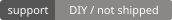
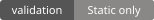
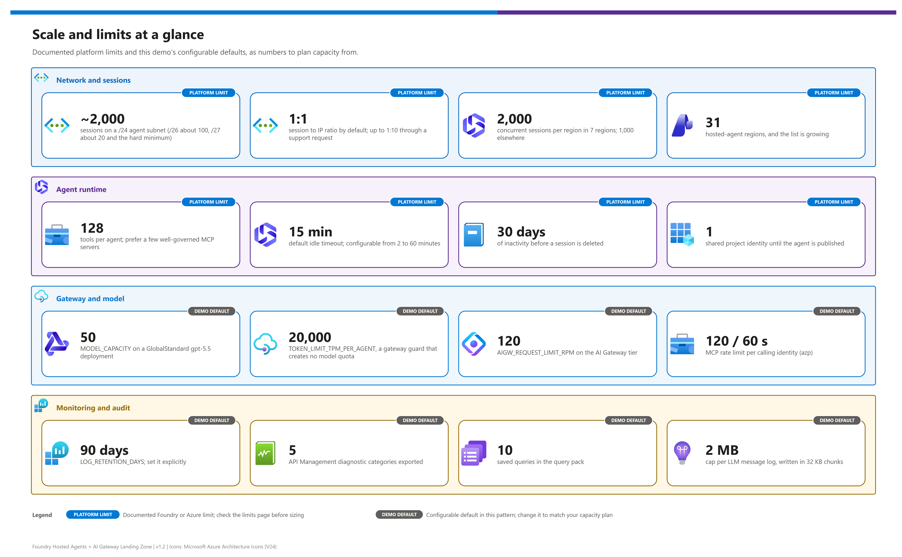

[README](../README.md) › [docs index](./00-reproduce-this-demo.md) › 10 Enterprise posture and scale

# 10 - Enterprise posture and scale

<p>
  &nbsp;
  &nbsp;
  &nbsp;
  &nbsp;
  &nbsp;
  &nbsp;
  &nbsp;
  &nbsp;
  &nbsp;
  &nbsp;
  
</p>

     

This document describes the **enterprise posture** of the hosted-agent and dual-gateway pattern: how traffic is isolated when `NETWORK_ISOLATION=true`, what the platform limits are, how the two gateways differ in private networking, and which parts of delivery (CI/CD, one-project-per-tier) remain your responsibility. It is for the network, security and platform architects who must say *yes* or *not yet* to a private deployment.

## At a glance

| | Topic | Bottom line |
|---|---|---|
|  | **Default vs isolated** | Default is public endpoints with Entra auth (demo friendly, live-tested ). `NETWORK_ISOLATION=true`  adds a VNet `10.40.0.0/16`, delegated subnets, nine private DNS zones, private endpoints and the Foundry standard agent setup. |
|  | **What is private** | Foundry account, Key Vault, Container Registry (Premium), Cosmos DB, Storage and AI Search get private endpoints with DNS zone groups, and public access is off. APIM v2 and the AI Gateway tier get inbound private endpoints, but their public access stays on until you lock it down (see [known gaps](#known-gaps)). |
|  | **Hosted agent endpoint** | The agent endpoint itself cannot be made private through azd today. |
|  | **Two gateways, two answers** | Standard v2 and the AI Gateway tier () have different private-networking options; one setting does not secure both. |
|  | **Key Vault under policy** | Hosted agents run outside your VNet, so a subscription policy that turns Key Vault public access off returns `ForbiddenByConnection`. Isolation mode is the proper fix; `AIGW_KEY_DELIVERY=env` is the demo-only escape hatch ([07](./07-identity-auth-traceability.md#key-vault-access-under-network-policy)). |
|  | **Delivery** | No first-party hosted-agent CI/CD exists; the demo ships a do-it-yourself workflow. |

## The network path

[](./assets/network-topology.png)

<sub>Editable source: [`assets/network-topology.drawio`](./assets/network-topology.drawio) - regenerate with `python scripts/export_diagrams.py docs/assets`.</sub>

A request crosses five hops. Each hop has a different privacy control, which is why "private" is never a single switch.

| Step | | Hop | Control | Validation |
|---|---|---|---|---|
| 1 |  | **Client to gateway** | Public endpoint or inbound private endpoint on the gateway (see the [SKU table](#api-management-v2-networking)). | - [ ] The gateway host resolves to a private IP from the client network when inbound private access is required. |
| 2 |  | **Agent runtime to gateway** | Hosted-agent sessions run in dedicated micro-VMs; with a BYO VNet they use the delegated agent subnet and a platform data proxy ([networking deep dive](https://learn.microsoft.com/en-us/azure/foundry/agents/concepts/agents-networking-deep-dive)). | - [ ] Agent calls carry `traceparent` and identity headers to the gateway. |
| 3 |  | **Gateway to model** | Managed identity of the gateway calls the Foundry model deployment (no keys). | - [ ] No API key for the model exists in policy or configuration. |
| 4 |  | **Gateway to tools** | APIM outbound VNet integration reaches the internal Container Apps environment (`snet-aca`), resolved through a private DNS zone named after the environment default domain. | - [ ] Tool backends are not reachable from the internet. |
| 5 |  | **Platform to state** | Cosmos DB, Storage and AI Search are reached over private endpoints from `snet-private-endpoints`. | - [ ] `publicNetworkAccess` is `Disabled` on all three. |

### Gateway comparison per hop

| Hop |  APIM Standard v2 |  AI Gateway tier (preview) | Recommendation |
|---|---|---|---|
| Client to gateway | Public endpoint, or inbound private endpoint (Standard v2 and Premium v2). | Inbound Private Link / private endpoint,  | Use private endpoints when policy requires private ingress. |
| Gateway to backends | Outbound VNet integration (Standard v2 / Premium v2); VNet injection on Premium v2 only. | Outbound VNet integration,  subnet must be same region, dedicated, at least `/27` (`/24` recommended), delegated to `Microsoft.Web/serverFarms`. | Plan a separate subnet for each gateway. |
| Gateway to model | Managed identity to the Foundry model backend. | Managed identity with the Foundry User role. | Managed identity is preferred for both. |
| Gateway to tools | APIM to Container Apps / private backends. | Remote MCP / OpenAPI / connectors. | Confirm reachability from the selected gateway subnet. |

Sources: [AI Gateway tier private networking](https://learn.microsoft.com/en-us/azure/api-management/ai-gateway-configure-private-networking), [APIM v2 tiers](https://learn.microsoft.com/en-us/azure/api-management/v2-service-tiers-overview).

## What `NETWORK_ISOLATION=true` deploys

  The flag is read by `infra/main.bicep` and drives `modules/network.bicep`, `private-dns.bicep`, `private-endpoint.bicep`, `foundry-private.bicep`, `foundry-agent-byo*.bicep`, `aca-private-dns.bicep` and the network arguments of the Foundry, Key Vault, Container Apps and gateway modules. Subnet prefixes are the `*_SUBNET_PREFIX` variables in [doc 12](./12-configuration-reference.md). Validated with `az bicep build` and a `what-if` (127 resources, no errors); **not deployed live** - the v1.2 live run used the default public posture.

| Resource | Setting when isolated | Deployed by the template |
|---|---|---|
|  **Virtual network** `vnet-<prefix>` | `10.40.0.0/16` (`VNET_ADDRESS_PREFIX`) | ✅ |
|  **`snet-agent`** | `10.40.0.0/24`, delegated to `Microsoft.App/environments`; bound to the Foundry account through `networkInjections` (`scenario: agent`) | ✅ |
|  **`snet-aca`** | `10.40.2.0/23`, delegated to `Microsoft.App/environments`; the Container Apps environment is created `internal`, with a private DNS zone for its default domain | ✅ |
|  **`snet-apim`** | `10.40.4.0/27`, delegated to `Microsoft.Web/serverFarms`; APIM `virtualNetworkConfiguration` points to it | ✅ |
|  **`snet-aigw`** | `10.40.6.0/27` (`AIGW_SUBNET_PREFIX`), delegated to `Microsoft.Web/serverFarms`, NSG allowing outbound 443 to `Storage` and `AzureKeyVault`; AI Gateway tier outbound VNet integration (same region as the VNet only) | ✅  |
|  **`snet-private-endpoints`** | `10.40.5.0/24`, private-endpoint network policies disabled | ✅ |
|  **Storage account** | Public access disabled, shared-key access off, TLS 1.2, private endpoint (`blob`) + DNS zone group | ✅ |
|  **AI Search** (`standard`) | Public access disabled, local auth off, private endpoint (`searchService`) + DNS zone group | ✅ |
|  **Cosmos DB** | Public access disabled, local auth off, private endpoint (`Sql`) + DNS zone group | ✅ |
|  **Foundry account** | `publicNetworkAccess: Disabled`, `networkAcls` deny, agent-subnet `networkInjections`; private endpoint (`account`) with the three Cognitive Services DNS zones | ✅ |
|  **Foundry project (standard agent setup)** | Connections to the three BYO resources, project identity roles, project capability host `caphostproj`, then the post-capability-host Blob Data Owner (ABAC) and Cosmos data-plane roles | ✅ |
|  **Key Vault** | `publicNetworkAccess: Disabled`, `networkAcls` deny with `AzureServices` bypass; private endpoint (`vault`) | ✅ |
|  **Container Registry** | `Premium` (private endpoints need it; `Standard` when not isolated), `publicNetworkAccess: Disabled`, `AzureServices` bypass; private endpoint (`registry`) | ✅ |
|  **APIM v2 inbound** | Private endpoint (`Gateway`) into `privatelink.azure-api.net`; public access left `Enabled` (it can only be disabled after the endpoint exists) | ✅ lock-down is a [post-provision step](#known-gaps) |
|  **AI Gateway tier inbound** | Private endpoint (`Gateway`) plus outbound VNet integration; skip the endpoint with `AIGW_INBOUND_PRIVATE_ENDPOINT=false` | ✅  cannot be proven by what-if |
|  **Private DNS zones** (9, linked to the VNet) | `privatelink.cognitiveservices.azure.com`, `privatelink.openai.azure.com`, `privatelink.services.ai.azure.com`, `privatelink.vaultcore.azure.net`, `privatelink.azurecr.io`, `privatelink.azure-api.net`, `privatelink.documents.azure.com`, `privatelink.blob.core.windows.net`, `privatelink.search.windows.net` | ✅ |

> [!WARNING]
> **Public access is off, so your workstation is locked out.** `azd deploy` (registry push), `az keyvault secret ...` and Foundry data-plane calls only work from **inside the VNet**: use a self-hosted runner, jump box or Bastion VM, or a VPN into the peered network. As a temporary break-glass you can allow your IP or re-enable public access on the registry, then revert. The post-provision hook skips the Key Vault data-plane write (Bicep writes the AI Gateway runtime key through ARM) and prints these instructions instead of failing silently.

> [!NOTE]
> Private ACR is only supported for Foundry projects **created after 2026-06-25**; older projects need a publicly reachable registry ([private ACR](https://learn.microsoft.com/en-us/azure/foundry/agents/how-to/deploy-hosted-agent-private-azure-container-registry)). The hosted-agent endpoint itself cannot be made private through azd.

> [!NOTE]
> **Cost.** Isolation adds Premium Container Registry (higher daily rate than Standard), six to eight private endpoints (billed hourly plus data processed), nine private DNS zones plus one for Container Apps, and an NSG. Use the [Azure pricing calculator](https://azure.microsoft.com/pricing/calculator/) for current prices.

## Egress options, BYO resources and encryption

Foundry describes egress as a taxonomy, **not** as Basic/Standard tiers ([networking options](https://learn.microsoft.com/en-us/azure/foundry/agents/concepts/networking-options)):

| Option |  Meaning | Status |
|---|---|---|
| Public egress | Default; agent traffic leaves over the platform's public path. |  |
| BYO VNet | Hosted agents get micro-VMs on your delegated subnet; outbound goes through a platform data proxy per project. |  |
| Managed VNet | Full isolation managed by the platform. | Capability settings use API `2026-07-15-preview` |
| Standard setup with private networking | BYO Cosmos DB, Storage and AI Search plus private endpoints. This is the pattern `foundry-private.bicep` and `foundry-agent-byo.bicep` follow. |  |

| BYO resource |  Project connection | Created by this demo when isolated | Private endpoint |
|---|---|---|---|
|  **Cosmos DB** | `CosmosDB` (thread storage) | `cosmos-<prefix>-<hash>` | ✅ `Sql` |
|  **Storage** | `AzureStorageAccount` (files) | `st<prefix><hash>` | ✅ `blob` |
|  **AI Search** | `CognitiveSearch` (vector store) | `srch-<prefix>-<hash>` | ✅ `searchService` |

Private endpoints are **not created automatically** by Foundry for these dependencies ([configure private link](https://learn.microsoft.com/en-us/azure/foundry/how-to/configure-private-link)); this demo creates them and the DNS zone groups. The project capability host binds the three connections, and the account-level capability host is created automatically from `networkInjections`. **Customer-managed keys (CMK)** are GA at the Foundry account level; CMK on the BYO dependencies relies on each service's own CMK feature, with no integrated pipeline documented ([encryption keys](https://learn.microsoft.com/en-us/azure/foundry/concepts/encryption-keys-portal)). The demo does not enable CMK.

> [!TIP]
> Reference templates live in `microsoft-foundry/foundry-samples` under `infrastructure/infrastructure-setup-bicep/`: `15-private-network-standard-agent-setup` (the pattern adapted here), `16-private-network-standard-agent-apim-setup`, `25-entraid-passthrough`, and `30`/`31`/`32` `customer-managed-keys*`.

## Scale numbers

[](./assets/scale-limits-infographic.png)

<sub>Editable source: [`assets/scale-limits-infographic.drawio`](./assets/scale-limits-infographic.drawio) - regenerate with `python scripts/export_diagrams.py docs/assets`.</sub>

Plan capacity from the documented limits, not from the demo's defaults ([networking deep dive](https://learn.microsoft.com/en-us/azure/foundry/agents/concepts/agents-networking-deep-dive), [limits, quotas and regions](https://learn.microsoft.com/en-us/azure/foundry/agents/concepts/limits-quotas-regions)).

| | Dimension | Number | Note |
|---|---|---|---|
|  | **Agent subnet size** | `/24` ≈ 2,000 sessions; `/26` ≈ 100; `/27` ≈ 20 (hard minimum) | `/24` is recommended; the demo default is `10.40.0.0/24`. |
|  | **Session to IP ratio** | 1:1 by default; up to 1:10 via a support request | Each session gets a dedicated micro-VM with its own NIC and IP. |
|  | **Concurrent sessions per region** | 2,000 in Canada Central, East US 2, Japan East, North Central US, South Africa North, Southeast Asia and Sweden Central; 1,000 elsewhere | Quotas can change; check the limits page before sizing. |
|  | **Tools per agent** | 128 | Prefer a few well-governed MCP servers over many ad-hoc tools. |
|  | **Hosted-agent regions** | 31 (list is growing) | Confirm your region on the hosted-agents page. |
|  | **Session lifecycle** | Idle timeout 2-60 minutes (15 default); deleted after 30 days of inactivity | Sessions are not durable records. |
|  | **Identity limit nuance** | The 250 limit applies only to non-Microsoft platforms using client credentials, and Foundry is exempt | A nuance, **not** a cap on hosted agents. A hosted agent's runtime principal is its own instance identity (see [07](./07-identity-auth-traceability.md#the-runtime-principal-is-the-instance-identity)). |
|  | **Model quota** | `MODEL_CAPACITY` (default 50), `GlobalStandard` | `TOKEN_LIMIT_TPM_PER_AGENT` protects the gateway but does not create model quota. |
|  | **Log ingestion** | Driven by LLM message logging and GenAI telemetry | Set `LOG_RETENTION_DAYS` explicitly; see [doc 09](./09-monitoring-and-audit.md#retention-and-cost). |

> [!NOTE]
> The delegated agent subnet requires the `Microsoft.App` and `Microsoft.ContainerService` resource providers to be registered in the subscription. No per-account project limit is documented, so this demo does not quote one.

## API Management v2 networking

 The demo defaults to `StandardV2` (`APIM_SKU`); `PremiumV2` is the alternative ([v2 tiers overview](https://learn.microsoft.com/en-us/azure/api-management/v2-service-tiers-overview)).

| SKU | Outbound VNet integration | Inbound private endpoint | VNet injection | Status |
|---|---|---|---|---|
|  **Standard v2** | Yes | Yes | No |  |
|  **Premium v2** | Yes | Yes | Yes |  |
|  **Classic tiers** | - | - | Premium only |  |
|  **Foundry portal "AI Gateway" feature** | Requires a v2 APIM instance | - | - |  |

> [!IMPORTANT]
> **AI Gateway tier private networking**   supports inbound Private Link and outbound VNet integration, with a same-region, dedicated outbound subnet of at least `/27` (`/24` recommended) delegated to `Microsoft.Web/serverFarms` ([Learn](https://learn.microsoft.com/en-us/azure/api-management/ai-gateway-configure-private-networking)). The tier itself was deployed and exercised live in v1.2 (`Microsoft.ApiManagement/service@2025-09-01-preview`, sku `AIGateway`, which needs the `AIGatewayPreview` feature registered), but only on public networking. It has **no SLA**, is available in East US 2 and Sweden Central only, and runtime access keys are gateway-scoped. **When `NETWORK_ISOLATION=true` this demo now deploys** the outbound integration (`snet-aigw`, only when the tier region equals `AZURE_LOCATION`) and an inbound private endpoint into `privatelink.azure-api.net`; the tier stays publicly reachable because the managed Agent Service plane calls the model through it. The resource shapes are untyped preview ARM, so what-if cannot prove them: validate with a real deployment, and set `AIGW_INBOUND_PRIVATE_ENDPOINT=false` if the endpoint is rejected.

## Environment strategy

| | Strategy | Recommended settings |
|---|---|---|
|  | **Demo / comparison** | `AI_GATEWAY_MODE=both`; start with `AGENT_DEFAULT_GATEWAY=apimv2`, then a second pass with `aigateway`. |
|  | **Customer-facing, repeatable** | `AI_GATEWAY_MODE=apimv2` unless AI Gateway tier () use is explicitly approved. |
|  | **Preview validation** | `AI_GATEWAY_MODE=both` in East US 2 or Sweden Central, with the `AIGatewayPreview` feature registered and a live report captured. |
|  | **Private posture** | Keep the decision explicit per gateway; one setting does not secure both. |
|  | **Environment tiers** | Use one Foundry project per environment tier (dev, test, production), each its own azd environment. |

## CI/CD is do-it-yourself

  There is **no first-party CI/CD** for hosted agents. The demo ships `.github/workflows/deploy.yml`, a manually triggered workflow that signs in with OpenID Connect (no stored secrets) and runs `azd up`. Adapt it to your pipeline system and add approvals, scanning and environment promotion.

> [!CAUTION]
> The workflow is a **starting point**, not a production pipeline: it has no tests, no approval gates, no image scanning and a single environment per run. Use a federated credential with least privilege for the pipeline identity, and keep tenant and subscription explicit.

<details><summary><b>Show workflow excerpt</b></summary>

```yaml
name: Deploy demo

on:
  workflow_dispatch:
    inputs:
      environment:
        description: azd environment name
        required: true
        default: demo

permissions:
  id-token: write
  contents: read

jobs:
  deploy:
    runs-on: ubuntu-latest
    environment: ${{ inputs.environment }}
    steps:
      - uses: actions/checkout@v4

      - name: Azure login with OIDC
        uses: azure/login@v2
        with:
          client-id: ${{ secrets.AZURE_CLIENT_ID }}
          tenant-id: ${{ secrets.AZURE_TENANT_ID }}
          subscription-id: ${{ secrets.AZURE_SUBSCRIPTION_ID }}

      - name: Install azd
        uses: Azure/setup-azd@v2

      - name: Install azd hosted-agent extension
        run: azd extension install azure.ai.agents

      - name: Provision and deploy
        run: azd up --no-prompt
```

The full file also runs `azd env new`/`azd env select` and sets `AZURE_TENANT_ID`, `AZURE_SUBSCRIPTION_ID`, `AZURE_LOCATION`, `AI_GATEWAY_MODE`, `AI_GATEWAY_TIER_LOCATION`, `AIGW_REQUEST_LIMIT_RPM`, `AIGW_RUNTIME_KEY_SECRET_NAME`, `APIM_PUBLISHER_EMAIL`, `APIM_PUBLISHER_NAME` and `GATEWAY_APP_CLIENT_ID` from repository variables before `azd up`.

</details>

## Known gaps

 These are the honest limits of the v1.2 demo. None of them changes the audit or tool contracts.

| | Gap | Impact | Workaround |
|---|---|---|---|
|  | APIM v2 and AI Gateway tier keep public access enabled in isolated mode | The private endpoints exist, but the gateways remain reachable from the internet (key/Entra protected) | After verifying the private path, disable public access: `az rest --method patch` on the service with `{"properties":{"publicNetworkAccess":"Disabled"}}` (APIM can only be locked after the endpoint exists). Confirm the Foundry Agent Service path still reaches the gateway first. |
|  | AI Gateway tier private networking is  and unverified end to end (the tier works live over public networking) | Untyped preview ARM shapes; what-if cannot validate them; no SLA | Deploy in a scratch environment first; `AIGW_INBOUND_PRIVATE_ENDPOINT=false` skips the inbound endpoint. |
|  | Hosted agents run outside the VNet, so Key Vault policy blocks them | `ForbiddenByConnection` when a policy such as `KeyVault_PublicNetwork_Modify` forces public access off (seen live) | Isolation mode (private endpoint plus agent subnet injection; what-if only) or the demo-only `AIGW_KEY_DELIVERY=env`. |
|  | The `postdeploy` RBAC hook is not live-verified | The instance identity needs **Key Vault Secrets User** after deploy; the hook automates it, but v1.2 granted it by hand | Run the manual `az role assignment create` from [03](./03-deployment.md#key-delivery-and-the-postdeploy-hook) if the hook warns. |
|  | Deployment and data-plane operations need in-VNet access | `azd deploy` (registry push), Key Vault and Foundry data-plane calls fail from a public workstation | Run azd from a runner / jump box / VPN in the VNet, or temporarily allow your IP (the post-provision hook prints the steps). |
|  | No Azure Monitor Private Link Scope; the Foundry agent subnet needs a `/24` and a project created after 2026-06-25 for private ACR | Telemetry ingestion stays on public endpoints; older projects cannot pull from the private registry | Add an AMPLS separately; recreate older projects. |
|  | The hosted-agent endpoint cannot be made private with azd | Clients reach the agent over its public endpoint with Entra auth | Front it with a gateway and restrict callers by identity. |
|  | No first-party hosted-agent CI/CD | Delivery is DIY | Use the sample workflow as a template. |
|  | One Foundry project per environment tier | Cross-environment isolation relies on separate azd environments | Keep tiers in separate resource groups. |
|  | Cross-system correlation is DIY | Joins rely on `traceparent` and APIM correlation ids | Use the [saved queries](./09-monitoring-and-audit.md#the-saved-queries). |
|  | Agent Optimizer cost estimates cover prompt agents only; exact hosted-agent OpenTelemetry environment variable names are unconfirmed | Cost and telemetry tuning is manual for hosted agents | Re-check the Learn pages before relying on either. |

## Recommendation

> [!TIP]
> **Bottom line:** default demos run live on both gateways today. Treat isolation mode as a validated design (what-if only) and a separate deployment track, and run it from inside the VNet.

Run default demos on APIM Standard v2, add `both` when evaluating the AI Gateway tier, and treat private networking for the tier as a separate validation track. Isolated mode is now a complete private-endpoint landing zone for the data and control plane, but run it from inside the VNet and validate the preview gateway path before relying on it. Keep the hosted-agent, tool, telemetry and audit contracts stable so posture changes do not fork application code.

Next: [11 - Demo walkthrough](./11-demo-walkthrough.md) →

---

*Last updated: 2026-10-02*
