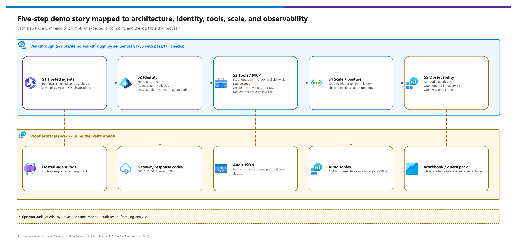
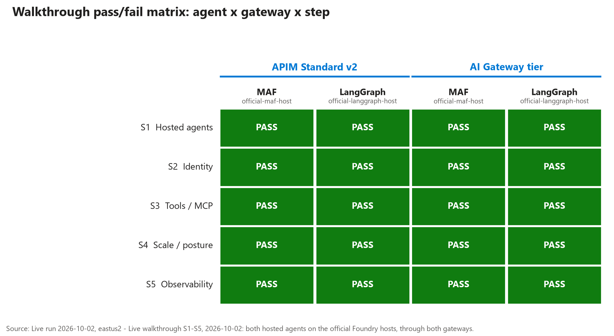

[README](../README.md) › [docs index](./00-reproduce-this-demo.md) › 11 Demo walkthrough

# 11 - Demo walkthrough

<p>
  &nbsp;
  &nbsp;
  &nbsp;
  &nbsp;
  &nbsp;
  &nbsp;
  &nbsp;
  
</p>

   

A shareable presenter script for the hosted-agent and AI gateway landing zone. The story runs as a **matrix**: two agent frameworks (Microsoft Agent Framework and LangGraph) against two gateway targets (APIM v2 and the AI Gateway tier), through five steps, **S1 to S5**, that end in the audit trail.

## At a glance

| | Item | Detail |
|---|---|---|
|  | **Audience** | Platform, security and application owners deciding how to govern agents. |
|  | **Driver** | `scripts/demo_walkthrough.py`, with `--dry-run` for rehearsal and `--step` to jump to a segment. |
|  | **Closing proof** | Audit query 01 and trace query 04 in Log Analytics ([doc 09](./09-monitoring-and-audit.md)). |
|  | **Preview lane** | AI Gateway tier steps are  and were run live on 2026-10-02; present them as a comparison, not a recommendation. |

## The story

[](./assets/demo-walkthrough-story.png)

<sub>Editable source: [`assets/demo-walkthrough-story.drawio`](./assets/demo-walkthrough-story.drawio) - regenerate with `python scripts/export_diagrams.py docs/assets`.</sub>

## Run of show

About 40 minutes with questions. Skip S4 to get to 30.

| Segment | Time | | What to show | Proof |
|---|---|---|---|---|
| **Open** | 3 min |  | The architecture diagram and the two-gateway idea. | The hero row: agents, gateways, tools, audit. |
| **S1 Hosted agents** | 6 min |  | Both agents answer the same prompt through the hosted-agent Responses contract. | `/readiness` returns 200; a `/responses` call returns an answer. |
| **S2 Identity** | 7 min |  | No token is refused, an agent identity is allowed, the audit record names the principal. | `401` without a token; `agent_principal` and `trace_id` in the audit row. |
| **S3 Tools / MCP** | 8 min |  | A governed tool call, a record created through a REST-as-MCP route, a denied tool. | MCP log rows for `check_availability`; a refused call outside the allow-list. |
| **S4 Scale / posture** | 6 min |  | A token-limit loop until the gateway returns `429`; the network-isolation diagram. | The `429` and the [network topology](./10-enterprise-posture-and-scale.md#the-network-path). |
| **S5 Observability** | 8 min |  | The audit query, the trace query, the workbook and the alert. | Query 01 and query 04 results; the workbook tiles. |
| **Close** | 2 min |  | Preview versus GA ( vs ), and next steps. | The status table in the [README](../README.md). |

> [!TIP]
> Open S5 in Log Analytics **before** the session starts and run query 01 once so the workspace is warm. Query results lag ingestion by a few minutes; do not rely on records from the call you just made.

## The agent by gateway matrix

Each cell is one rehearsal command. Dry-run and live runs are both verified; results are in the [live evidence](#live-evidence) section.

| Agent | Gateway | Dry run | Live |
|---|---|---|---|
|  **MAF** |  APIM v2 | ✅ `python scripts/demo_walkthrough.py --ids demo-ids.local.json --agent maf --gateway apimv2 --dry-run` | ✅ |
|  **LangGraph** |  APIM v2 | ✅ `python scripts/demo_walkthrough.py --ids demo-ids.local.json --agent langgraph --gateway apimv2 --dry-run` | ✅ |
|  **MAF** |  AI Gateway tier  | ✅ `python scripts/demo_walkthrough.py --ids demo-ids.local.json --agent maf --gateway aigateway --dry-run` | ✅ |
|  **LangGraph** |  AI Gateway tier  | ✅ `python scripts/demo_walkthrough.py --ids demo-ids.local.json --agent langgraph --gateway aigateway --dry-run` | ✅ |
| **Both agents** | Selected gateway | ✅ `python scripts/demo_walkthrough.py --ids demo-ids.local.json --agent both --gateway apimv2 --dry-run`; repeat with `aigateway` | ✅ |

## Walkthrough steps

### S1 - Hosted agents

| Step | | Action | Validation |
|---|---|---|---|
| 1 |  | Run `python scripts/demo_walkthrough.py --ids demo-ids.local.json --agent both --gateway apimv2 --step S1`. The prompt asks the agent to check readiness and say which governed tools it can use. | - [ ] `agent-maf` and `agent-langgraph` both accept the Responses contract (`GET /readiness`, `POST /responses`). |
| 2 |  | Optional: show the same image on Container Apps (`DEPLOY_AGENT_ON_ACA=true`). | - [ ] The hosted and Container Apps runtimes give the same answer. |

**Expected result:** two frameworks, one contract. **Proof:** App Insights traces, or the constructed endpoint in dry-run.

### S2 - Identity

| Step | | Action | Validation |
|---|---|---|---|
| 1 |  | Call the gateway with **no token**. | - [ ] The response is `401`. |
| 2 |  | Invoke through the gateway with an agent token and a `traceparent` header. | - [ ] The call is allowed; the audit row has `agent_principal` and `trace_id`. |
| 3 |  | Optional: the on-behalf-of sample shows human and agent together. | - [ ] The audit row carries both identities. |

**Expected result:** the APIM path shows Entra principal headers; the AI Gateway tier path shows its runtime-key limitation (`caller="aigw-runtime-key:agents"`, no agent principal). **Proof:** audit fields `gateway`, `caller`, `agent_principal`.

> [!TIP]
> Say it plainly: "Runtime keys prove possession of a gateway key; they do not identify a human or agent principal." This is the single most important difference between the two gateways.

### S3 - Tools and MCP

| Step | | Action | Validation |
|---|---|---|---|
| 1 |  | Ask: "Do we have enough PRT-100 units for today's line inspection?" | - [ ] The agent calls `check_availability` through the gateway's MCP route. |
| 2 |  | Create a work order through the REST-as-MCP route. | - [ ] A record is created and appears in the tool audit rows. |
| 3 |  | Attempt a tool that is **not** on the allow-list. | - [ ] The gateway denies the call. |

**Expected result:** tool operations route through the selected gateway. **Proof:** MCP logs and tool audit rows (`GatewayMCPLogs` on APIM).

### S4 - Scale and posture

| Step | | Action | Validation |
|---|---|---|---|
| 1 |  | Run `python scripts/validate_gateway.py --ids demo-ids.local.json --target apimv2 --probe-429` to loop calls until the token-limit policy refuses. | - [ ] A `429` is returned once `TOKEN_LIMIT_TPM_PER_AGENT` is exceeded. |
| 2 |  | Show the network topology and the [posture table](./10-enterprise-posture-and-scale.md#what-network_isolationtrue-deploys). | - [ ] The audience can name which hops are private and which are not yet. |

**Expected result:** limits and posture are shown with gateway-specific caveats. **Proof:** APIM logs or GenAI telemetry plus the diagrams.

### S5 - Observability

| Step | | Action | Validation |
|---|---|---|---|
| 1 |  | Run `python scripts/run_audit_queries.py --ids demo-ids.local.json --query 01`. | - [ ] The audit rows include `gateway`, `caller` and `agent_principal`. |
| 2 |  | Re-run with `--query 04 --trace-id <id>` using the trace id from S2. | - [ ] The agent, gateway and tool spans for that trace appear together. |
| 3 |  | Open the workbook, then show the alert rule. | - [ ] The call volume, denials and token usage tiles are populated. |

**Expected result:** query 01 and the trace query answer the audit story; query 11 compares AI Gateway tier telemetry (`AppRequests`) with the APIM LLM log. **Proof:** Log Analytics and the workbook ([doc 09](./09-monitoring-and-audit.md#the-saved-queries)).

## Presenter notes

| | Moment | Say this | Avoid saying |
|---|---|---|---|
|  | **Gateway comparison**  | "APIM v2 is the safe default; the AI Gateway tier is a preview side lane that we ran live for comparison." | "The preview tier has the same identity guarantees as APIM token validation." |
|  | **Framework comparison** | "The two agents use different official host packages (`ResponsesHostServer` from Agent Framework and from `langchain-azure-ai`) but the same gateway and audit contract." | "Hosted agents require one specific SDK." |
|  | **Identity** | "Runtime keys prove possession of a gateway key; they do not identify a human or agent principal." | "The key is the agent identity." |
|  | **Monitoring** | "The AI Gateway tier writes its LLM and MCP calls to `AppRequests`, not the LLM log; query 11 puts both lanes side by side." | "The tier writes `ApiManagementGatewayLlmLog` rows." |

> [!CAUTION]
> **Do not show** the **Visual Workflow** canvas (retiring 2026-12-01) or the classic **Assistants API** (threads and runs). The demo is built on the current hosted-agent Responses contract; showing retiring surfaces invites the wrong follow-up questions.

<details><summary><b>Show all rehearsal commands</b></summary>

```powershell
# Dry-run the full matrix (no cloud calls)
python scripts/demo_walkthrough.py --ids demo-ids.local.json --agent both --gateway apimv2 --dry-run
python scripts/demo_walkthrough.py --ids demo-ids.local.json --agent both --gateway aigateway --dry-run

# One step, one agent
python scripts/demo_walkthrough.py --ids demo-ids.local.json --agent maf --gateway apimv2 --step S3

# Gateway checks
python scripts/validate_gateway.py --ids demo-ids.local.json --target apimv2 --assert-401
python scripts/validate_gateway.py --ids demo-ids.local.json --target apimv2 --probe-429

# Audit and trace queries
python scripts/run_audit_queries.py --ids demo-ids.local.json --query 01
python scripts/run_audit_queries.py --ids demo-ids.local.json --query 04 --trace-id <trace-id>
```

Step values are `S1` to `S5` and `smoke`. Defaults are `--agent maf` and `--gateway apimv2`.

</details>

## Live evidence

 for **both gateway lanes** and **both agents**. Run `fhagl1002` on 2026-10-02 in `eastus2`; details and defects in [04 - Testing](./04-testing.md#live-validation-2026-10-02).

[](./assets/evidence/pass-fail-matrix.png)

*Source: live run 2026-10-02, eastus2.*

| Agent (host) | Gateway | S1 | S2 | S3 | S4 | S5 |
|---|---|---|---|---|---|---|
| Microsoft Agent Framework (official `ResponsesHostServer`) | APIM Standard v2 | ✅ | ✅ | ✅ | ✅ | ✅ |
| LangGraph (official `ResponsesHostServer`) | APIM Standard v2 | ✅ | ✅ | ✅ | ✅ | ✅ |
| Microsoft Agent Framework | AI Gateway tier  | ✅ | ✅ | ✅ | ✅ | ✅ |
| LangGraph | AI Gateway tier  | ✅ | ✅ | ✅ | ✅ | ✅ |

> [!TIP]
> **Presenter guidance - what is proven live and what is not.**
> - **Safe to say live:** both agents complete S1-S5 through both gateways; unauthenticated calls get 401; the throttle probe returns 429 (183 of 240 calls throttled on the tier); tool and model calls appear in the audit queries ([09](./09-monitoring-and-audit.md#live-evidence)).
> - **Say as design intent, not as demonstrated:** network isolation mode (what-if validated only), the `postdeploy` RBAC hook (the grant was done by hand in the run) and the other tier policy cards beyond the 429 probe.
> - If asked about the agent's identity, say the runtime principal is the hosted agent's **instance identity** ([07](./07-identity-auth-traceability.md#the-runtime-principal-is-the-instance-identity)), and that the tier lane needs it to read the runtime key from Key Vault (or `AIGW_KEY_DELIVERY=env` under a Key Vault network policy).

Next: [12 - Configuration reference](./12-configuration-reference.md) →

---

*Last updated: 2026-10-02*
