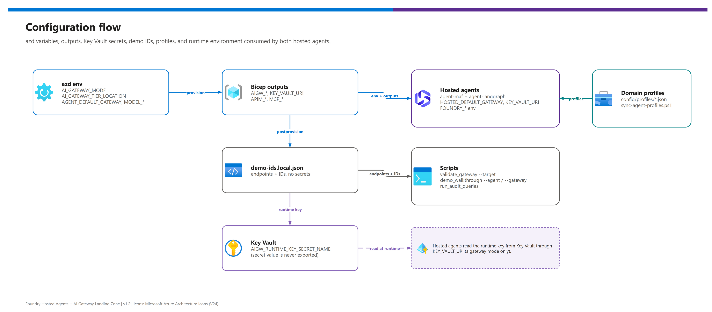

[README](../README.md) › [docs index](./00-reproduce-this-demo.md) › 12 Configuration reference

# 12 - Configuration reference

<p>
  &nbsp;
  &nbsp;
  &nbsp;
  &nbsp;
  &nbsp;
  &nbsp;
  &nbsp;
  &nbsp;
  
</p>

  

The complete configuration index for the demo. If a value is configurable, generated as an azd output, read by a hook, script or runtime component, or written to `demo-ids.local.json`, it is documented here. A test (`tests/test_configuration.py`) fails when any of them is missing.

## At a glance

| | Layer | What it holds |
|---|---|---|
|  | **azd environment** | 40 input variables (target, gateway, network, model, workload, monitoring) plus the opt-in `AIGW_KEY_DELIVERY` and `AIGW_RUNTIME_KEY` agent settings. |
|  | **azd outputs** | 29 outputs, mirrored into `demo-ids.local.json` by the postprovision hook. |
|  | **Runtime environment** | Per-component variables for hosted agents, tool backends, scripts, hooks and tests. |
|  | **Domain profile JSON** | Labels, agent instructions, tool descriptions, seed data and walkthrough prompts. |

## How configuration flows

[](./assets/configuration-flow.png)

<sub>Editable source: [`assets/configuration-flow.drawio`](./assets/configuration-flow.drawio) - regenerate with `python scripts/export_diagrams.py docs/assets`.</sub>

### Configuration precedence

When the same value exists in several places, the lower number wins.

| Precedence | | Source | Contents |
|---:|---|---|---|
| 1 |  | **Process environment / command-line parameter** | Temporary script overrides such as `AIGW_RUNTIME_KEY`, `DRAWIO_EXE`, `REUSABILITY_DENYLIST`. |
| 2 |  | **azd environment values** | Tenant, subscription, region, gateway modes, model, monitoring, networking. |
| 3 |  | **`demo-ids.local.json`** | Resource names, endpoints, workspace IDs, Key Vault URI, runtime discovery values. |
| 4 |  | **Domain profile JSON** | Labels, instructions, tool descriptions, seed data, walkthrough prompts. |
| 5 |  | **Code defaults** | Safe defaults only; never domain-specific or customer-specific values. |

> [!IMPORTANT]
> **Secrets are not configuration.** Runtime keys, tokens, connection strings and populated identifiers belong in Key Vault, managed identity, the azd secret store or ignored local files. `APPLICATIONINSIGHTS_CONNECTION_STRING` is an azd output but is deliberately **not** written to `demo-ids.local.json`.

## azd environment variables

Set a value with `azd env set <NAME> <value>`. Defaults come from `infra/azd.parameters.json`. The same variables are parameters of `infra/deploy.ps1` ([below](#deployps1-parameters)).

###  Target and identity

| Variable | Default | Effect |
|---|---|---|
| `AZURE_ENV_NAME` | Set by `azd env new` | Environment slug used in resource names. |
| `AZURE_LOCATION` | `eastus2` recommended  | Primary region; the v1.2 live run used `eastus2`. |
| `AZURE_SUBSCRIPTION_ID` | azd-provided | Subscription target. Keep it explicit when you work across tenants. |
| `AZURE_TENANT_ID` | azd-provided | Tenant target. |
| `AZURE_PRINCIPAL_ID` | azd-provided | Deployment principal. |
| `AZURE_PRINCIPAL_TYPE` | `User` | Role assignment principal type. |
| `AZURE_RESOURCE_GROUP` | Blank | Reuse an existing resource group, or create `rg-<env>`. |

###  Gateway

| Variable | Default | Allowed values | Effect |
|---|---|---|---|
| `AI_GATEWAY_MODE` | `apimv2` | `apimv2`, `aigateway`, `both` | Deploy APIM v2 , the AI Gateway tier , or both. |
| `APIM_SKU` | `StandardV2` | `StandardV2`, `PremiumV2` | APIM SKU. |
| `APIM_PUBLISHER_EMAIL` | `demo@example.com` | Email | APIM publisher email. |
| `APIM_PUBLISHER_NAME` | `Demo Publisher` | String | APIM publisher name. |
| `GATEWAY_APP_CLIENT_ID` | Blank | App client ID | Blank lets preprovision create `gw-<env>`. |
| `TOKEN_LIMIT_TPM_PER_AGENT` | `20000` | Integer | Token-per-minute guard per agent. It does not create model quota. |
| `ENABLE_CONTENT_SAFETY` | `true` | Boolean | Enables the content-safety control where configured. |
| `ENABLE_LLM_MESSAGE_LOGGING` | `true` | Boolean | Enables APIM LLM prompt and completion logs. Review the [privacy warning](./09-monitoring-and-audit.md#llm-message-logging-and-privacy) before production. |

###  AI Gateway tier  

| Variable | Default | Allowed values | Effect |
|---|---|---|---|
| `AI_GATEWAY_TIER_LOCATION` | `eastus2` | `eastus2`, `swedencentral` | Region for the AI Gateway tier; independent of `AZURE_LOCATION`. |
| `AIGW_REQUEST_LIMIT_RPM` | `120` | Integer | Request-rate policy target for the tier. |
| `AIGW_RUNTIME_KEY_SECRET_NAME` | `aigw-runtime-key` | Key Vault secret name | Secret that Bicep writes the gateway-scoped `agents` runtime key to (from `listSecrets` on `Microsoft.ApiManagement/service/apiKeys`). `postprovision` only repairs a missing secret. |
| `AIGW_KEY_DELIVERY` | `keyvault` | `keyvault`, `env` | How hosted agents obtain the runtime key. `keyvault` (default) reads the secret with the **agent instance identity**. `env`  projects the key into the agent environment as `AIGW_RUNTIME_KEY` for subscriptions whose policy blocks Key Vault public access. See [Key Vault access under network policy](./07-identity-auth-traceability.md#key-vault-access-under-network-policy). |
| `AIGW_RUNTIME_KEY` | Blank | Runtime key | `postprovision` fills it only when `AIGW_KEY_DELIVERY=env` and clears it (`""`) in `keyvault` mode. In `keyvault` mode the agent uses a non-empty value only as a fallback when the Key Vault read fails (WARNING `aigw_runtime_key_source`); in `env` mode it is required and Key Vault is never read. The key is never logged. Treat it as a secret: keep it in the azd environment and never commit it. |

###  Network 

| Variable | Default | Effect |
|---|---|---|
| `NETWORK_ISOLATION` | `false` | Deploy the VNet and private-endpoint posture when `true` ([doc 10](./10-enterprise-posture-and-scale.md#what-network_isolationtrue-deploys)). |
| `VNET_ADDRESS_PREFIX` | `10.40.0.0/16` | VNet address space. |
| `AGENT_SUBNET_PREFIX` | `10.40.0.0/24` | Hosted-agent session subnet (`/24` recommended, `/27` minimum). |
| `ACA_SUBNET_PREFIX` | `10.40.2.0/23` | Container Apps subnet. |
| `APIM_SUBNET_PREFIX` | `10.40.4.0/27` | APIM outbound integration subnet. |
| `PE_SUBNET_PREFIX` | `10.40.5.0/24` | Private endpoint subnet. |
| `AIGW_SUBNET_PREFIX` | `10.40.6.0/27` | AI Gateway tier outbound VNet-integration subnet (`snet-aigw`, delegated to `Microsoft.Web/serverFarms`). Used only when the tier region equals `AZURE_LOCATION`. |
| `AIGW_INBOUND_PRIVATE_ENDPOINT` | `true` | Create an inbound private endpoint for the AI Gateway tier when `NETWORK_ISOLATION=true`. Set `false` to skip this feature (, not live-verified). |

###  Models

| Variable | Default | Effect |
|---|---|---|
| `MODEL_NAME` | `gpt-5.5` | Model name. |
| `MODEL_VERSION` | `2026-04-24` | Model version. |
| `MODEL_DEPLOYMENT_NAME` | `chat` | Deployment name used by the gateways and agents. |
| `MODEL_SKU` | `GlobalStandard` | Model deployment SKU ([deployment types](https://learn.microsoft.com/en-us/azure/foundry/foundry-models/concepts/deployment-types)). |
| `MODEL_CAPACITY` | `50` | Model capacity parameter. |

###  Agents and workload

| Variable | Default | Effect |
|---|---|---|
| `DOMAIN_PROFILE` | `manufacturing-field-ops` | Selects the domain profile and seed data. |
| `DEPLOY_AGENT_ON_ACA` | `false` | Optional Container Apps comparison runtime for the agent. |
| `SEED_SAMPLE_DATA` | `true` | Seed the profile's sample data. |

###  Monitoring

| Variable | Default | Effect |
|---|---|---|
| `LOG_RETENTION_DAYS` | `90` | Log Analytics retention in days. |
| `ENABLE_ALERTS` | `true` | Scheduled-query alerts. |
| `ALERT_EMAIL` | Blank | Optional action-group email. |
| `ENABLE_ACTIVITY_LOG_EXPORT` | `false` | Subscription Activity Log export . |
| `ENABLE_SENTINEL` | `false` | Optional Microsoft Sentinel onboarding . |
| `ENABLE_ENTRA_DIAGNOSTICS` | `false` | Optional tenant diagnostic export for Entra sign-in logs . |

## azd outputs to `demo-ids.local.json`

 The postprovision hook writes the azd outputs to `demo-ids.local.json` (ignored by git). Scripts read that file instead of querying Azure.

| | azd output | `demo-ids.local.json` key | Notes |
|---|---|---|---|
|  | `AZURE_RESOURCE_GROUP` | `resourceGroup` | Resource group. |
|  | `FOUNDRY_ACCOUNT_NAME` | `foundryAccountName` | Foundry account. |
|  | `FOUNDRY_PROJECT_NAME` | `foundryProjectName` | Foundry project. |
|  | `FOUNDRY_PROJECT_ENDPOINT` | `foundryProjectEndpoint` | Project endpoint. |
|  | `AZURE_AI_PROJECT_ENDPOINT` | Not written to IDs file | The name the `azd ai agent` extension reads for the project endpoint. |
|  | `AZURE_AI_PROJECT_ID` | Not written to IDs file | Project ARM resource ID, read by the `azd ai agent` extension. |
|  | `MODEL_DEPLOYMENT_NAME` | `modelDeploymentName` | Model deployment. |
|  | `AZURE_CONTAINER_REGISTRY_ENDPOINT` | `containerRegistryEndpoint` | Container registry endpoint. |
|  | `ACR_NAME` | Not written to IDs file | Registry name, read by `postprovision` to print the isolated-mode ACR allowlist step. It is a `main.bicep` output; if `azd` does not surface it, run `azd env set ACR_NAME <name>`. |
|  | `CONTAINER_APPS_ENVIRONMENT_NAME` | `containerAppsEnvironmentName` | Container Apps environment. |
|  | `APIM_NAME` | `apimName` | APIM service. |
|  | `APIM_GATEWAY_URL` | `apimGatewayUrl` | APIM base URL. |
|  | `AI_GATEWAY_MODE` | `aiGatewayMode` | `apimv2`, `aigateway` or `both`. |
|  | `AIGW_GATEWAY_NAME` | `aigwGatewayName` | AI Gateway tier name; blank when not deployed. |
|  | `AIGW_GATEWAY_URL` | `aigwGatewayUrl` | AI Gateway tier base URL. |
|  | `AIGW_LOCATION` | `aigwLocation` | AI Gateway tier region. |
|  | `AIGW_MCP_CATALOG_URL` | `aigwMcpCatalogUrl` | Catalog MCP tool-server URL on the AI Gateway tier (`.../default/toolservers/catalog-mcp/mcp`). |
|  | `AIGW_MCP_RECORDS_URL` | `aigwMcpRecordsUrl` | Records tool-server URL on the AI Gateway tier (OpenAPI exposed as MCP, `.../default/toolservers/records/mcp`). |
|  | `AIGW_RUNTIME_KEY_SECRET_NAME` | Not written to IDs file | Name of the Key Vault secret that holds the runtime key (not the key itself). |
|  | `LLM_API_PATH` | `llmApiPath` | APIM LLM path, default `llm`. |
|  | `MCP_CATALOG_URL` | `mcpCatalogUrl` | APIM catalog MCP URL. |
|  | `MCP_RECORDS_URL` | `mcpRecordsUrl` | APIM records MCP URL. |
|  | `RECORDS_API_URL` | `recordsApiUrl` | APIM records REST URL. |
|  | `GATEWAY_APP_CLIENT_ID` | `gatewayAppClientId` | Entra gateway app. |
|  | `LOG_ANALYTICS_WORKSPACE_ID` | `logAnalyticsWorkspaceId` | Workspace resource ID. |
|  | `LOG_ANALYTICS_CUSTOMER_ID` | `logAnalyticsCustomerId` | Workspace customer ID. |
|  | `APPLICATIONINSIGHTS_NAME` | `applicationInsightsName` | Application Insights component. |
|  | `APPLICATIONINSIGHTS_CONNECTION_STRING` | Not written to IDs file | Secret-like; keep in azd or app settings. |
|  | `WORKBOOK_ID` | `workbookId` | Workbook ID. |
|  | `QUERY_PACK_ID` | `queryPackId` | Query pack ID. |
|  | `KEY_VAULT_NAME` | `keyVaultName` | Key Vault name. |
|  | `KEY_VAULT_URI` | `keyVaultUri` | Key Vault URI for runtime secret reads. |
|  | `VNET_ID` | `vnetId` | Empty when there is no isolation. |

### All `demo-ids.local.json` keys

<details><summary><b>Show the complete key list</b></summary>

`resourceGroup`, `foundryAccountName`, `foundryProjectName`, `foundryProjectEndpoint`, `modelDeploymentName`, `containerRegistryEndpoint`, `containerAppsEnvironmentName`, `apimName`, `apimGatewayUrl`, `aiGatewayMode`, `aigwGatewayName`, `aigwGatewayUrl`, `aigwLocation`, `aigwMcpCatalogUrl`, `aigwMcpRecordsUrl`, `llmApiPath`, `mcpCatalogUrl`, `mcpRecordsUrl`, `recordsApiUrl`, `gatewayAppClientId`, `logAnalyticsWorkspaceId`, `logAnalyticsCustomerId`, `applicationInsightsName`, `workbookId`, `queryPackId`, `keyVaultName`, `keyVaultUri`, `vnetId`, optional `hostedAgentUrl`, optional `agentMafResponsesEndpoint`, optional `agentLanggraphResponsesEndpoint`, `workload.domainProfile`, and `workload.profilePath`.

</details>

## `deploy.ps1` parameters

 `infra/deploy.ps1` is the manual alternative to `azd up`: it validates the environment name, the Azure tenant and subscription context, `AI_GATEWAY_MODE` (`apimv2`, `aigateway`, `both`) and the tier location, then runs `az deployment sub create` against `infra/azd.bicep` with the deployment name `foundry-hosted-agents-<EnvironmentName>`. Each parameter defaults to the environment variable of the same azd name.

| Group | Parameters |
|---|---|
|  **Target and identity** | `-EnvironmentName`, `-AzureLocation`, `-AzureSubscriptionId`, `-AzureTenantId`, `-AzurePrincipalId`, `-AzurePrincipalType`, `-AzureResourceGroup` |
|  **Gateway** | `-AiGatewayMode`, `-ApimSku`, `-ApimPublisherEmail`, `-ApimPublisherName`, `-GatewayAppClientId`, `-TokenLimitTpmPerAgent`, `-EnableContentSafety`, `-EnableLlmMessageLogging` |
|  **AI Gateway tier** | `-AiGatewayTierLocation`, `-AigwRequestLimitRpm`, `-AigwRuntimeKeySecretName` |
|  **Network** | `-NetworkIsolation`, `-VnetAddressPrefix`, `-AgentSubnetPrefix`, `-AcaSubnetPrefix`, `-ApimSubnetPrefix`, `-PeSubnetPrefix` |
|  **Models** | `-ModelName`, `-ModelVersion`, `-ModelDeploymentName`, `-ModelSku`, `-ModelCapacity` |
|  **Agents and workload** | `-DomainProfile`, `-DeployAgentOnAca`, `-SeedSampleData` |
|  **Monitoring** | `-LogRetentionDays`, `-EnableAlerts`, `-AlertEmail`, `-EnableActivityLogExport`, `-EnableSentinel`, `-EnableEntraDiagnostics` |

## Runtime environment variables

Names are grouped by the component that reads them. Hosted agents get their values from `azure.yaml` (`env:` per agent service). Foundry reserves the `AGENT_*` and `PORT`-style names in a deployed hosted-agent container, so the shipping configuration uses the **`HOSTED_*`** names; the unprefixed `AGENT_*` form is read only as a local-run fallback. The official hosts (`ResponsesHostServer`) also depend on variables the **platform injects**; do not set those yourself.

###  Hosted agents (`agent-maf`, `agent-langgraph`)

| Variable | Purpose |
|---|---|
| `HOSTED_DEFAULT_GATEWAY` | `apimv2` or `aigateway`; selects the runtime path. Set in `azure.yaml` from the azd value `AGENT_DEFAULT_GATEWAY`. |
| `AGENT_DEFAULT_GATEWAY` | The azd environment value behind `HOSTED_DEFAULT_GATEWAY`; also the local-run fallback name. |
| `HOSTED_PROTOCOL` | `responses` (the only protocol the manifests declare). `invocations` is a local or optional host mode. |
| `AGENT_PROTOCOL` | Local-run fallback name for `HOSTED_PROTOCOL`. |
| `HOSTED_RUNTIME` | `foundry-hosted` in `azure.yaml`; logged at start-up. |
| `AGENT_RUNTIME` | `foundry-hosted`, `aca` or `local`. Applies to the optional Container Apps comparison runtime and as a local-run fallback. |
| `APIM_GATEWAY_URL` | APIM base URL. |
| `LLM_API_PATH` | APIM LLM route path (default `llm`). |
| `MCP_CATALOG_URL` | APIM catalog MCP URL. |
| `MCP_RECORDS_URL` | APIM records MCP URL. |
| `GATEWAY_AUDIENCE` | APIM token audience (`https://cognitiveservices.azure.com`). |
| `AIGW_GATEWAY_URL` | AI Gateway tier base URL. |
| `AIGW_MCP_CATALOG_URL` | AI Gateway tier catalog tool-server URL. |
| `AIGW_MCP_RECORDS_URL` | AI Gateway tier records tool-server URL. |
| `KEY_VAULT_URI` | Key Vault URI used to read the runtime key. |
| `AIGW_RUNTIME_KEY_SECRET_NAME` | Secret name for the AI Gateway runtime key. |
| `AIGW_RUNTIME_KEY` | Runtime key delivered through the environment when `AIGW_KEY_DELIVERY=env`, or set locally; used when the Key Vault read fails. Never commit it. |
| `MODEL_DEPLOYMENT_NAME` | Model deployment name (the AI Gateway alias must equal this name). |
| `AZURE_AI_MODEL_DEPLOYMENT_NAME` | Foundry-injected model variable (read after `MODEL_DEPLOYMENT_NAME`). |
| `FOUNDRY_MODEL_NAME` | Foundry-injected model variable (read after the two above). |
| `FOUNDRY_PROJECT_ENDPOINT` | Foundry project endpoint (platform-injected; also read by scripts). |
| `DOMAIN_PROFILE` | Profile selector. |
| `PORT` | Container port; the official host defaults to `8088`. |

###  Platform-injected variables (hosted agents)

> [!NOTE]
> The Foundry hosted-agent runtime sets these in the container. They are **read, not configured**, by this repo. Do not add them to `azure.yaml`; the runtime rejects reserved names.

| Variable | Set by | Used for |
|---|---|---|
| `APPLICATIONINSIGHTS_CONNECTION_STRING` | Foundry platform | The official host's Azure Monitor exporter. `AppRoleName` becomes the agent name (`agent-maf`, `agent-langgraph`). |
| `FOUNDRY_HOSTING_ENVIRONMENT` | Foundry platform | When present, `gateway_auth.py` authenticates with `ManagedIdentityCredential` instead of `DefaultAzureCredential`. |
| `FOUNDRY_AGENT_INSTANCE_CLIENT_ID` | Foundry platform | Client ID of the **agent instance identity** passed to `ManagedIdentityCredential`. This is the principal that must hold Key Vault and gateway permissions ([doc 07](./07-identity-auth-traceability.md#the-runtime-principal-is-the-instance-identity)). |
| `FOUNDRY_PROJECT_ENDPOINT`, `AZURE_AI_MODEL_DEPLOYMENT_NAME` | Foundry platform | Project endpoint and model name defaults. |

###  Tool backends (`catalog-mcp`, `records-api`)

| Variable | Purpose |
|---|---|
| `PORT` | Container port (`8080`). |
| `LOG_LEVEL` | Runtime logging verbosity. |
| `DOMAIN_PROFILE` | Profile selector for seed data. |
| `APPLICATIONINSIGHTS_CONNECTION_STRING` | Application Insights exporter (set from the azd output in `azure.yaml`). |

###  Scripts, hooks and tests

| Variable | Used by | Purpose |
|---|---|---|
| `AZURE_TENANT_ID` | Scripts and hooks | Tenant-explicit authentication. |
| `AZURE_SUBSCRIPTION_ID` | Scripts and hooks | Subscription-explicit authentication. |
| `LOG_ANALYTICS_CUSTOMER_ID` | `run_audit_queries.py` | Workspace customer ID. |
| `AZD_SERVICE_NAME` | `infra/hooks/postdeploy-agents.ps1` | Provided by azd during `azd deploy`; the hook uses it (or `-AgentName`) to process only the agent being deployed. |
| `AGENT_<NAME>_INSTANCE_IDENTITY_PRINCIPAL_ID` | `postdeploy-agents.ps1` | Optional azd environment value the hook reads when `azd ai agent show` does not return the instance principal. |
| `DRAWIO_EXE` | `export_diagrams.py` | draw.io executable override. |
| `REUSABILITY_DENYLIST` | Tests | Runtime denylist for customer-specific terms. |
| `AGENT_AGENT_MAF_RESPONSES_ENDPOINT` | `demo_walkthrough.py` | Explicit MAF endpoint override. |
| `AGENT_AGENT_LANGGRAPH_RESPONSES_ENDPOINT` | `demo_walkthrough.py` | Explicit LangGraph endpoint override. |

## Domain profile JSON

 A profile in `config/profiles/<name>.json` carries everything domain-specific, so retargeting the demo never touches code.

| Key | Contains |
|---|---|
| `profileName`, `displayName` | Identifier and display name. |
| `agent` | `name`, `description`, `instructions` for the agent. |
| `labels` | Singular and plural nouns for items and records, used in prompts and docs. |
| `catalogTools` | Tool name to description: `list_items`, `search_items`, `get_item`, `check_availability`, `check_availability_batch`. |
| `recordsTools` | Tool name to description: `list_records`, `get_record`, `create_record`, `update_record`. |
| `seedData` | Paths to the items and records seed files. |
| `walkthrough[]` | Prompts for the demo: `step`, `segment`, `prompt`, `expectedTool`, `assertion`. |

<details><summary><b>Show a profile skeleton</b></summary>

```json
{
  "profileName": "manufacturing-field-ops",
  "displayName": "Manufacturing field operations",
  "agent": { "name": "FieldOpsGatewayAgent", "description": "...", "instructions": "..." },
  "labels": { "item": "part", "items": "parts", "record": "work order", "records": "work orders" },
  "catalogTools": { "list_items": "...", "check_availability": "..." },
  "recordsTools": { "list_records": "...", "create_record": "..." },
  "seedData": {
    "items": "src/catalog-mcp/data/profiles/manufacturing-field-ops/items.json",
    "records": "src/records-api/data/profiles/manufacturing-field-ops/records.json"
  },
  "walkthrough": [
    { "step": "S3", "segment": "Tools / MCP", "prompt": "...", "expectedTool": "check_availability", "assertion": "..." }
  ]
}
```

Values are shortened here; the real profile lists every tool in `catalogTools` and `recordsTools`.

</details>

## Recipes

| | Goal | Configuration change |
|---|---|---|
|  | **Deploy both gateways** | `azd env set AI_GATEWAY_MODE both`; `azd env set AI_GATEWAY_TIER_LOCATION eastus2`. |
|  | **Use APIM v2 for agents** | `azd env set AGENT_DEFAULT_GATEWAY apimv2`; `azd deploy agent-maf agent-langgraph`. |
|  | **Use the AI Gateway tier for agents** | `azd env set AGENT_DEFAULT_GATEWAY aigateway`; confirm the Key Vault runtime key; `azd deploy agent-maf agent-langgraph`. |
|  | **Validate APIM** | `python scripts/validate_gateway.py --ids demo-ids.local.json --target apimv2`. |
|  | **Validate the AI Gateway tier** | `python scripts/validate_gateway.py --ids demo-ids.local.json --target aigateway`. |
|  | **Retarget the domain** | Add the profile JSON and seed data, then `azd env set DOMAIN_PROFILE <new-profile>` and run `scripts/sync-agent-profiles.ps1`. |

> [!TIP]
> After any change to a gateway variable, redeploy the hosted agents (`azd deploy agent-maf agent-langgraph`). Their environment is fixed at deploy time, so a changed value is not picked up by running sessions.

Next: back to the [docs index](./00-reproduce-this-demo.md) →

---

*Last updated: 2026-10-02*
